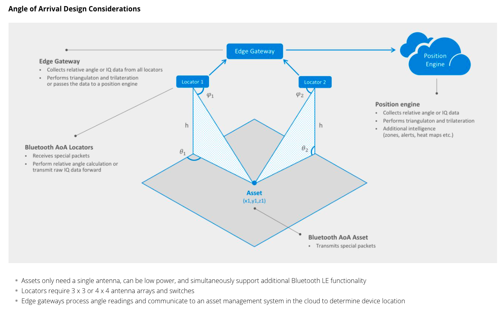

\## Application

\## Direction-finding: RSSI [AoA & AoD](https://www.silabs.com/wireless/bluetooth/bluetooth-5-1)

\### AoA & AoD

\### AoA

\### AoD

\### RSSI
This section briefly presents two other locationing technologies for comparison. These two methods use different kinds of algorithms/methods for locationing than those presented in this paper. With Received Signal Strength Indicator (RSSI), the basic idea is to measure the signal strength of the received signal to get a distance approximation between RX and TX. This information can be used to trilaterate the position of a receiver device based on multiple distance measurements from different transmitter points. This technology requires only one antenna per device, but is not usually very accurate in an indoor environment. With Time of Arrival / Time of Flight (ToA/ToF), you measure the travel time of a signal between RX and TX and use that to calculate the distance between the ends. This distance is then used to trilaterate the position of the receiver.

\## Algorithm

\### Classical Beamformer
Let's begin with a mathematical model of a uniform linear array. You are given a data vector of IQ-samples for each antenna. Let this vector be called x. Now, a phase shift is seen by each antenna (which can be 0) plus some noise, 𝑛, in the measurements, so 𝑥 can be written as a function of time 𝑡:

where 𝑠 is the signal sent over the air, and 𝑎 is the steering vector of the antenna array:

where 𝑑 is the distance between adjacent antennas, 𝜆 is the wavelength of the signal, 𝑚 is the number of elements inthe antenna array, and 𝜃 stands for the angle of arrival. Steering vector (2) describes how signals on each antenna are phase shifted because of the varying distances to the transmitter. By using (1), you can calculate an approximation of the so-called sample covariance matrix, 𝑅xx , by calculating

where H stands for the Hermitian transpose of a matrix.

The sample covariance matrix (3) will be used as an input for the estimator algorithm, as you will see.

The idea of the classical beamformer is to maximize the output power as a function of the angle, similar to how a mechanical radar works. If you attempt to maximize the power, you end up with the next formula:

Now, to find the arrival angle, you need to loop through the arrival angle 𝜃 and find the peak maximum power, 𝑃. The angle, or theta, producing the maximum power corresponds to the angle of arrival. While this approach is quite simple, its accuracy is not generally very good. Therefore, let's introduce another method, which is a bit better in terms of accuracy. See, for example, [4] for an algorithm accuracy comparison.

\###

MUSIC (Multiple Signal Classification)
One type of estimation algorithm is the so-called subspace estimator, and one popular algorithm of that category is called MUSIC (Multiple Signal Classification). The idea of this algorithm is to perform eigen decomposition on the covariance matrix 𝑅xx :

where 𝐴 is a diagonal matrix containing eigenvalues and 𝑉 containing the corresponding eigenvectors of 𝑅xx .

Assume that you are trying to estimate the angle of arrival for one transmitter with an 𝑛 antenna linear array. It can be shown that the eigenvectors of 𝑅xx either belong to so-called noise subspace or signal subspace. If the eigen values are sorted in ascending order, the corresponding 𝑛 − 1 eigen vectors span the noise subspace, which is orthogonal to the signal subspace. Based on the orthogonality information, you can calculate the pseudo spectrum 𝑃:

As in a classical beamformer, you loop through the desired values of 𝜃 and find the maximum peak value of 𝑃, which corresponds the angle of arrival (argument 𝜃) you wish to measure.

In an ideal case, MUSIC has excellent resolution in a good SNR environment and is very accurate. On the other hand, its performance is not very strong when the input signals are highly correlated, especially in an indoor environment. Multipath effects distort the pseudo-spectrum causing it to have maximums at the wrong locations. More information about the conventional beamformer and MUSIC estimators can be found from [3].

\### Spatial Smoothing
Spatial smoothing is a method for solving problems caused by multipathing (when coherent signals are present). It can be proven that the signal covariance matrix can be "decorrelated" by calculating an averaged covariance matrix using subarrays of the original covariance matrix. For a two-dimensional array, this can be written as the following

where 𝑀2 and 𝑁2 are the number of subarrays in x- and y-directions respectively and 𝑅𝑚𝑚 stands for the (𝑚, 𝑛), which is the sub array covariance matrix. An example proof of this formula and more information can be found from [2]. The resulting covariance matrix can now be used as a "decorrelated" version of the covariance matrix and fed to the MUSIC algorithm to produce correct results. The downside of spatial smoothing is that it reduces the size of the covariance matrix, which further reduces the accuracy of the estimate.

\## Refer
[bluetooth-low-energy#SDK](https://www.silabs.com/developers/bluetooth-low-energy#)

[bluetooth-5-1 方向定位简介](https://www.silabs.com/wireless/bluetooth/bluetooth-5-1)

[蓝牙室内定位](https://zhuanlan.zhihu.com/p/86540226)

[whitepapers-bluetooth-angle-estimation-for-real-time-locationing](https://www.silabs.com/whitepapers/bluetooth-angle-estimation-for-real-time-locationing)

[芯科科技卖出模拟芯片业务, 投入物联网](https://www.eefocus.com/mcu-dsp/484628)