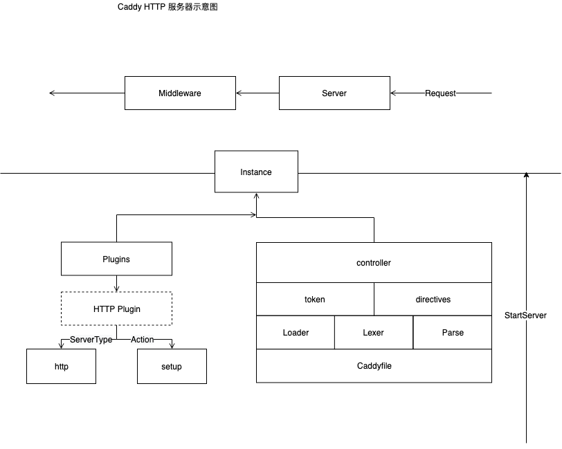

\### 前言
本次系列会讲解 caddy 整个生命周期涉及到的源码。

平时我们使用 caddy 都是使用 它的 二进制 分发文件，现在来分析 caddy 的 Run 函数。

Run 在上图中是 最右的箭头 StartServer

我们从最外层逻辑看它都做了些什么。

\### Caddy Run
我们来看看 Caddy Run 中引入了哪些包和操作，对 Caddy 的总体行为做一个概览

\`caddy/caddymain/run.go\`

首先看 init 函数
\`\`\`go
func init() {
 caddy.TrapSignals()

 flag.BoolVar(&certmagic.Default.Agreed, "agree", false, "Agree to the CA's Subscriber Agreement")
 flag.StringVar(&certmagic.Default.CA, "ca", certmagic.Default.CA, "URL to certificate authority's ACME server directory")
 flag.StringVar(&certmagic.Default.DefaultServerName, "default-sni", certmagic.Default.DefaultServerName, "If a ClientHello ServerName is empty, use this ServerName to choose a TLS certificate")
 flag.BoolVar(&certmagic.Default.DisableHTTPChallenge, "disable-http-challenge", certmagic.Default.DisableHTTPChallenge, "Disable the ACME HTTP challenge")
 flag.BoolVar(&certmagic.Default.DisableTLSALPNChallenge, "disable-tls-alpn-challenge", certmagic.Default.DisableTLSALPNChallenge, "Disable the ACME TLS-ALPN challenge")
 flag.StringVar(&certmagic.Default.Email, "email", "", "Default ACME CA account email address")
 flag.DurationVar(&certmagic.HTTPTimeout, "catimeout", certmagic.HTTPTimeout, "Default ACME CA HTTP timeout")
 flag.StringVar(&revoke, "revoke", "", "Hostname for which to revoke the certificate")

 flag.StringVar(&disabledMetrics, "disabled-metrics", "", "Comma-separated list of telemetry metrics to disable")

 flag.StringVar(&conf, "conf", "", "Caddyfile to load (default \\""+caddy.DefaultConfigFile+"\\")")
 flag.StringVar(&cpu, "cpu", "100%", "CPU cap")
 flag.BoolVar(&printEnv, "env", false, "Enable to print environment variables")
 flag.StringVar(&envFile, "envfile", "", "Path to file with environment variables to load in KEY=VALUE format")

 flag.BoolVar(&fromJSON, "json-to-caddyfile", false, "From JSON stdin to Caddyfile stdout")
 flag.BoolVar(&toJSON, "caddyfile-to-json", false, "From Caddyfile stdin to JSON stdout")
 flag.BoolVar(&plugins, "plugins", false, "List installed plugins")
 flag.StringVar(&logfile, "log", "", "Process log file")
 flag.IntVar(&logRollMB, "log-roll-mb", 100, "Roll process log when it reaches this many megabytes (0 to disable rolling)")
 flag.BoolVar(&logRollCompress, "log-roll-compress", true, "Gzip-compress rolled process log files")
 flag.StringVar(&caddy.PidFile, "pidfile", "", "Path to write pid file")
 flag.BoolVar(&caddy.Quiet, "quiet", false, "Quiet mode (no initialization output)")
 flag.StringVar(&serverType, "type", "http", "Type of server to run")
 flag.BoolVar(&version, "version", false, "Show version")
 flag.BoolVar(&validate, "validate", false, "Parse the Caddyfile but do not start the server")

 caddy.RegisterCaddyfileLoader("flag", caddy.LoaderFunc(confLoader))
 caddy.SetDefaultCaddyfileLoader("default", caddy.LoaderFunc(defaultLoader))
}
\`\`\`
然后我们来看 \`Run()\` 函数 Run() 函数全文可在最下看到

\#### conf 的灵活设置
\`conf\` 用来设置 Caddyfile 的文件路径，是可以从 Stdin 即终端输入配置的。

会在以下两个在 init() 中的函数调用更改
\`\`\`go
 caddy.RegisterCaddyfileLoader("flag", caddy.LoaderFunc(confLoader))
 caddy.SetDefaultCaddyfileLoader("default", caddy.LoaderFunc(defaultLoader))
\`\`\`
而注意到这里使用的 Loader ，可以用来自定义 caddyfile 的装载方式。
\`\`\`go
// confLoader loads the Caddyfile using the -conf flag.
func confLoader(serverType string) (caddy.Input, error) {
 if conf == "" {
 return nil, nil
 }

 if conf == "stdin" {
 return caddy.CaddyfileFromPipe(os.Stdin, serverType)
 }

 var contents []byte
 if strings.Contains(conf, "\*") {
 // Let caddyfile.doImport logic handle the globbed path
 contents = []byte("import " + conf)
 } else {
 var err error
 contents, err = ioutil.ReadFile(conf)
 if err != nil {
 return nil, err
 }
 }

 return caddy.CaddyfileInput{
 Contents: contents,
 Filepath: conf,
 ServerTypeName: serverType,
 }, nil
}

\`\`\`
 注意到这里返回的 caddy.Input 类型，它代表 caddyfile 在程序中的 structure

\#### Log
\`log\` 设置 日志 输出在什么地方，\`log-roll-mb\` \`log-roll-compress\` 是设置 log 文件大小限制，达到限制的时候会放弃旧的日志。还有 文件的压缩选项
\`\`\`go
 // Set up process log before anything bad happens
 switch logfile {
 case "stdout":
 log.SetOutput(os.Stdout)
 case "stderr":
 log.SetOutput(os.Stderr)
 case "":
 log.SetOutput(ioutil.Discard)
 default:
 if logRollMB > 0 {
 log.SetOutput(&lumberjack.Logger{
 Filename: logfile,
 MaxSize: logRollMB,
 MaxAge: 14,
 MaxBackups: 10,
 Compress: logRollCompress,
 })
 } else {
 err := os.MkdirAll(filepath.Dir(logfile), 0755)
 if err != nil {
 mustLogFatalf("%v", err)
 }
 f, err := os.OpenFile(logfile, os.O\_APPEND\|os.O\_CREATE\|os.O\_WRONLY, 0644)
 if err != nil {
 mustLogFatalf("%v", err)
 }
 // don't close file; log should be writeable for duration of process
 log.SetOutput(f)
 }
 }

\`\`\`

\#### 证书处理
我们看前 8 个 flag 选项，都是设定 TLS 配置的。使用的是 [CertMagic](https://github.com/mholt/certmagic) ，同时作者也把它放出来可以被其他的 Go 语言程序集成，如果想要为自己的 Go 程序添加 TLS 加密传输，就使用它吧。他还支持自动续期，本身是使用的 ACME 客户端集成。

本身大部分不需要设置，会使用默认设置帮助你启用 HTTPS 。

介绍一下 revoke 选项，这里会调用 CertMagic 的 Certificate revocation (please, only if private key is compromised)来撤销证书
\`\`\`go
// Check for one-time actions
 if revoke != "" {
 err := caddytls.Revoke(revoke)
 if err != nil {
 mustLogFatalf("%v", err)
 }
 fmt.Printf("Revoked certificate for %s\\n", revoke)
 os.Exit(0)
 }
\`\`\`

\#### telemetry
然后是 \`disabled-metrics\` 选项，用来关闭一些不需要的 遥测指标

注意到这里的 initTelemetry() 函数，其中会使用 这里输入的选项进行遥测的关闭。
\`\`\`go
// initialize telemetry client
 if EnableTelemetry {
 err := initTelemetry()
 if err != nil {
 mustLogFatalf("[ERROR] Initializing telemetry: %v", err)
 }
 } else if disabledMetrics != "" {
 mustLogFatalf("[ERROR] Cannot disable specific metrics because telemetry is disabled")
 }

\`\`\`

然后会在 Run() 的最后部分进行相应遥测模块的 设置
\`\`\`go

 // Begin telemetry (these are no-ops if telemetry disabled)
 telemetry.Set("caddy\_version", module.Version)
 telemetry.Set("num\_listeners", len(instance.Servers()))
 telemetry.Set("server\_type", serverType)
 telemetry.Set("os", runtime.GOOS)
 telemetry.Set("arch", runtime.GOARCH)
 telemetry.Set("cpu", struct {
 BrandName string \`json:"brand\_name,omitempty"\`
 NumLogical int \`json:"num\_logical,omitempty"\`
 AESNI bool \`json:"aes\_ni,omitempty"\`
 }{
 BrandName: cpuid.CPU.BrandName,
 NumLogical: runtime.NumCPU(),
 AESNI: cpuid.CPU.AesNi(),
 })
 if containerized := detectContainer(); containerized {
 telemetry.Set("container", containerized)
 }
 telemetry.StartEmitting()
\`\`\`

\#### 环境设置
然后是环境变量的设置 \`env\`、\`envfile\`，分别是打印出环境信息和可以设置环境变量文件的位置
\`\`\`go
// load all additional envs as soon as possible
 if err := LoadEnvFromFile(envFile); err != nil {
 mustLogFatalf("%v", err)
 }

 if printEnv {
 for \_, v := range os.Environ() {
 fmt.Println(v)
 }
 }
\`\`\`

\#### cpu
\`cpu\` 设定 cpu 使用限制
\`\`\`go
 // Set CPU cap
 err := setCPU(cpu)
 if err != nil {
 mustLogFatalf("%v", err)
 }
\`\`\`

\#### 分发事件
这是用来启用插件的。
\`\`\`go
 // Executes Startup events
 caddy.EmitEvent(caddy.StartupEvent, nil)
\`\`\`

\#### 服务器类型
\`type\` 设定 caddy 启动的服务器类型，这是因为 caddy 能启动的服务器很多，只要满足了 Server 的接口就可以使用 caddy。

这里调用的 LoadCaddyfile 可以认为是 Caddy 配置最重要的部分。
\`\`\`go
 // Get Caddyfile input
 caddyfileinput, err := caddy.LoadCaddyfile(serverType)
 if err != nil {
 mustLogFatalf("%v", err)
 }
\`\`\`

\`pidfile\` 设置写入 pid 文件的路径， \`quiet\` 设置 caddy 不输出初始化信息的启动 。

\#### version 和 plugin 信息
\`version\` 用来显示 caddy 版本，\`plugins\` 用来列出已经安装的 插件
\`\`\`go
 if version {
 if module.Sum != "" {
 // a build with a known version will also have a checksum
 fmt.Printf("Caddy %s (%s)\\n", module.Version, module.Sum)
 } else {
 fmt.Println(module.Version)
 }
 os.Exit(0)
 }
 if plugins {
 fmt.Println(caddy.DescribePlugins())
 os.Exit(0)
 }

\`\`\`

\#### validate 验证 caddyfile 文件
\`validate\` 是验证 caddyfile 的可行性，他会检测 caddyfile 但是不会启动一个新的 Server。注意到在这里调用了 os.Exit(0) 退出。
\`\`\`go
 if validate {
 err := caddy.ValidateAndExecuteDirectives(caddyfileinput, nil, true)
 if err != nil {
 mustLogFatalf("%v", err)
 }
 msg := "Caddyfile is valid"
 fmt.Println(msg)
 log.Printf("[INFO] %s", msg)
 os.Exit(0)
 }
\`\`\`

\#### caddyfile 与 JSON
\`json-to-caddyfile\` 和\` caddyfile-to-json\` 从 JSON 文件中读取 caddyfile 的配置文件，或者将 caddyfile 文件输出为 JSON 格式。
\`\`\`go
 // Check if we just need to do a Caddyfile Convert and exit
 checkJSONCaddyfile()
\`\`\`
根据 flag 选项进行 Caddyfile  和 JSON 直接的转换。
\`\`\`go
func checkJSONCaddyfile() {
 if fromJSON {
 jsonBytes, err := ioutil.ReadAll(os.Stdin)
 if err != nil {
 fmt.Fprintf(os.Stderr, "Read stdin failed: %v", err)
 os.Exit(1)
 }
 caddyfileBytes, err := caddyfile.FromJSON(jsonBytes)
 if err != nil {
 fmt.Fprintf(os.Stderr, "Converting from JSON failed: %v", err)
 os.Exit(2)
 }
 fmt.Println(string(caddyfileBytes))
 os.Exit(0)
 }
 if toJSON {
 caddyfileBytes, err := ioutil.ReadAll(os.Stdin)
 if err != nil {
 fmt.Fprintf(os.Stderr, "Read stdin failed: %v", err)
 os.Exit(1)
 }
 jsonBytes, err := caddyfile.ToJSON(caddyfileBytes)
 if err != nil {
 fmt.Fprintf(os.Stderr, "Converting to JSON failed: %v", err)
 os.Exit(2)
 }
 fmt.Println(string(jsonBytes))
 os.Exit(0)
 }
}
\`\`\`

\#### Start
启动服务器
\`\`\`go
 // Start your engines
 instance, err := caddy.Start(caddyfileinput)
 if err != nil {
 mustLogFatalf("%v", err)
 }
\`\`\`

\### 总结
看完 caddy 的 run 函数，了解了程序的启动配置了哪些东西，相应的会有一些问题。带着这些问题继续看源码，能够深入了解 caddy 内的逻辑。

\- caddy.Input 的内在读取 caddyfile 的操作
\- Loader 可以看出也是可以自定义的，他实际涉及到 Caddy 较为重要的 接收配置，安装配置的操作部分。它会读取 token 给 plugin 配置时 给 controller 消费，这里多的名词是来自于 caddy 的配置部分
\- caddy.EmitEvent 是怎样启动各 caddy 插件的
\- caddy.ServerType 除了 HTTP 还有什么（插件会对应相应的服务器的）
\- instance 可以看出是 caddy 服务器的实例，它具体的设置逻辑是什么来获得 插件装配的能力的。他是怎样作为服务器服务的
\- 遥测模块的接入（caddy 2已经不用了）
\- 其他的就是一些方便的选项了。

\### 附件
Run() 函数源码
\`\`\`go
// Run is Caddy's main() function.
func Run() {
 flag.Parse()

 module := getBuildModule()
 cleanModVersion := strings.TrimPrefix(module.Version, "v")

 caddy.AppName = appName
 caddy.AppVersion = module.Version
 certmagic.UserAgent = appName + "/" + cleanModVersion

 // Set up process log before anything bad happens
 switch logfile {
 case "stdout":
 log.SetOutput(os.Stdout)
 case "stderr":
 log.SetOutput(os.Stderr)
 case "":
 log.SetOutput(ioutil.Discard)
 default:
 if logRollMB > 0 {
 log.SetOutput(&lumberjack.Logger{
 Filename: logfile,
 MaxSize: logRollMB,
 MaxAge: 14,
 MaxBackups: 10,
 Compress: logRollCompress,
 })
 } else {
 err := os.MkdirAll(filepath.Dir(logfile), 0755)
 if err != nil {
 mustLogFatalf("%v", err)
 }
 f, err := os.OpenFile(logfile, os.O\_APPEND\|os.O\_CREATE\|os.O\_WRONLY, 0644)
 if err != nil {
 mustLogFatalf("%v", err)
 }
 // don't close file; log should be writeable for duration of process
 log.SetOutput(f)
 }
 }

 // load all additional envs as soon as possible
 if err := LoadEnvFromFile(envFile); err != nil {
 mustLogFatalf("%v", err)
 }

 if printEnv {
 for \_, v := range os.Environ() {
 fmt.Println(v)
 }
 }

 // initialize telemetry client
 if EnableTelemetry {
 err := initTelemetry()
 if err != nil {
 mustLogFatalf("[ERROR] Initializing telemetry: %v", err)
 }
 } else if disabledMetrics != "" {
 mustLogFatalf("[ERROR] Cannot disable specific metrics because telemetry is disabled")
 }

 // Check for one-time actions
 if revoke != "" {
 err := caddytls.Revoke(revoke)
 if err != nil {
 mustLogFatalf("%v", err)
 }
 fmt.Printf("Revoked certificate for %s\\n", revoke)
 os.Exit(0)
 }
 if version {
 if module.Sum != "" {
 // a build with a known version will also have a checksum
 fmt.Printf("Caddy %s (%s)\\n", module.Version, module.Sum)
 } else {
 fmt.Println(module.Version)
 }
 os.Exit(0)
 }
 if plugins {
 fmt.Println(caddy.DescribePlugins())
 os.Exit(0)
 }

 // Check if we just need to do a Caddyfile Convert and exit
 checkJSONCaddyfile()

 // Set CPU cap
 err := setCPU(cpu)
 if err != nil {
 mustLogFatalf("%v", err)
 }

 // Executes Startup events
 caddy.EmitEvent(caddy.StartupEvent, nil)

 // Get Caddyfile input
 caddyfileinput, err := caddy.LoadCaddyfile(serverType)
 if err != nil {
 mustLogFatalf("%v", err)
 }

 if validate {
 err := caddy.ValidateAndExecuteDirectives(caddyfileinput, nil, true)
 if err != nil {
 mustLogFatalf("%v", err)
 }
 msg := "Caddyfile is valid"
 fmt.Println(msg)
 log.Printf("[INFO] %s", msg)
 os.Exit(0)
 }

 // Log Caddy version before start
 log.Printf("[INFO] Caddy version: %s", module.Version)

 // Start your engines
 instance, err := caddy.Start(caddyfileinput)
 if err != nil {
 mustLogFatalf("%v", err)
 }

 // Begin telemetry (these are no-ops if telemetry disabled)
 telemetry.Set("caddy\_version", module.Version)
 telemetry.Set("num\_listeners", len(instance.Servers()))
 telemetry.Set("server\_type", serverType)
 telemetry.Set("os", runtime.GOOS)
 telemetry.Set("arch", runtime.GOARCH)
 telemetry.Set("cpu", struct {
 BrandName string \`json:"brand\_name,omitempty"\`
 NumLogical int \`json:"num\_logical,omitempty"\`
 AESNI bool \`json:"aes\_ni,omitempty"\`
 }{
 BrandName: cpuid.CPU.BrandName,
 NumLogical: runtime.NumCPU(),
 AESNI: cpuid.CPU.AesNi(),
 })
 if containerized := detectContainer(); containerized {
 telemetry.Set("container", containerized)
 }
 telemetry.StartEmitting()

 // Twiddle your thumbs
 instance.Wait()
}
\`\`\`

\-\-\-

\###                                         