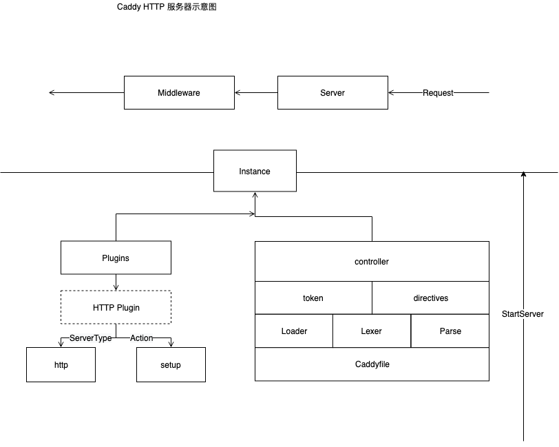
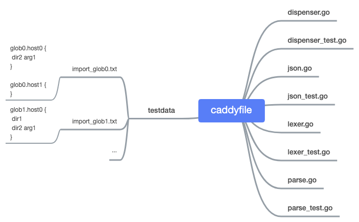
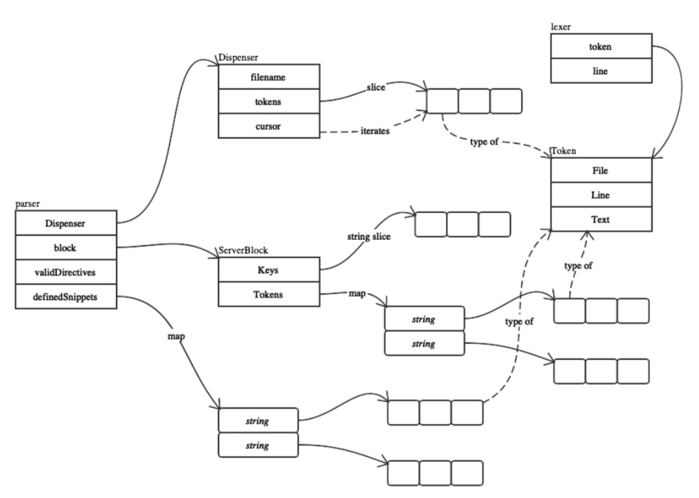

--- 
layout: category-post
title:  "Welcome to blog!"
date:   2016-08-05 20:20:56 -0400
categories: writing
---

\## Preview
前文提到了 Caddy 的启动流程 和 Run 函数，现在我们顺着启动流程的第一步，读取 Caddyfile 的 源码阅读开始。

\## Loader

\### 概念
可以理解为读取器。

在 caddy 中 由 \`Loader\` 执行 装载 配置文件的职能。看一下它的工作流程。

这个图来源于 [plugin.go](https://sourcegraph.com/github.com/caddyserver/caddy/-/blob/plugins.go#L404:6) 文件

\### 
可以看到这里通过 \`Loader\` 解耦了 caddyfile 文件的读取，所以把它放在了 plugin.go 文件中，作为一个插件注册在 caddy app 中。

\- 可以多定义 caddyfileloader 在图中由三个长方形的表示为数组
\- 自定义的 caddyfileloader 会实现 右半部分的 Loader 接口
\- caddyfileloader 会有对应读取的 ServerType 的 name
\- 最后生产出的是 Input

下面我们看它的实现

\### 保存
在 \`plugin.go\` 中有一个全局变量保存
\`\`\`go
// caddyfileLoaders is the list of all Caddyfile loaders
// in registration order.
caddyfileLoaders []caddyfileLoader
\`\`\`

\### 设计
我们看这个接口
\`\`\`go
type Loader interface {
 Load(serverType string) (Input, error)
}
\`\`\`
这是用来 load  caddyfile 的 你可以为自己的所有独有的 server 自定义读取 caddyfile 的方式

\### Usage
我们自定义的时候，只需要实现一个  LoaderFunc 即可。因为它使用了 类似 http.HandlerFunc 的模式，帮你自动实现了上文所说的 Loader 接口
\`\`\`go
// LoaderFunc is a convenience type similar to http.HandlerFunc
// that allows you to use a plain function as a Load() method.
type LoaderFunc func(serverType string) (Input, error)

// Load loads a Caddyfile.
func (lf LoaderFunc) Load(serverType string) (Input, error) {
 return lf(serverType)
}
\`\`\`

\### 扩展
两个方法，

1\. 可以注册新的 Loader
1\. 或者设置为默认的 Loader
\`\`\`go
// RegisterCaddyfileLoader registers loader named name.
func RegisterCaddyfileLoader(name string, loader Loader) {
 caddyfileLoaders = append(caddyfileLoaders, caddyfileLoader{name: name, loader: loader})
}

// SetDefaultCaddyfileLoader registers loader by name
// as the default Caddyfile loader if no others produce
// a Caddyfile. If another Caddyfile loader has already
// been set as the default, this replaces it.
//
// Do not call RegisterCaddyfileLoader on the same
// loader; that would be redundant.
func SetDefaultCaddyfileLoader(name string, loader Loader) {
 defaultCaddyfileLoader = caddyfileLoader{name: name, loader: loader}
}
\`\`\`

\### Logic
\`\`\`go
// loadCaddyfileInput iterates the registered Caddyfile loaders
// and, if needed, calls the default loader, to load a Caddyfile.
// It is an error if any of the loaders return an error or if
// more than one loader returns a Caddyfile.
func loadCaddyfileInput(serverType string) (Input, error) {
 var loadedBy string
 var caddyfileToUse Input
 for \_, l := range caddyfileLoaders {
 cdyfile, err := l.loader.Load(serverType)
 if err != nil {
 return nil, fmt.Errorf("loading Caddyfile via %s: %v", l.name, err)
 }
 if cdyfile != nil {
 if caddyfileToUse != nil {
 return nil, fmt.Errorf("Caddyfile loaded multiple times; first by %s, then by %s", loadedBy, l.name)
 }
 loaderUsed = l
 caddyfileToUse = cdyfile
 loadedBy = l.name
 }
 }
 if caddyfileToUse == nil && defaultCaddyfileLoader.loader != nil {
 cdyfile, err := defaultCaddyfileLoader.loader.Load(serverType)
 if err != nil {
 return nil, err
 }
 if cdyfile != nil {
 loaderUsed = defaultCaddyfileLoader
 caddyfileToUse = cdyfile
 }
 }
 return caddyfileToUse, nil
}
\`\`\`
很轻松的看到，装载 caddyfile 的逻辑 是尝试调用 所有的 Loader 并且重复装载会报错。

如果尝试过之后装载失败，则使用 默认的 defaultCaddyfileLoader

这里可以看到最终流程是 \`caddyfile\` -> \`caddy.Input\` 那么这个 [\`Input\`](https://sourcegraph.com/github.com/caddyserver/caddy/-/blob/caddy.go#L979:6) 是什么呢？

实际上 \`Input\` 就是 caddyfile 在代码中的映射。可以理解为，caddyfile 转化为了 \`Input\` 给 caddy 读取。

谁来读取它呢？

那么干活的主角登场啦！

\## [Parser](https://sourcegraph.com/github.com/caddyserver/caddy/-/blob/caddyfile/parse.go)

\### 文件结构

我们想看到各个流程中的 \`Token\` 是如何被分析出来的,需要知道，这里的 \`Token\` 代表着 caddyfile 中的每行选项配置

\### lexer.go
一个实用工具，它可以从 \`Reader\`获取一个\`token\`接一个\`token\`的值。通过 \`next()\`函数

\`token\` 是一个单词，\`token\`由空格分隔。如果一个单词包含空格，可以用引号括起来。

即 \`lexer\` 用来做 \`caddyfile\` 的语法分析 被其他程序调用

\#### 词法分析
[\`next()\`](https://sourcegraph.com/github.com/caddyserver/caddy/-/blob/caddyfile/lexer.go#L73:17)函数就是 lexer 用来提供功能的函数
\`\`\`go
// next loads the next token into the lexer.
// A token is delimited by whitespace, unless
// the token starts with a quotes character (")
// in which case the token goes until the closing
// quotes (the enclosing quotes are not included).
// Inside quoted strings, quotes may be escaped
// with a preceding \ character. No other chars
// may be escaped. The rest of the line is skipped
// if a "#" character is read in. Returns true if
// a token was loaded; false otherwise.
func (l \*lexer) next() bool {
 var val []rune
 var comment, quoted, escaped bool

 makeToken := func() bool {
 l.token.Text = string(val)
 return true
 }

 for {
 ch, \_, err := l.reader.ReadRune()
 if err != nil {
 if len(val) > 0 {
 return makeToken()
 }
 if err == io.EOF {
 return false
 }
 panic(err)
 }

 if quoted {
 if !escaped {
 if ch == '\\\' {
 escaped = true
 continue
 } else if ch == '"' {
 quoted = false
 return makeToken()
 }
 }
 if ch == '\\n' {
 l.line++
 }
 if escaped {
 // only escape quotes
 if ch != '"' {
 val = append(val, '\\\')
 }
 }
 val = append(val, ch)
 escaped = false
 continue
 }

 if unicode.IsSpace(ch) {
 if ch == '\\r' {
 continue
 }
 if ch == '\\n' {
 l.line++
 comment = false
 }
 if len(val) > 0 {
 return makeToken()
 }
 continue
 }

 if ch == '#' {
 comment = true
 }

 if comment {
 continue
 }

 if len(val) == 0 {
 l.token = Token{Line: l.line}
 if ch == '"' {
 quoted = true
 continue
 }
 }

 val = append(val, ch)
 }
}
\`\`\`

他会根据 caddyfile 定义的写法，进行多种判断来实现分词

理解了 \`next\` 函数，就很容易知道如何分析一块选项的 \`token\` 了，不过都是 \`next()\` 的包装函数罢了。

这就是 lexer.go 中的解读，接下来我们看 parse.go

\### Parser.go

\#### serverBlock
实际上， ServerBlock 存储的是 一组 token 信息，
\`\`\`go
//ServerBlock associates any number of keys
//(usually addresses of some sort) with tokens
//(grouped by directive name).
type ServerBlock struct {
 Keys []string
 Tokens map[string][]Token
}
\`\`\`

它包含的 Token 正是 Parser 在 Caddyfile 中得来的。

context 还负责生成 caddy 管理的 Server，用来提供供 caddy Start 的信息

注意：这里的 Server 是 TCPServer 和 UDPServer，用来 Listen 等操作的。

\##### parse
在 parser.go 中，由 Parse 函数进行生成 ServerBlock 的操作。
\`\`\`go
// Parse parses the input just enough to group tokens, in
// order, by server block. No further parsing is performed.
// Server blocks are returned in the order in which they appear.
// Directives that do not appear in validDirectives will cause
// an error. If you do not want to check for valid directives,
// pass in nil instead.
func Parse(filename string, input io.Reader, validDirectives []string) ([]ServerBlock, error) {
 p := parser{Dispenser: NewDispenser(filename, input), validDirectives: validDirectives}
 return p.parseAll()
}
\`\`\`
这里使用的 Dispenser ，是令牌分发器，我们下面马上讨论

\#### allTokens
在 praser.go 中使用 allTokens 进行 lexer 分词生成 token
\`\`\`go
// allTokens lexes the entire input, but does not parse it.
// It returns all the tokens from the input, unstructured
// and in order.
func allTokens(input io.Reader) ([]Token, error) {
 l := new(lexer)
 err := l.load(input)
 if err != nil {
 return nil, err
 }
 var tokens []Token
 for l.next() {
 tokens = append(tokens, l.token)
 }
 return tokens, nil
}
\`\`\`

\## Dispenser
\`allTokens\` 会在 新建 \`Dispenser\` 的时候调用
\`\`\`go
// NewDispenser returns a Dispenser, ready to use for parsing the given input.
func NewDispenser(filename string, input io.Reader) Dispenser {
 tokens, \_ := allTokens(input) // ignoring error because nothing to do with it
 return Dispenser{
 filename: filename,
 tokens: tokens,
 cursor: -1,
 }
}
\`\`\`

如此，整个解析流程就串起来了， \`lexer\` 负责词法分析，\`Parse\` 用于将一组 \`tokens\` 分类（因为很多的插件的设置稍微复杂一些），\`Dispenser\` 负责分析去的 \`tokens\` 令牌消费

我们看一下纵览

\### 
\`Dispenser\` 的关键是 把不同的 \`tokens\` 转换成 \`Directives\` 命令来执行

 \`dispenser\` 中由 \`cursor\` 来进行 \`Token\` 数组中的迭代

关键在于移动 \`cursor\` 索引的函数

需要注意到的是 \`Dispenser\` 中的函数实际上都是 获取 \`tokens\` 的函数，意思是，在 \`Dispenser\` 中不会做任何配置，而是在相应的 controller.go ，caddy.go 中使用

请看下集，Plugin 的逻辑和相应的配置如何更改