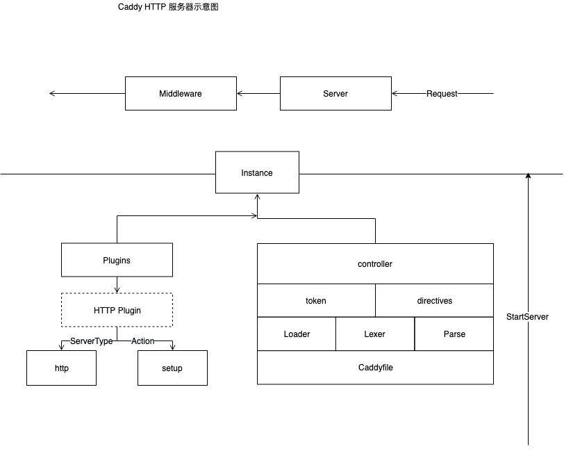
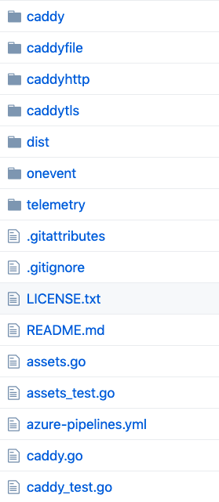
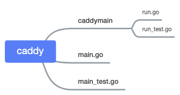
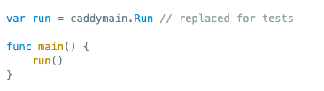
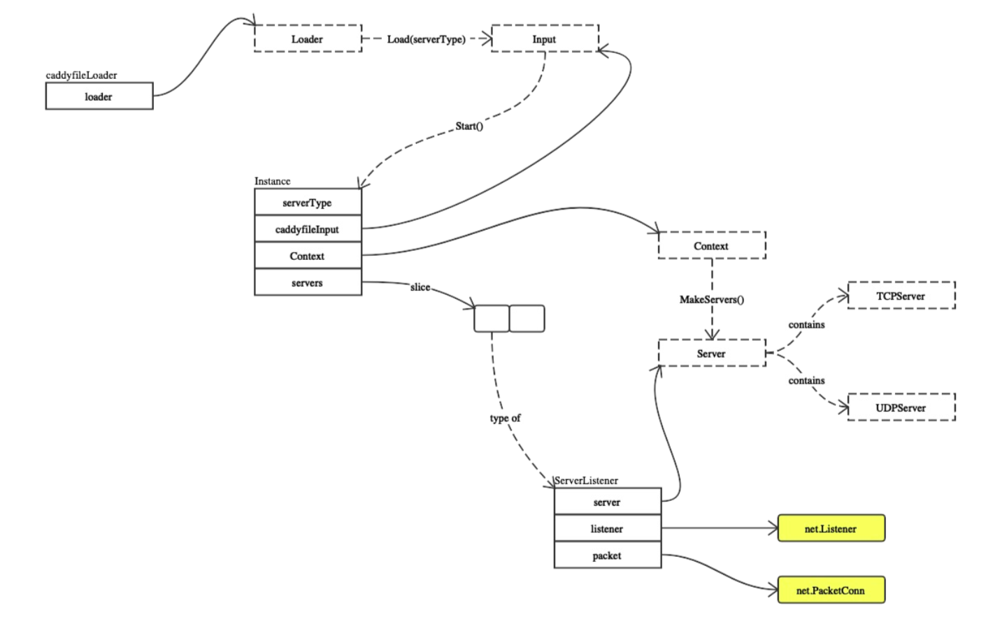
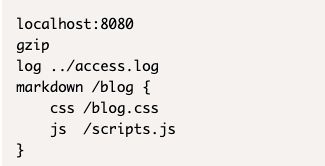
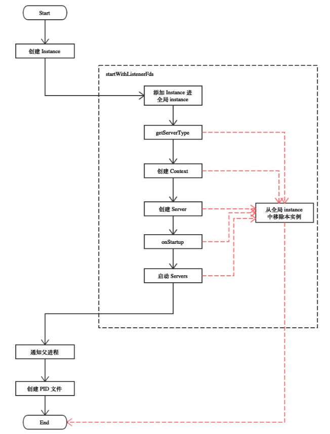

\## Preface
Caddy 是 Go 语言构建的轻量配置化服务器。[https://github.com/caddyserver/caddy](https://github.com/caddyserver/caddy)

Caddy 整个软件可以说是由不同的 插件 堆砌起来的。自己本身仅提供 Plugin 的注册运行逻辑和 Server 的监听服务功能。

学习 caddy 的源码，实际上是学习 如何构建一个 松耦合的 抽象 Plugin 设计，即模块化插拔的做法。

所以我们的源码阅读，围绕 Caddy 为 Plugin 提供的基础设施，和 Plugin 自身逻辑。

下面我们从第一步，启动流程开始阅读。

之后的路径应该是  Caddyfile 的解析，解析出的 配置文件如何消费，配置完成的服务器如何服务。

\## Overview

\### Package
这是 caddy 包的结构

\#### main.go
一切的开始  ---

我们查看 在 caddy 文件夹下的 main.go 函数。

这是 上图 caddy 文件夹下的目录结构。

其中 run.go 我们在[上一篇文章](https://www.yuque.com/abser/process/ntyfkv)阅读完成

\#### main.go 的 Trick
在 caddy 文件夹中的 main 函数启动 caddy 服务器。实际运行的是 run.go 中的文件，这是方便测试使用

看 [main.go ](https://sourcegraph.com/github.com/caddyserver/caddy/-/blob/caddy/main.go#L24:11)的代码

通过改变 run 变量的值来方便测试，可以学习一下。

\## 启动流程
启动 caddy 的流程

 \`caddyfileLoader\` 加载 caddyfile 配置  =》生成 Input 信息

\`Context\` =》 生成 Server

\#### caddyfile 示例
\`caddyfile\` 简单示例：

\`Instance\` 是运行操作的 Server 实例，可以看到几个主要的操作都是在他身上

\`Server\` 两种监听模式 \`TCP\` \`UDP\`

我们首先关心的是 \`Start()\` 启动服务器。

\### 启动服务器
发送 StartupEvent, 参照下文中 [Event](#TuRNA) 理解
\`\`\`go
// Executes Startup events
caddy.EmitEvent(caddy.StartupEvent, nil)
\`\`\`

读取配置文件：参照我的接下来的文章 [Caddy-解析Caddyfile](https://www.yuque.com/abser/process/nz1nga)
\`\`\`go
caddyfileinput, err := caddy.LoadCaddyfile(serverType)
\`\`\`

启动：
\`\`\`go
instance, err := caddy.Start(caddyfileinput)
\`\`\`

发送 InstanceStartupEvent
\`\`\`go
caddy.EmitEvent(caddy.InstanceStartupEvent, instance）
\`\`\`

\### Start（）
\`\`\`go
// Start your engines
instance, err := caddy.Start(caddyfileinput)
if err != nil {
 mustLogFatalf("%v", err)
}
\`\`\`

阅读完代码，画一张图帮助理解

这里除了 \`Instance\` 之外还有两个新名词

 \`Controller\`：它是用来帮助 \`Directives\` 设置它自身的，通过读取 \`Token\`，这里的 \`Directives\` 实际上对应的就是上文所说的 caddyfile 中的配置文件选项。

\> 这一点请参照 [Caddy（三）](https://www.yuque.com/abser/process/nz1nga)中 \`Loader\` 下的 \`excuteDirective\` 理解。

 \`Token\` ：是 caddy 自己的 词法分析器 解析 caddyfile 配置文件出的选项的标记。

\> 这一点请[Caddy（三）](https://www.yuque.com/abser/process/nz1nga)中 \`Loader\` 中的 Parser 理解

我们来看顺序，第一遍从顶向下看。

第一个是 \`Input\`，这是 \`caddyfile\` 的变量结构，他可以通过 \`Start（）\`方法新建实例 \`Instance\`

\`Instance\` 通过从 \`caddyfile\` 读取到信息的 \`Input\` 生成 \`Context\`

携带信息的 \`Context\` 承担 新建 \`Server\` 的任务

\`Context\` 读取 \`caddyfile\` 解析出的 \`ServerBlock\` 配置服务器

\`ServerBlock\` 包含 不同的 \`Tokens\` 他们会转换为 \`Directive\`

\`Directive\` 会被 \`Controller\` 消费，用于配置插件 安装到服务器上

值得注意的是 \`Controller\`  更改的是 \`Instance\`

对于 \`http\` 服务器来说还会增加 \`http\` 服务的中间件

如果不理解，首先记住 caddy 是 \*\*配置的 \*\*模块化的服务器，

通过 \`caddyfile\` 配置 -> \`caddyfile\`

读取它 -\> \`Loader\`

解析配置目标-\> \`token\` & \`directives\`

进行配置 -\> \`controller\` & \`setup\`

启动 -\> \`instance\` & \`Start()\`

记住这个流程就能理解了。

\## Event 事件通知启动插件

\## 

\#### 引入
我们看到，在 caddy 的 run.go 中有一行代码是
\`\`\`go
caddy.EmitEvent(caddy.StartupEvent, nil)
\`\`\`
这就是 caddy 中的 事件通知系统，通知的是所有的 plugin。

\#### 变量
在 [caddy/plugin.go](https://sourcegraph.com/github.com/caddyserver/caddy@ed4c2775e46b924d4851e04cc281633b1b2c15af/-/blob/plugins.go#L42) 包中
\`\`\`go
// eventHooks is a map of hook name to Hook. All hooks plugins
// must have a name.
eventHooks = &sync.Map{}
\`\`\`
是一个保存所有 plugin hook 的 sync.Map{}

这个标准包的 Map 是并发安全的， 通常我们使用 Load() 或者 LoadOrStore() 方法存读信息，Range() 方法遍历，如果你需要，可以引入你的 Go 程序中。

\#### Logic
看内在实现
\`\`\`go
// EmitEvent executes the different hooks passing the EventType as an
// argument. This is a blocking function. Hook developers should
// use 'go' keyword if they don't want to block Caddy.
func EmitEvent(event EventName, info interface{}) {
 eventHooks.Range(func(k, v interface{}) bool {
 err := v.(EventHook)(event, info)
 if err != nil {
 log.Printf("error on '%s' hook: %v", k.(string), err)
 }
 return true
 })
}
\`\`\`

很简单，上文提过，eventHooks.Range 是遍历信息，会遍历所有保存的 EventHook 函数并运行。

那么 Plugin 想使用接收某一个事件通知做相应操作的时候，只需把自己的 EventHook 函数注册到这个 map 中
\`\`\`go
// eventHooks is a map of hook name to Hook. All hooks plugins
// must have a name.
eventHooks = &sync.Map{}
\`\`\`
使用 \`RegisterEventHook\` 注册

 \`type EventHook func(eventType EventName, eventInfo interface{}) error\`
\`\`\`go
// RegisterEventHook plugs in hook. All the hooks should register themselves
// and they must have a name.
func RegisterEventHook(name string, hook EventHook) {
 if name == "" {
 panic("event hook must have a name")
 }
 \_, dup := eventHooks.LoadOrStore(name, hook)
 if dup {
 panic("hook named " + name + " already registered")
 }
}
\`\`\`

那么可以监听哪些事件呢？在 Plugin 中有定义常量
\`\`\`go
// Define names for the various events
const (
 StartupEvent EventName = "startup"
 ShutdownEvent = "shutdown"
 CertRenewEvent = "certrenew"
 InstanceStartupEvent = "instancestartup"
 InstanceRestartEvent = "instancerestart"
)
\`\`\`
启动，关闭，刷新证书，这里提到的 Instance 是 caddy 中的 Server 实例

\### 结语
我们概览了 caddy 的 run 和 Start 启动流程，接下来我们会继续深入了解 Caddy 每个部分流程。

\-\-\-

\###                                         