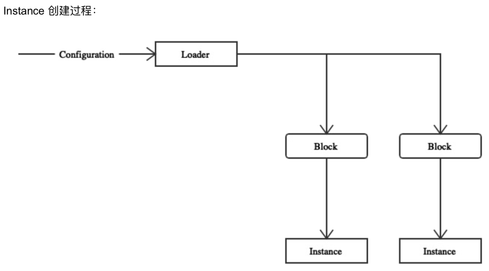

--- 
layout: category-post
title:  "Welcome to blog!"
date:   2016-08-05 20:20:56 -0400
categories: writing
---

\## Preview
我们已经了解了 Caddy 的整个建立流程，这一次我们来了解关于 Caddy 服务的执行者， Instance 和 Server。

Caddy 中 Server 的定义是接口，只要 满足 Server 的接口的行为，你可以任意扩展你自己的 Caddy 程序。

而 Instance 是执行服务的实例。

\## Server
在 caddy.go 中定义着 \`Server\` 的接口，同时实现了优雅的退出。我们首先看图了解组织结构

\## 
简单看一下 \`Stopper\` 的接口
\`\`\`go
// Stopper is a type that can stop serving. The stop
// does not necessarily have to be graceful.
type Stopper interface {
 // Stop stops the server. It blocks until the
 // server is completely stopped.
 Stop() error
}
\`\`\`

[\`GracefulServer\`](https://sourcegraph.com/github.com/caddyserver/caddy/-/blob/caddy.go#L345:6) 包含 \`Stopper\` 的接口实现了优雅退出，这是拦截了 系统 signal 的信号之后执行的结果，意在意外中断的时候保存好需要保存的东西。

它同时包含着 WrapListener 函数。可以看出，他用来做中间件。
\`\`\`go
 // WrapListener wraps a listener with the
 // listener middlewares configured for this
 // server, if any.
 WrapListener(net.Listener) net.Listener
\`\`\`

\## ServerType
上文看到，caddyfile 的 Loader 是针对 不同的 serverType 的，例如 HTTP。

当没有 caddyfile 可以 Load 的时候，对于一个 ServerType 也有一个默认的方法 \`DefaultInput\`进行调用，让你的程序更健壮。
\`\`\`go
// ServerType contains information about a server type.
type ServerType struct {
 // Function that returns the list of directives, in
 // execution order, that are valid for this server
 // type. Directives should be one word if possible
 // and lower-cased.
 Directives func() []string

 // DefaultInput returns a default config input if none
 // is otherwise loaded. This is optional, but highly
 // recommended, otherwise a blank Caddyfile will be
 // used.
 DefaultInput func() Input

 // The function that produces a new server type context.
 // This will be called when a new Caddyfile is being
 // loaded, parsed, and executed independently of any
 // startup phases before this one. It's a way to keep
 // each set of server instances separate and to reduce
 // the amount of global state you need.
 NewContext func(inst \*Instance) Context
}
\`\`\`

\#### 保存
有一个全局变量维护有的 ServerType
\`\`\`go
 // serverTypes is a map of registered server types.
 serverTypes = make(map[string]ServerType)
\`\`\`

\#### usage
使用 RegisterServerType 注册
\`\`\`go
// RegisterServerType registers a server type srv by its
// name, typeName.
func RegisterServerType(typeName string, srv ServerType) {
 if \_, ok := serverTypes[typeName]; ok {
 panic("server type already registered")
 }
 serverTypes[typeName] = srv
}
\`\`\`

\### Directives
前文提过该概念，这是在 caddy 中的概念，和 token 对应，

Loader 和 Parser 会通过 caddyfile 生产 token ，

通过读取 token 对应相应的 plugin 的 directive ，用来配置 plugin 。

值得注意的是，他是交给 controller 来配置的，可在上一篇文章详细了解

controller 会调用 plugin 结构中的 Action 字段，

Action 是一个 SetupFunc 类型
\`\`\`go
// SetupFunc is used to set up a plugin, or in other words,
// execute a directive. It will be called once per key for
// each server block it appears in.
type SetupFunc func(c \*Controller) error
\`\`\`

在 Plugin.go 中有  DirectiveAction 来通过 directive 调用 action
\`\`\`go
// DirectiveAction gets the action for directive dir of
// server type serverType.
func DirectiveAction(serverType, dir string) (SetupFunc, error) {
 if stypePlugins, ok := plugins[serverType]; ok {
 if plugin, ok := stypePlugins[dir]; ok {
 return plugin.Action, nil
 }
 }
 if genericPlugins, ok := plugins[""]; ok {
 if plugin, ok := genericPlugins[dir]; ok {
 return plugin.Action, nil
 }
 }
 return nil, fmt.Errorf("no action found for directive '%s' with server type '%s' (missing a plugin?)",
 dir, serverType)
}
\`\`\`
最后看到不同 serverType 生成不同的 server

另外可以看到 这里最重要的 \`Instance\` 下面我们进一步查看 \`Instance\` 的代码

\## Instance
instance 是 Server 用来执行操作的实体。首先来看他的结构。它的代码在 主文件夹中的 [caddy.go](https://sourcegraph.com/github.com/caddyserver/caddy/-/blob/caddy.go) 中

首先我们看一下 它的结构了解下它可能有的功能

\#### [struct](https://sourcegraph.com/github.com/caddyserver/caddy/-/blob/caddy.go#L93)
\`\`\`go
type Instance struct {
 serverType string
 caddyfileInput Input
 wg \*sync.WaitGroup
 context Context
 servers []ServerListener
 OnFirstStartup []func() error // starting, not as part of a restart
 OnStartup []func() error // starting, even as part of a restart
 OnRestart []func() error // before restart commences
 OnRestartFailed []func() error // if restart failed
 OnShutdown []func() error // stopping, even as part of a restart
 OnFinalShutdown []func() error // stopping, not as part of a restart
 Storage map[interface{}]interface{}
 StorageMu sync.RWMutex
}
\`\`\`

\##### \`serverType\` 代表这个实例的服务器类型，通常是 HTTP

\##### \`caddyfileInput\` 是 \`Input\` 类型，通常我们配置 caddy 服务器的时候，就是通过编辑 caddyfileInput 的文本实现的修改配置行动。值得注意的是，生成 \`Instance\` 的参数同样是 caddyfile，这里的 caddyfile 在程序中是一个接口，一会儿继续讲解

\##### \`wg\` 是用来等待所有 \`servers\` 执行他们操作的信号量。

\##### \`context\` 是实例 \`Instance\`的上下文，其中包含 \`serverType\` 信息和服务器配置管理状态的信息。

\##### \`servers\` 是一组 \`server\` 和 他们的 \`listeners\`，两种 Server TCP/UDP，即 \`serverType\` ，两种不同的 \`serverType\` 会对应不同的 \`caddyfile\`中的选项。

\##### \`OnXXX\` 等 6 个函数是一系列回调函数，通过名字能够看出在什么时候回调触发。

\##### \`Storage\` 是存储数据的地方，本来可以设计在 全局状态中，但是设计在这里更好，考虑到垃圾回收机制，进程中重新加载时，旧的 Instance be destroyed 之后，会变成垃圾，收集。这和 [12-factor 中的 第九条 Disposability](https://12factor.net/disposability) 相符合。意思是每一次重载实例 Instance 即使是在进程中重载，也不会出现数据相互影响到情况，保持[幂等](https://www.google.com/search?q=%E4%BB%80%E4%B9%88%E6%98%AF%E5%B9%82%E7%AD%89&oq=%E4%BB%80%E4%B9%88%E6%98%AF%E5%B9%82%E7%AD%89&aqs=chrome..69i57.3848j0j7&sourceid=chrome&ie=UTF-8)。

虽然 Instance 操作着众多操作，但是我们却不是从它讲起，我们已经了解了 Instance 的整个建立，渐渐了解 Instance 能调用的函数，自然 Instance 的功能就清晰了。

上面的 Instance 结构非常简单，各个字段的功能也很明晰，下面我们看涉及到 建立服务器的 Context 字段和结构

\## Context
Context 看源码可以知道，他是用来创建 Server 的。
\`\`\`bash
// Context is a type which carries a server type through
// the load and setup phase; it maintains the state
// between loading the Caddyfile, then executing its
// directives, then making the servers for Caddy to
// manage. Typically, such state involves configuration
// structs, etc.
type Context interface {
 // Called after the Caddyfile is parsed into server
 // blocks but before the directives are executed,
 // this method gives you an opportunity to inspect
 // the server blocks and prepare for the execution
 // of directives. Return the server blocks (which
 // you may modify, if desired) and an error, if any.
 // The first argument is the name or path to the
 // configuration file (Caddyfile).
 //
 // This function can be a no-op and simply return its
 // input if there is nothing to do here.
 InspectServerBlocks(string, []caddyfile.ServerBlock) ([]caddyfile.ServerBlock, error)

 // This is what Caddy calls to make server instances.
 // By this time, all directives have been executed and,
 // presumably, the context has enough state to produce
 // server instances for Caddy to start.
 MakeServers() ([]Server, error)
}
\`\`\`

他在 Caddy.go 中 被 \`startWithListenerFds(cdyfile Input, inst \*Instance, restartFds map[string]restartTriple) error\` 调用

用来创建服务器们
\`\`\`bash
slist, err := inst.context.MakeServers()
\`\`\`

\-\-\-

                        