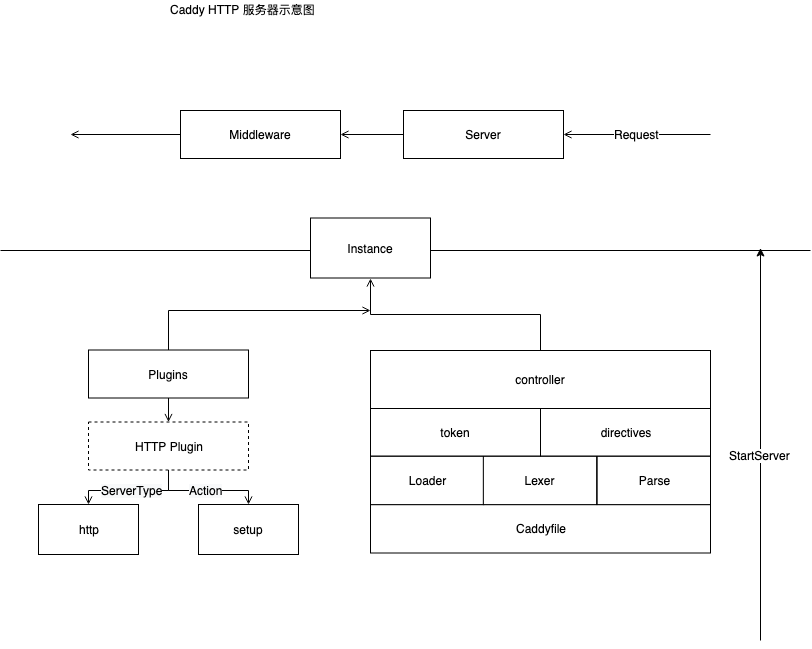
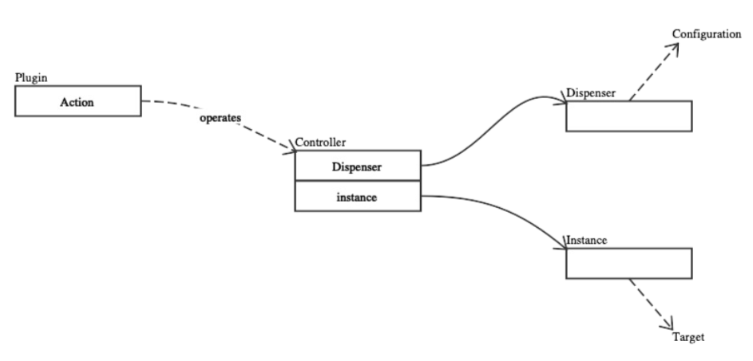

--- 
layout: category-post
title:  "Welcome to blog!"
date:   2016-08-05 20:20:56 -0400
categories: writing
---

\## Preview
[Caddy](https://github.com/caddyserver/caddy)

在日常软件开发中，Controller 是 MVC 的 逻辑处理部分，在 Caddy 中，它意味这 Plugin 的安装逻辑。

Caddy 自身提供了一个 总的可扩展的房子一样的框架，Controller 把不同的 Plugin 像积木一样搭建成一个服务器程序提供服务。

\## Context

前文提到， Caddyfile 通过 Loader ，lexer 等进行读取。

读取出来的 \`token\` \`directives\` 最终是用来配置 Plugin 的，

在本文中会详细探索 Plugin 如何读取配置安装，Controller 是完成这一行为的执行者。

同时探索 Plugin 的设计是如何解耦 Caddy 的 Plugin 开发者和 Caddy 的 maintainer 的。

\## Plugin 插件的巧妙设计解耦扩展

\### 变量
在 \`caddy/plugin.go \`中保存着整个 caddy 的插件，当使用插件的时候，导入某个插件包即可。在包里的 init 函数会帮助你注册好 插件
\`\`\`go
// plugins is a map of server type to map of plugin name to
// Plugin. These are the "general" plugins that may or may
// not be associated with a specific server type. If it's
// applicable to multiple server types or the server type is
// irrelevant, the key is empty string (""). But all plugins
// must have a name.
plugins = make(map[string]map[string]Plugin)
\`\`\`
这里使用的 两层 map 第一层是 ServerType 的 name ，第二层是 plugin 的名字，如果第一个为空，说明这个插件所有的 ServerType 都可以使用

\### 注册
使用 caddy.RegisterPlugin() 注册，dup 是 duplicate 的简写
\`\`\`go
// RegisterPlugin plugs in plugin. All plugins should register
// themselves, even if they do not perform an action associated
// with a directive. It is important for the process to know
// which plugins are available.
//
// The plugin MUST have a name: lower case and one word.
// If this plugin has an action, it must be the name of
// the directive that invokes it. A name is always required
// and must be unique for the server type.
func RegisterPlugin(name string, plugin Plugin) {
 if name == "" {
 panic("plugin must have a name")
 }
 if \_, ok := plugins[plugin.ServerType]; !ok {
 plugins[plugin.ServerType] = make(map[string]Plugin)
 }
 if \_, dup := plugins[plugin.ServerType][name]; dup {
 panic("plugin named " + name + " already registered for server type " + plugin.ServerType)
 }
 plugins[plugin.ServerType][name] = plugin
}
\`\`\`

\## 实现
逻辑解耦使得我们实现 Plugin 只需要关注如何将我们的 Plugin 注册到 Caddy Server 中了。

如何实现 一个 \`Plugin\` 呢

\### Overview
这里概览了 \`Plugin\` 是如何注册的。

\### 
可以在这里看到我们之前讲解的很多的熟悉的概念，这是因为我们快要读完 caddy 的架构了，剩下的是具体的 \`Plugin\` 的各种扩展实现了。

可以看到，\`Plugin\` 是注册在不同的 服务器类型 \`serverType\` 下的，是在两重 map 映射的结构中，图中可以看出，然后是 \`Action\` ，最近的上文才说明了它，用它来进行 \`Plugin\` 的安装。

然后来到 \`Controller\` ，实际进行配置的家伙，看到了之前所说的 \`Dispenser\` 和 \`Token\` 配置

还记得吗，他们在刚才的词法分析里才出现过。

你会注意到，在目录中有一个 叫 \`caddyhttp\` 的文件夹中的文件夹特别多，

这就是 一系列 \`http\` 服务器 的 \`Plugin\` 实现

接下来我们看一个 \`HTTP\` 的 \`Plugin\` 的例子 \`errors\` 的实现

\### caddyHTTP

\#### errors

\##### overview
这里我们从下看，[caddy.Listener](https://sourcegraph.com/github.com/caddyserver/caddy/-/blob/caddy.go#L367:15) 定义在 caddy.go 中，用来支持 零停机时间加载。

往上看到 Middleware 调用，我们来看看 errorsHandle 的结构
\`\`\`go
// ErrorHandler handles HTTP errors (and errors from other middleware).
type ErrorHandler struct {
 Next httpserver.Handler
 GenericErrorPage string // default error page filename
 ErrorPages map[int]string // map of status code to filename
 Log \*httpserver.Logger
 Debug bool // if true, errors are written out to client rather than to a log
}
\`\`\`
可以看到，Next 字段明显是 Chain 调用的下一个 Handler 处理。事实上，每一个 Plugin 或者算是 HTTP 服务中的中间件都有这个字段用于 构建链式调用。

每一个 Plugin 值得注意的两个，

一个是他们会实现 ServeHTTP 接口进行 HTTP 请求处理。
\`\`\`go
func (h ErrorHandler) ServeHTTP(w http.ResponseWriter, r \*http.Request) (int, error) {
 defer h.recovery(w, r)

 status, err := h.Next.ServeHTTP(w, r)

 if err != nil {
 errMsg := fmt.Sprintf("%s [ERROR %d %s] %v", time.Now().Format(timeFormat), status, r.URL.Path, err)
 if h.Debug {
 // Write error to response instead of to log
 w.Header().Set("Content-Type", "text/plain; charset=utf-8")
 w.WriteHeader(status)
 fmt.Fprintln(w, errMsg)
 return 0, err // returning 0 signals that a response has been written
 }
 h.Log.Println(errMsg)
 }

 if status >= 400 {
 h.errorPage(w, r, status)
 return 0, err
 }

 return status, err
}
\`\`\`

另一个是安装到 caddy 中的 [setup.go](https://sourcegraph.com/github.com/caddyserver/caddy/-/blob/caddyhttp/errors/setup.go) 文件，我们看一下 Plugin 安装的全流程。

\### Directives
前面提到过很多次 Directives 这里做一个它的整个流程概览。上文中提到，这些注册都是 Controller 执行的。下半部分是 关于 HTTP 的服务配置

重点在 errors.serup() ，可以看到，它创建了 errors.ErrHandler 并注册到了 httpserver 的一对中间件中
\`\`\`go
// setup configures a new errors middleware instance.
func setup(c \*caddy.Controller) error {
 handler, err := errorsParse(c)
 ···
 httpserver.GetConfig(c).AddMiddleware(func(next httpserver.Handler) httpserver.Handler {
 handler.Next = next
 return handler
 })
 return nil
}
\`\`\`

这里还有一个关于 caddy.Controller 到 ErrorHandler 的一个转换 通过 [errorsParse](https://sourcegraph.com/github.com/caddyserver/caddy/-/blob/caddyhttp/errors/setup.go#L52:1) 函数

\#### DirectiveAction

\### 
Plugin 通过 Controller 来实现 配置自己的 Action 的
\`\`\`go
// DirectiveAction gets the action for directive dir of
// server type serverType.
func DirectiveAction(serverType, dir string) (SetupFunc, error) {
 if stypePlugins, ok := plugins[serverType]; ok {
 if plugin, ok := stypePlugins[dir]; ok {
 return plugin.Action, nil
 }
 }
 if genericPlugins, ok := plugins[""]; ok {
 if plugin, ok := genericPlugins[dir]; ok {
 return plugin.Action, nil
 }
 }
 return nil, fmt.Errorf("no action found for directive '%s' with server type '%s' (missing a plugin?)",
 dir, serverType)
}
\`\`\`

了解完这些，我们注意到有一个 叫做 \`Action\` 的东西，它又是怎么来的？别急，他就在 \`Plugin\` 包中。我们知道了。

配置文件是配置各种 \`plugin\` 作为插件安装在 caddy 服务器上，而 caddyfile 正是被转化为了 \`Token\`，

\`Dispenser\` 分发读取到的配置，即不同的插件安装。那么 \`Action\` 就是 \`Plugin\` 的 \`SetupFunc\`啦，来看看吧。

\#### [excuteDirective](https://sourcegraph.com/github.com/caddyserver/caddy/-/blob/caddy.go#L624:6)
excuteDirective 函数就是所以指令消耗的核心。他以正确的顺序执行指令 Directive。 会调用 DirectiveAciton 来通过 Controller 执行。

需要顺序是为了执行回调函数。下面会讲到他 ParsingCallback
\`\`\`go
func executeDirectives(inst \*Instance, filename string,
 directives []string, sblocks []caddyfile.ServerBlock, justValidate bool) error {
 // map of server block ID to map of directive name to whatever.
 storages := make(map[int]map[string]interface{})

 // It is crucial that directives are executed in the proper order.
 // We loop with the directives on the outer loop so we execute
 // a directive for all server blocks before going to the next directive.
 // This is important mainly due to the parsing callbacks (below).
 for \_, dir := range directives {
 for i, sb := range sblocks {
 var once sync.Once
 if \_, ok := storages[i]; !ok {
 storages[i] = make(map[string]interface{})
 }

 for j, key := range sb.Keys {
 // Execute directive if it is in the server block
 if tokens, ok := sb.Tokens[dir]; ok {
 controller := &Controller{
 instance: inst,
 Key: key,
 Dispenser: caddyfile.NewDispenserTokens(filename, tokens),
 OncePerServerBlock: func(f func() error) error {
 var err error
 once.Do(func() {
 err = f()
 })
 return err
 },
 ServerBlockIndex: i,
 ServerBlockKeyIndex: j,
 ServerBlockKeys: sb.Keys,
 ServerBlockStorage: storages[i][dir],
 }

 setup, err := DirectiveAction(inst.serverType, dir)
 if err != nil {
 return err
 }

 err = setup(controller)
 if err != nil {
 return err
 }

 storages[i][dir] = controller.ServerBlockStorage // persist for this server block
 }
 }
 }

 if !justValidate {
 // See if there are any callbacks to execute after this directive
 if allCallbacks, ok := parsingCallbacks[inst.serverType]; ok {
 callbacks := allCallbacks[dir]
 for \_, callback := range callbacks {
 if err := callback(inst.context); err != nil {
 return err
 }
 }
 }
 }
 }

 return nil
}
\`\`\`

\### ParsingCallback

\#### 变量
在 directives 执行中还可以加入 回调函数

\`caddy/plugin.go\`
\`\`\`go
 // parsingCallbacks maps server type to map of directive
 // to list of callback functions. These aren't really
 // plugins on their own, but are often registered from
 // plugins.
 parsingCallbacks = make(map[string]map[string][]ParsingCallback)
\`\`\`

\#### 实现
只需要使用 \`RegisterParsingCallback\` 注册到变量中即可
\`\`\`go
// ParsingCallback is a function that is called after
// a directive's setup functions have been executed
// for all the server blocks.
type ParsingCallback func(Context) error

// RegisterParsingCallback registers callback to be called after
// executing the directive afterDir for server type serverType.
func RegisterParsingCallback(serverType, afterDir string, callback ParsingCallback) {
 if \_, ok := parsingCallbacks[serverType]; !ok {
 parsingCallbacks[serverType] = make(map[string][]ParsingCallback)
 }
 parsingCallbacks[serverType][afterDir] = append(parsingCallbacks[serverType][afterDir], callback)
}
\`\`\`
可以看到，能传入的参数是 Context ，而 Context 在上文中的 ServerType 中有涉及到

\## 扩展阅读