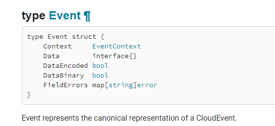
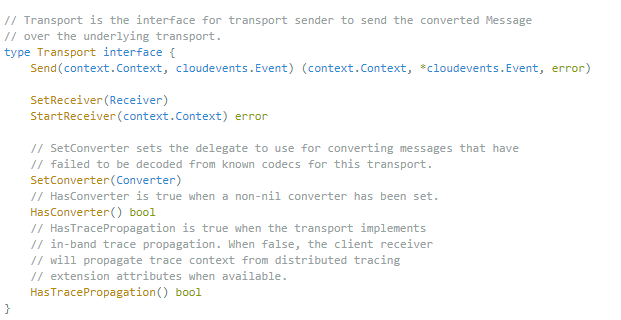
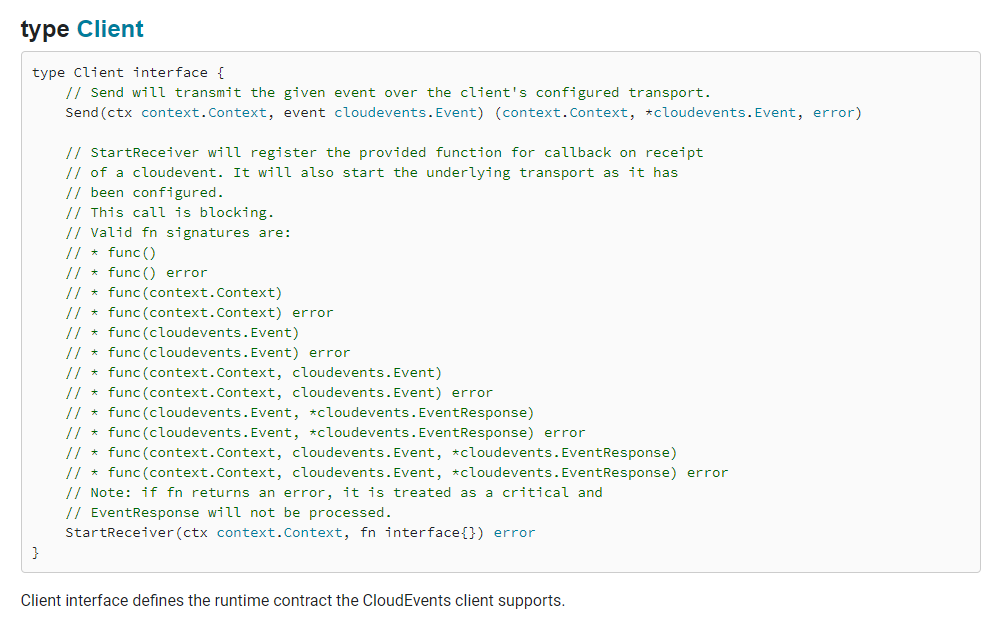
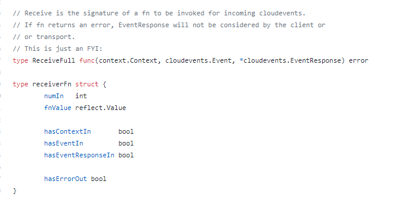
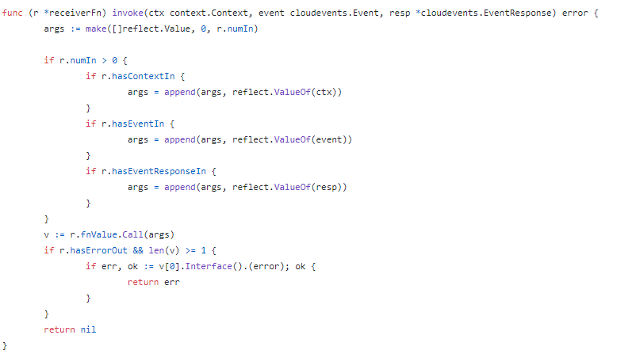
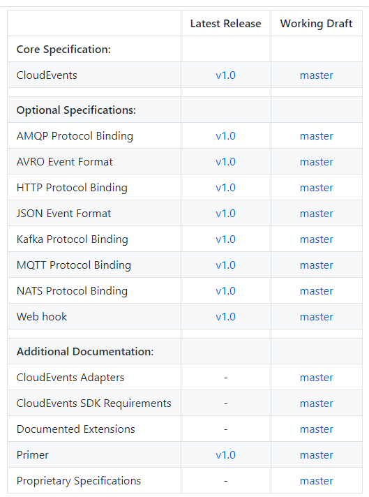

--- 
layout: category-post
title:  "Welcome to blog!"
date:   2016-08-05 20:20:56 -0400
categories: writing
---

CloudEvents is a specification for describing event data in common formats to provide interoperability across services, platforms and systems.

CloudEvent 重点在于跨平台, 跨服务, 跨系统的一个跨字. 重在适应性, 通用性.

该类用户认为, 世界上无处不在事件, 行为均可看作是事件驱动. 也认为这样消耗比是最低的(我的看法)因为事件->行为 这一个模式是典型的按需供应资源.

CloudEvent 我认为意在跨不同的云, 不同的数据源, 比如你在 阿里云的数据应用和在 亚马逊的数据应用, 是不能互通的, 至少同一个软件不行. 任意数据的变动, CloudEvent 或者 CNCF 认为是一个 Occurrence. 不同的 Occurrence 触发的事件是各个云服务商, 各个软件, 各个协议所独有的. 这给云原生或者大混合云(我取的名字, 意为以混合云服务为主的云服务商经营的云集群)带来了不方便. 不方便之处在于, 开发者的任意一款产品, 是在单独的一片云上原生的. 我认为 CNCF 一直致力于制定一个标准解决这一个问题.

下图是 go-sdk 中 event 的定义.

我尤其注意到的是事件携带有错误域, 我认为这给了 Occurrence 方的适配层或者用户一个处理的机会. 但最重要的是, 事件发生的错误也是 CloudEvent 的一部分.

更新: 我看了之后发现, 和我现在做的 MQ 是一样的思路. 通过 CloudEvent.New 生成不同的 Client 针对不同的通信方式并进行通信. go-sdk 相当于为不同的传输方式(协议) 实现了 CloudEvent 定义的 Transport 接口.

该类实现由 amqp, http , nats, pubsub 定义在 pkg/cloudevent/transport 下

此时看 [Client ](https://pkg.go.dev/github.com/cloudevents/sdk-go/pkg/cloudevents/client?tab=doc#Client)的接口, 可以看到仅发送和接收两个方法, 看注释 可以接受很多种函数签名. 如何从 fn interface{} 中断定 fn 是哪一种呢.

找到 Receive 的 func 签名可以看到, 实际上所有的签名都是用的一个, 即三个参数和 error 返回值都有的签名. 只是传入的时候, 会转换为 receiveFn 结构体判断用户的自定义 fn 回调有哪些参数, 从而不使用哪一些.

最后根据 receiveFn 的结构来传入参数们

我们看一看 CloudEvent 支持的协议如下. 但是数据源并不只是由这些协议的承载体(你写的程序). 还有包括 github, aws , gitlab 等, 均可产生消息. 这时候用到了 CloudEvent Adapters 这一个工具了.

类似于 Prometheus Exporter 的作用. 作为适配层, 将 CloudEvent 需要的 Event 元数据解出来使用.

[https://github.com/cloudevents/spec/blob/master/adapters/github.md](https://github.com/cloudevents/spec/blob/master/adapters/github.md) 用于参考 [GitHub webhook events](https://developer.github.com/v3/activity/events/types/) 是如何转换成 CloudEvents 的.

综上 CloudEvent 是一个规约, 他贯彻了 CNCF 规范云的思想. CloudEvent 定义了一个事件系统, 让云原生程序(函数)不仅只需要关注自己本身业务, 同时让云原生程序在不同的云之间依然具有鲁棒性. 如果云上有操作系统, CloudEvent 就是他的协议层.

如果了解更多, 可以查看 CloudEvent 的 [Primer](https://github.com/cloudevents/spec/blob/master/primer.md)