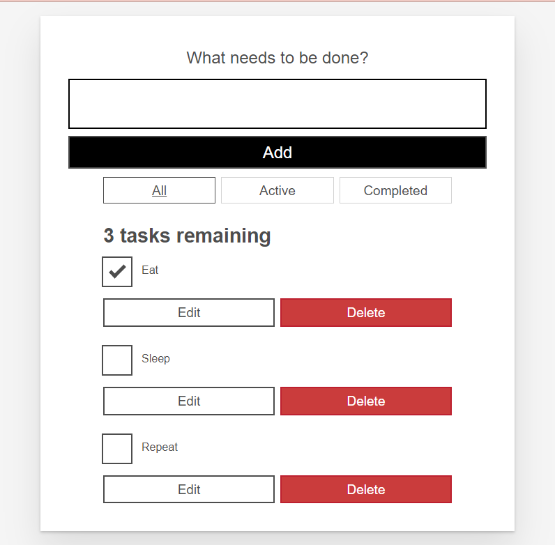
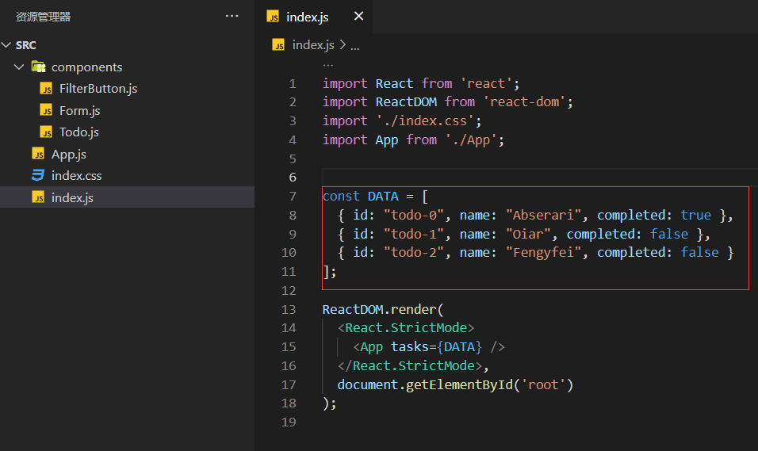
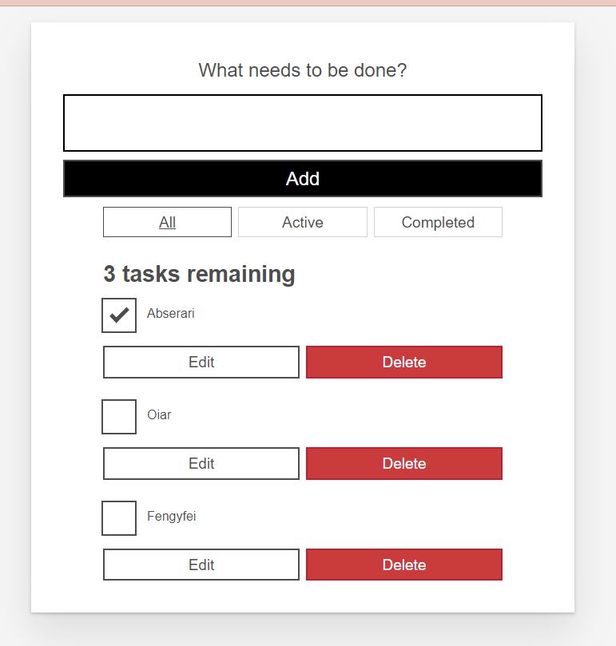
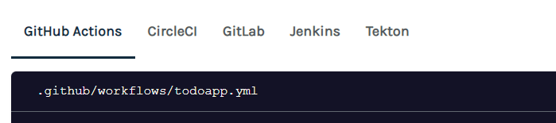

\## Overview
[https://dagger.io/](https://dagger.io/)： Dagger 是 Docker 创始人的 Devops 平台创业项目，A轮融资 2000w 美元。据说这一次会吸取 Docker 的教训，不要被迅速的成功蒙蔽了视野。

\## Getting Started
[https://docs.dagger.io/](https://docs.dagger.io/) 照着官网的文档体验一下。

\### 安装
尝试了下官网的 windows 的安装指导，curl 不支持 Powershell 6\|7 的感觉
\`\`\`bash
curl https://dl.dagger.io/dagger/install.ps1 -OutFile install.ps1
./install.ps1
rm install.ps1
\`\`\`
所以选择了通过 scoop 安装
\`\`\`bash
scoop install dagger
\`\`\`

\### 测试
首先需要 docker 环境，windows 就是要 docker desktop 啦。

官网测试步骤
\`\`\`bash
git clone https://github.com/dagger/dagger
cd dagger
git checkout v0.2.4

cd pkg/universe.dagger.io/examples/todoapp
dagger do build
\`\`\`
我实际执行的时候遇到了错误，不愧是 Devops 的工具，根据运行提示执行就能继续：
\`\`\`bash
D:\\temp
❯ dagger version
dagger 0.2.4 (b32c8732) windows/amd64

D:\\temp
❯ git clone https://github.com/dagger/dagger
∙
Cloning into 'dagger'...
remote: Enumerating objects: 22883, done.
remote: Counting objects: 100% (648/648), done.
remote: Compressing objects: 100% (161/161), done.
remote: Total 22883 (delta 573), reused 487 (delta 487), pack-reused 22235R
Receiving objects: 100% (22883/22883), 10.32 MiB \| 529.00 KiB/s, done.
Resolving deltas: 100% (12441/12441), done.

universe.dagger.io\\examples\\todoapp on  HEAD (b32c873) via 
❯ dagger do build
4:36PM FTL failed to load plan: import failed: cannot find package "dagger.io/dagger":
 D:\\temp\\dagger\\pkg\\universe.dagger.io\\examples\\todoapp\\todoapp.cue:4:2
: running \`dagger project update\` may resolve this

universe.dagger.io\\examples\\todoapp on  HEAD (b32c873) via  took 2m14s
❯ ls

 Directory: D:\\temp\\dagger\\pkg\\universe.dagger.io\\examples\\todoapp

Mode LastWriteTime Length Name
\-\-\-- ------------- ------ ----
d---- 2022/3/31 16:32 public
d---- 2022/3/31 16:32 src
-a--- 2022/3/31 16:32 7 .gitignore
-a--- 2022/3/31 16:32 946 package.json
-a--- 2022/3/31 16:32 68 README.md
-a--- 2022/3/31 16:32 1926 todoapp.cue
-a--- 2022/3/31 16:32 467872 yarn.lock

universe.dagger.io\\examples\\todoapp on  HEAD (b32c873) via 
❯ dagger project update

universe.dagger.io\\examples\\todoapp on  HEAD (b32c873) via  took 4s
❯ dagger do build
[✔] actions.build.run.script 0.3s
[✔] client.filesystem."./".read 0.6s
[✔] actions.test.script 0.4s
[+] actions.deps 347.8s
#8 57.14 (4/4) Installing bash (5.1.16-r0)
#8 70.63 Executing bash-5.1.16-r0.post-install
#8 70.65 Executing busybox-1.34.1-r3.trigger
#8 70.65 OK: 8 MiB in 18 packages
#9 0.346 fetch https://dl-cdn.alpinelinux.org/alpine/v3.15/main/x86\_64/APKINDEX.tar.gz
#9 1.872 fetch https://dl-cdn.alpinelinux.org/alpine/v3.15/community/x86\_64/APKINDEX.tar.gz
#9 4.026 (1/8) Installing ca-certificates (20211220-r0)
#9 4.294 (2/8) Installing nghttp2-libs (1.46.0-r0)
#9 4.498 (3/8) Installing brotli-libs (1.0.9-r5)
#9 4.960 (4/8) Installing c-ares (1.18.1-r0)
#9 5.124 (5/8) Installing libgcc (10.3.1\_git20211027-r0)
#9 5.268 (6/8) Installing libstdc++ (10.3.1\_git20211027-r0)
#9 5.953 (7/8) Installing nodejs (16.14.2-r0)
#9 21.82 (8/8) Installing yarn (1.22.17-r0)
#9 23.56 Executing busybox-1.34.1-r3.trigger
#9 23.56 Executing ca-certificates-20211220-r0.trigger
#9 23.62 OK: 55 MiB in 26 packages
#10 0.326 fetch https://dl-cdn.alpinelinux.org/alpine/v3.15/main/x86\_64/APKINDEX.tar.gz
#10 8.557 fetch https://dl-cdn.alpinelinux.org/alpine/v3.15/community/x86\_64/APKINDEX.tar.gz
#10 58.22 (1/4) Installing libcurl (7.80.0-r0)
#10 62.77 (2/4) Installing expat (2.4.7-r0)
#10 64.41 (3/4) Installing pcre2 (10.39-r0)
#10 70.08 (4/4) Installing git (2.34.1-r0)
#10 202.5 Executing busybox-1.34.1-r3.trigger
#10 202.6 OK: 67 MiB in 30 packages
#12 0.999 yarn config v1.22.17
#12 1.052 success Set "cache-folder" to "/cache/yarn".
#12 1.052 Done in 0.07s.
#12 1.357 yarn install v1.22.17
#12 1.523 [1/4] Resolving packages...
#12 2.454 [2/4] Fetching packages...
\`\`\`
很爽，流畅的过去了，可能是试验机器的网络环境好的原因。
\`\`\`bash
universe.dagger.io\\examples\\todoapp on  HEAD (b32c873) via  took 4s
❯ dagger do build
[✔] actions.build.run.script 0.3s
[✔] client.filesystem."./".read 0.6s
[✔] actions.test.script 0.4s
[✔] actions.deps 440.0s
[✔] actions.test 1.5s
[✔] actions.build.run 13.0s
[✔] actions.build.contents 0.2s
[✔] client.filesystem."./\_build".write 0.7s
\`\`\`

\### 测试
因为编译出来的是静态页面，可以直接打开测试，windows 使用 start 即可在浏览器中看到如下页面
\`\`\`bash
start \_build/index.html
\`\`\`

\## 第一次修改测试
\`\`\`bash
universe.dagger.io\\examples\\todoapp on  HEAD (b32c873) via 
❯ code src
\`\`\`

变更一点信息重新调用 dagger do build。这一次速度当然会很快啦。
\`\`\`bash
universe.dagger.io\\examples\\todoapp on  HEAD (b32c873) via  took 5s
❯ dagger do build
[✔] actions.deps 9.9s
[✔] client.filesystem."./".read 0.4s
[✔] actions.build.run.script 0.0s
[✔] actions.test.script 0.0s
[✔] actions.test 3.1s
[✔] actions.build.run 7.0s
[✔] actions.build.contents 0.1s
[✔] client.filesystem."./\_build".write 0.2s
\`\`\`
\`\`\`bash
start \_build/index.html
\`\`\`
结果当然不出所料啦

\## 总结
当然，Local Dev 环境之外，还可以集成自己的 CI 环境啦。示例如图：

想到最近的 devstream 开源，终于到 devops 领域开花结果了。CUE 语言也是遍地开花了。