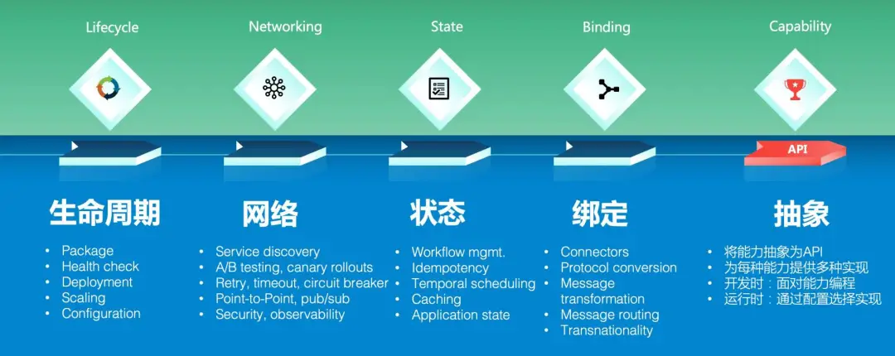
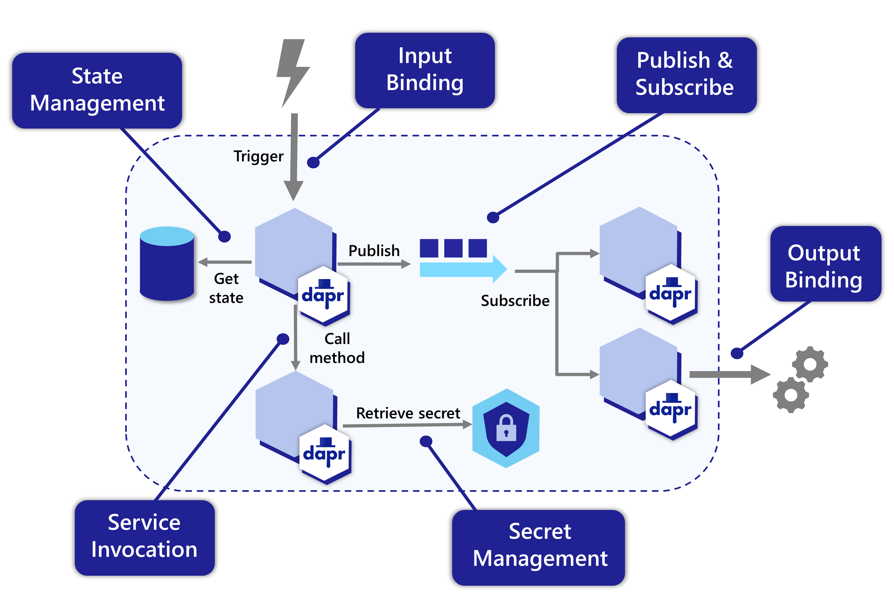

--- 
layout: category-post
title:  "Welcome to blog!"
date:   2016-08-05 20:20:56 -0400
categories: writing
---

\## PPT 大纲

\## 简单介绍

[Mecha：将Mesh进行到底](https://skyao.io/talk/202004-mecha-mesh-through-to-the-end/)

[一年增加 1.2w 星，Dapr 能否引领云原生中间件的未来？](https://developer.aliyun.com/article/783174)

Service Mesh 是一个基础设施层，用于处理服务间通讯。现代云原生应用有着复杂的服务拓扑，服务网格负责在这些拓扑中实现请求的可靠传递。

在实践中，服务网格通常实现为一组轻量级网络代理，它们与应用程序部署在一起，而对应用程序透明。

\*\*Multi-Runtime 的本质是面向云原生应用的分布式能力抽象层。\*\*

何为 “分布式能力抽象层”?

如上图所示，左侧是分布式应用存在的四大类需求：生命周期、网络、状态、绑定。从需求上说 Multi-Runtime 要为分布式应用提供这四大类需求下所列出的各种具体的分布式能力。以 Sidecar 模式为应用提供这些能力容易理解，但关键在于 Multi-Runtime 提供这些能力的方式。和 Service Mesh 采用原协议转发不同，Multi-Runtime 的方式是：

\- 将能力抽象为 API：很多分布式能力没有类似 HTTP 这种业界通用的协议，因此 Multi-Runtime 的实现方式是将这些能力抽象为和通讯协议无关的 API，只用于描述应用对分布式能力的需求和意图，尽量避免和某个实现绑定。
\- 为每种能力提供多种实现：Multi-Runtime 中的能力一般都提供有多种实现，包括开源产品和公有云商业产品。
\- 开发时：这里我们引入一个“面对能力编程”的概念，类似于编程语言中的“不要面对实现编程，要面向接口编程”。Multi-Runtime 中提倡面向“能力（Capability）”编程，即应用开发者面向的应该是已经抽象好的分布式能力原语，而不是底层提供这些能力的具体实现。
\- 运行时：通过配置在运行时选择具体实现，不影响抽象层 API 的定义，也不影响遵循“面对能力编程”原则而开发完成的应用。

Any language, any framework, anywhere

即：可以使用任意编程语言开发，可以和任意框架集成，可以部署在任意平台。下图是 Dapr 目前已有的构建块和他们提供的能力的简单描述：

\### 标准化

\- 完善的多语言支持和应用轻量化的需求推动中间件将更多的能力从应用中分离出来。
\- Sidecar 模式会推广到更大的领域，越来越多的中间件产品会 开始 Mesh 化，整合到 Runtime。
\- 对厂商锁定的天然厌恶和规避，会加剧对可移植性的追求，从而进一步促使为下沉到 Runtime 的中分布式能力提供标准而业界通用的 API。
\- API 的标准化和社区认可，将成为 Runtime 普及的最大挑战，但同时也将推动各种中间件产品改进自身实现，实现中间件产品和社区标准 API 之间的磨合与完善。

作为标准的举例, Docker 的 moby 与 kubernetes 的 etcd 和 CRI

\### 云供应商无关的云事件总线
[https://github.com/silverswords/pulse](https://github.com/silverswords/pulse)

\### Google go-cloud 项目
google 有一个 go-cloud 项目[https://github.com/google/go-cloud](https://github.com/google/go-cloud)
\> The Go Cloud Development Kit (Go CDK): A library and tools for open cloud development in Go.
\> The Go CDK provides generic APIs for:
\> \- Unstructured binary (blob) storage
\> \- Publish/Subscribe (pubsub)
\> \- Variables that change at runtime (runtimevar)
\> \- Connecting to MySQL and PostgreSQL databases (mysql, postgres)
\> \- Server startup and diagnostics: request logging, tracing, and health checking (server)

\### 事件驱动架构
\*\*Smart Runtime， Dumb Pipes\*\*

\### Dapr 部分源码解析

[https://www.yuque.com/dapr/dapr/sourcecode-v1](https://www.yuque.com/dapr/dapr/sourcecode-v1)

\### 社区现状

\## 实践
大部分实践可以只使用某一些 component.

\### Microsoft 的实践
极小改动完成底层消息总线的替换

\### Ali 实践
[kubecon 的视频分享](https://share.weiyun.com/ts0tTxLg)

\#### 多语言

[云原生分布式应用运行时 Dapr 在阿里的实践](https://skyao.io/post/202103-how-alibaba-is-using-dapr/)

\#### 云间迁移
\> 通过 Dapr 的可移植性，上层的钉钉文档应用现在可以和底层的基础设施（如消息系统）解耦，从而实现在不同的云平台之间平滑迁移：

\### 传统企业的实践
[如何与 Dapr 集成打造 Apache APISIX 网关控制器](assert/1639387466659-978ef72b-c99b-4d16-8553-8a78ed7a5e50.png)

\## 闲聊

\### xaas 化展望

\### 能力逐渐下沉到基础设施