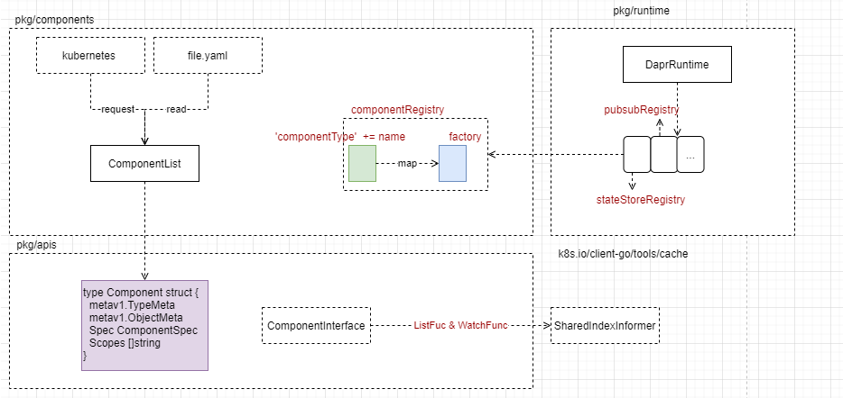

\# Actor Enhanced
[actors](https://github.com/dapr/docs/blob/334ff4c626e9a1921dbf22260da3f11a9d44f007/concepts/actors/README.md): is an enhanced model when you need

\- Your problem space involves a large number (thousands or more) of small, independent, and isolated units of state and logic.
\- You want to work with single-threaded objects that do not require significant interaction from external components, including querying state across a set of actors.
\- Your actor instances won't block callers with unpredictable delays by issuing I/O operations.

It builds on dapr components with statestore to store the state and appchannel what is using to communicate. and user code register to compute the incoming data.

\-\-\-

\### Reference

[research/project/orleans-virtual-actors](https://www.microsoft.com/en-us/research/project/orleans-virtual-actors/)

\# Signal

\# Components

\## Components Overview

\### Components-Realize example by pubsub

\# fswatcher
