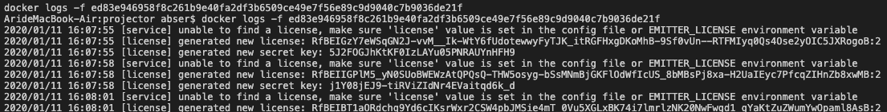
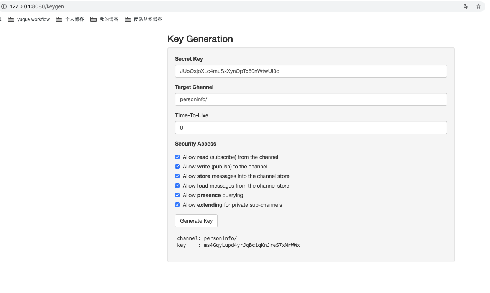
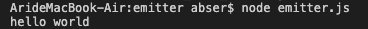

--- 
layout: category-post
title:  "Welcome to blog!"
date:   2016-08-05 20:20:56 -0400
categories: writing
---

\## Docker run

\### Get License
运行下面的命令，然后进入 docker log 中查看 生成的 \`license\`
\`\`\`shell
docker run -d --name emitter -p 8080:8080 --restart=unless-stopped emitter/server
\`\`\`
注意这一个容器会无限循环重启，因为没有指定环境变量 —— License

\### 查看日志
\`\`\`shell
docker logs -f ed83e946958f8c261b9e40fa2df3b6509ce49e7f56e89c9d9040c7b9036de21f
\`\`\`

注意 \`secret key\` 和 \`license\` 是配套的

\### Re-Run
重新运行以下命令
\`\`\`shell
docker run -d --name emitter -p 8080:8080 -e EMITTER\_LICENSE=uppD0PFIcNK6VY-7PTo7uWH8EobaOGgRAAAAAAAAAAI --restart=unless-stopped emitter/server
\`\`\`

\## 获得指定通信频道的 key
上述命令的配套 \`secret\` ：\`JUoOxjoXLc4muSxXynOpTc60nWtwUI3o\`

⚠️：使用文档里提供的 \`license\` 和 \`secret\` 并不安全

注意，在这里可以先勾选前两个 access ，因为多个 access 时需要使用 link 来进行 private 的访问。

\## 开始使用

\### JS
使用 \`node emitter.js\` 运行以下文件即可看到 hello world

\`\`\`javascript
// emitter.js
var client = require('emitter-io').connect({host:"127.0.0.1", port:"8080"});
// use on NodeJS
var emitterKey = "DhfPNWDeeBkLI1ym0VN8NP7GufF58rUE";
var channel = "timeout";

// once we're connected, subscribe to the 'chat' channel
client.subscribe({
 key: emitterKey,
 channel: channel
});

// on every message, print it out
client.on('message', function(msg){
 console.log( msg.asString());
});

// publish a message to the chat channel
client.publish({
 key: emitterKey,
 channel: channel,
 message: "hello world"
})
\`\`\`

\#### 效果

\### 高权限的 Key 需要 private link
\`\`\`javascript
client.publishWithLink({
 link: "linkname",
 message: "hello world through link"
})

client.link({
 key: key,
 channel: channel,
 name: shortcut,
 private: true,
 subscribe: true
})
\`\`\`