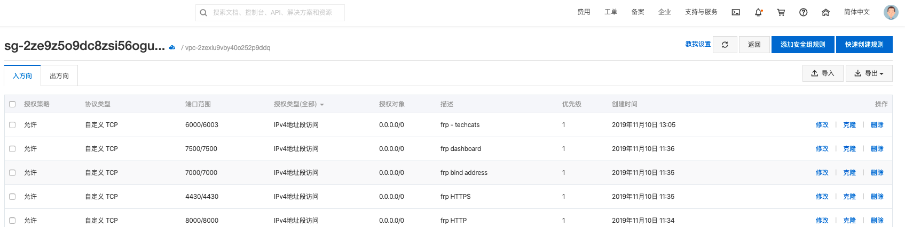

--- 
layout: category-post
title:  "Welcome to blog!"
date:   2016-08-05 20:20:56 -0400
categories: writing
---

[官方文档](https://github.com/fatedier/frp/blob/master/README\_zh.md)

需要有公网服务器

\## 下载 Frp 到服务器

\### 下载
[frp\_0.29.1\_linux\_amd64.tar.gz](https://www.yuque.com/attachments/yuque/0/2019/gz/176280/1573363068204-3b5e9dd3-56f4-44e9-92a7-3202a603778a.gz?\_lake\_card=%7B%22uid%22%3A%221573363066819-0%22%2C%22src%22%3A%22https%3A%2F%2Fwww.yuque.com%2Fattachments%2Fyuque%2F0%2F2019%2Fgz%2F176280%2F1573363068204-3b5e9dd3-56f4-44e9-92a7-3202a603778a.gz%22%2C%22name%22%3A%22frp\_0.29.1\_linux\_amd64.tar.gz%22%2C%22size%22%3A8371369%2C%22type%22%3A%22application%2Fx-gzip%22%2C%22ext%22%3A%22gz%22%2C%22progress%22%3A%7B%22percent%22%3A0%7D%2C%22status%22%3A%22done%22%2C%22percent%22%3A0%2C%22id%22%3A%22JAIYp%22%2C%22card%22%3A%22file%22%7D)

\### 解压
\`\`\`bash
$ tar zxvf frp\_0.29.1\_linux\_amd64.tar.gz
\`\`\`

\### 上传
\`\`\`bash
$ scp frps frps.ini root@192.168.0.124:/root/frps
\`\`\`

\## 配置

\### frpc
\`\`\`bash
[common]
server\_addr = 39.105.141.168
server\_port = 7000

\# for authentication
\# token = 12345678

[dev1]
type = tcp
local\_ip = 127.0.0.1
local\_port = 22
remote\_port = 6000

[web]
type = https
local\_port = 443
custom\_domains = abser.top
\`\`\`

\### fprs
\`\`\`bash
\# [common] is integral section
[common]
\# A literal address or host name for IPv6 must be enclosed
\# in square brackets, as in "[::1]:80", "[ipv6-host]:http" or "[ipv6-host%zone]:80"
bind\_addr = 0.0.0.0
bind\_port = 7000

\# udp port to help make udp hole to penetrate nat
bind\_udp\_port = 7001

\# udp port used for kcp protocol, it can be same with 'bind\_port'
\# if not set, kcp is disabled in frps
kcp\_bind\_port = 7000

\# if you want to support virtual host, you must set the http port for listening (optional)
\# Note: http port and https port can be same with bind\_port
vhost\_http\_port = 8000
vhost\_https\_port = 4430

\# set dashboard\_addr and dashboard\_port to view dashboard of frps
\# dashboard\_addr's default value is same with bind\_addr
\# dashboard is available only if dashboard\_port is set
dashboard\_addr = 0.0.0.0
dashboard\_port = 7500

\# dashboard user and passwd for basic auth protect, if not set, both default value is admin
dashboard\_user = admin
dashboard\_pwd = admin

\# dashboard assets directory(only for debug mode)
\# assets\_dir = ./static
\# console or real logFile path like ./frps.log
log\_file = ./frps.log

\# trace, debug, info, warn, error
log\_level = info

log\_max\_days = 3

\# disable log colors when log\_file is console, default is false
disable\_log\_color = false

\# max ports can be used for each client, default value is 0 means no limit
max\_ports\_per\_client = 0

\# if tcp stream multiplexing is used, default is true
tcp\_mux = true
\`\`\`

\## 防火墙

\### 阿里云

\### 宝塔
或者关闭防火墙也行

\## 启动与停止
centos  环境

\### 运行
\`\`\`bash
$ nohup ./frps -c frps.ini >/dev/null 2>&1 &
\`\`\`
或者客户端:
\`\`\`bash
$ nohup ./frpc -c ./frpc.ini >/dev/null 2>&1 &
\`\`\`

\### 停止
找到这个进程
\`\`\`bash
$ ps -aux\|grep frp\| grep -v grep
root 3600 0.1 0.1 110188 9484 pts/0 Sl 15:04 0:00 ./frpc -c ./frpc.ini
\`\`\`

kill
\`\`\`bash
$ kill -9 3600
\`\`\`

\## 运行
[http://39.105.141.168:7500/static/#/proxies/tcp](http://39.105.141.168:7500/static/#/proxies/tcp)

