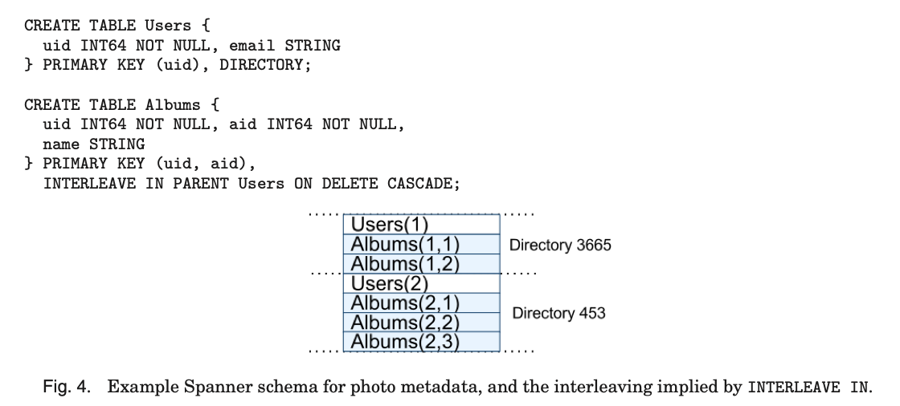

脑图详细

\- [Spanner- Google’s Globally Distributed Database]()

 \- Spanner is a scalable, globally distributed database designed, built, and deployed at Google.

可扩展，全球分布式

介绍

 \- features

 \- [细粒度动态控制]()

First, the replication configurations for data can be dynamically controlled at a fine grain by applications. Applications can specify constraints to control which datacenters contain which data, how far data is from its users (to control read latency), how far replicas are from each other (to control write latency), and how many replicas are maintained (to control durability, availability, and read performance). Data can also be dynamically and transparently moved between datacenters by the system to balance resource usage across datacenters.

 \- [读和写的外部一致性]()

Second, Spanner has two features that are difficult to implement in a distributed database: it provides externally consistent [Gifford 1982] reads and writes, and globally consistent reads across the database at a timestamp.

These features enable Spanner to support consistent backups, consistent MapReduce executions [Dean and Ghemawat 2010], and atomic schema updates, all at global scale, and even in the presence of ongoing transactions.

 \- [实现]()

 \- [组织架构]()

Figure 1 illustrates the servers in a Spanner universe. A zone has one zonemas- ter and between one hundred and several thousand spanservers. The former assigns data to spanservers; the latter serve data to clients. The per-zone location proxies are used by clients to locate the spanservers assigned to serve their data. The universe master and the placement driver are currently singletons. The universe master is pri- marily a console that displays status information about all the zones for interactive debugging. The placement driver handles automated movement of data across zones on the timescale of minutes. The placement driver periodically communicates with the spanservers to find data that needs to be moved, either to meet updated replication constraints or to balance load. For space reasons, we will only describe the spanserver in any detail.

 \- [软件栈]()

A tablet is similar to Bigtable’s tablet abstraction, in that it implements a bag of the following mappings.

(key:string, timestamp:int64) → string

 \- [桶的转移]()

A directory is the unit of data placement. All data in a directory has the same repli- cation configuration. When data is moved between Paxos groups, it is moved directory by directory, as shown in Figure 3. Spanner might move a directory to shed load from a Paxos group; to put directories that are frequently accessed together into the same group; or to move a directory into a group that is closer to its accessors. Directories can be moved while client operations are ongoing. One would expect that a 50MB directory could be moved in a few seconds.

 \- [数据模型]()

Figure 4 contains an example Spanner schema for storing photo metadata on a per-user, per-album basis. The schema language is similar to Megastore’s, with the additional requirement that every Spanner database must be partitioned by clients into one or more hierarchies of tables. Client applications declare the hierarchies in database schemas via the INTERLEAVE IN declarations. The table at the top of a hi- erarchy is a directory table. Each row in a directory table with key K, together with all of the rows in descendant tables that start with K in lexicographic order, forms a directory. ON DELETE CASCADE says that deleting a row in the directory table deletes any associated child rows. The figure also illustrates the interleaved layout for the ex- ample database: for example, Albums(2,1) represents the row from the Albums table for user id 2, album id 1. This interleaving of tables to form directories is significant because it allows clients to describe the locality relationships that exist between multi- ple tables, which is necessary for good performance in a sharded, distributed database.

Without it, Spanner would not know the most important locality relationships.

 \- [Use TrueTime API]()

 \- [API 方法 有界限不确定性时间返回]()

 \- [支持操作]()

 \- [领导者租约]()

Paxos Leader Leases. Spanner’s Paxos implementation uses timed leases to make leadership long-lived (10 seconds by default). A potential leader sends requests for timed lease votes; upon receiving a quorum of lease votes the leader knows it has a lease. A replica extends its lease vote implicitly on a successful write, and the leader requests lease-vote extensions if they are near expiration. Define a leader’s lease in- terval to start when it discovers it has a quorum of lease votes, and to end when it no longer has a quorum of lease votes (because some have expired). Spanner depends on the following disjointness invariant: for each Paxos group, each Paxos leader’s lease interval is disjoint from every other leader’s. Section 4.2.5 describes how this invariant is enforced.

The Spanner implementation permits a Paxos leader to abdicate by releasing its slaves from their lease votes. To preserve the disjointness invariant, Spanner

constrains when abdication is permissible. Define smaxto be the maximum timestamp used by a leader. Subsequent sections will describe when smaxis advanced. Before ab- dicating, a leader must wait until TT.after(smax) is true.

 \- [外部一致性]()

Spanner also enforces the following external-consistency invariant: if the start of a transaction T2occurs after the commit of a transaction T1, then the commit time- stamp of T2must be greater than the commit timestamp of T1. Define the start and commit events for a transaction Tiby estart i and ecommit i ; and the commit timestamp of a transaction Tiby si. The invariant becomes tabs(ecommit 1 ) < tabs(estart 2 ) ⇒ s1< s2. The protocol for executing transactions and assigning timestamps obeys two rules, which together guarantee this invariant, as shown in the following. Define the arrival event of the commit request at the coordinator leader for a write Tito be eserver i .

Start. The coordinator leader for a write Tiassigns a commit timestamp sino less than the value of TT.now().latest, computed after eserver i . Note that the participant lead- ers do not matter here; Section 4.2.1 describes how they are involved in the implemen- tation of the next rule.

Commit Wait. The coordinator leader ensures that clients cannot see any data com- mitted by Tiuntil TT.after(si) is true. Commit wait ensures that siis less than the absolute commit time of Ti, or si< tabs(ecommit i ). The implementation of commit wait is described in Section 4.2.1. Proof:

 \- [总结]()

 \- [数据库研究和分布式系统研究]()

To summarize, Spanner combines and extends ideas from two research communities: from the database community, a familiar, easy-to-use, semirelational interface, trans- actions, and an SQL-based query language; from the systems community, scalability, automatic sharding, fault tolerance, consistent replication, external consistency, and wide-area distribution.

 \- [更健壮的时间语义实现]()

We have shown that reifying clock uncertainty in the time API makes it possible to build distributed systems with much stronger time semantics. In addition, as the underlying system enforces tighter bounds on clock uncertainty, the overhead of the stronger semantics decreases. As a community, we should no longer depend on loosely synchronized clocks and weak time APIs in designing distributed algorithms.

[MindMap-Spanner- Google’s Globally Distributed Database.pdf](https://www.yuque.com/attachments/yuque/0/2019/pdf/176280/1553317854760-1a5ba9b6-5796-4c60-bb40-ac1e2c09b668.pdf?\_lake\_card=%7B%22uid%22%3A%22rc-upload-1553317763460-3%22%2C%22src%22%3A%22https%3A%2F%2Fwww.yuque.com%2Fattachments%2Fyuque%2F0%2F2019%2Fpdf%2F176280%2F1553317854760-1a5ba9b6-5796-4c60-bb40-ac1e2c09b668.pdf%22%2C%22name%22%3A%22MindMap-Spanner-+Google%26rsquo%3Bs+Globally+Distributed+Database.pdf%22%2C%22size%22%3A216817%2C%22type%22%3A%22application%2Fpdf%22%2C%22ext%22%3A%22pdf%22%2C%22progress%22%3A%7B%22percent%22%3A0%7D%2C%22status%22%3A%22done%22%2C%22percent%22%3A0%2C%22id%22%3A%22Od8IX%22%2C%22card%22%3A%22file%22%7D)

[Spanner- Google’s Globally Distributed Database.pdf](https://www.yuque.com/attachments/yuque/0/2019/pdf/176280/1553317996602-b88bae82-bfc4-43db-8c1c-ea839b1c1353.pdf?\_lake\_card=%7B%22uid%22%3A%22rc-upload-1553317955214-3%22%2C%22src%22%3A%22https%3A%2F%2Fwww.yuque.com%2Fattachments%2Fyuque%2F0%2F2019%2Fpdf%2F176280%2F1553317996602-b88bae82-bfc4-43db-8c1c-ea839b1c1353.pdf%22%2C%22name%22%3A%22Spanner-+Google%26rsquo%3Bs+Globally+Distributed+Database.pdf%22%2C%22size%22%3A369777%2C%22type%22%3A%22application%2Fpdf%22%2C%22ext%22%3A%22pdf%22%2C%22progress%22%3A%7B%22percent%22%3A0%7D%2C%22status%22%3A%22done%22%2C%22percent%22%3A0%2C%22id%22%3A%225jSWB%22%2C%22card%22%3A%22file%22%7D)