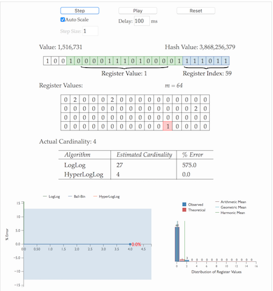
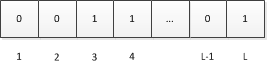

\## 基数计数基本概念

\*\*基数计数(cardinality counting)\*\*通常用来统计一个集合中不重复的元素个数，例如统计某个网站的UV，或者用户搜索网站的关键词数量。数据分析、网络监控及数据库优化等领域都会涉及到基数计数的需求。 要实现基数计数，最简单的做法是记录集合中所有不重复的元素集合，当新来一个元素，若中不包含元素，则将加入，否则不加入，计数值就是的元素数量。这种做法存在两个问题：

1\. 当统计的数据量变大时，相应的存储内存也会线性增长

2\. 当集合变大，判断其是否包含新加入元素的成本变大

\### 概率算法
实际上目前还没有发现更好的在大数据场景中准确计算基数的高效算法，因此在不追求绝对准确的情况下，使用概率算法算是一个不错的解决方案。概率算法不直接存储数据集合本身，通过一定的概率统计方法预估基数值，这种方法可以大大节省内存，同时保证误差控制在一定范围内。目前用于基数计数的概率算法包括:

\- \*\*\_Linear Counting(LC)\_\*\*：早期的基数估计算法，LC在空间复杂度方面并不算优秀，实际上LC的空间复杂度与简单bitmap方法是一样的（但是有个常数项级别的降低），都是O(Nmax)；

\- \*\*\_LogLog Counting(LLC)\_\*\*：LogLog Counting相比于LC更加节省内存，空间复杂度只有O(log2(log2(Nmax)))

\- \*\*\_HyperLogLog Counting(HLL)\_\*\*：HyperLogLog Counting是基于LLC的优化和改进，在同样空间复杂度情况下，能够比LLC的基数估计误差更小。

\# HLL

\### 直观演示
[HLLDEMO](http://content.research.neustar.biz/blog/hll.html)

\### HLL的实际步骤

1\. 通过hash函数计算输入值对应的比特串

2\. 比特串的低 位对应的数字用来找到数组\*\*S\*\*中对应的位置 \*\*i\*\*

3\. \*\*t+1\*\*位开始找到第一个1出现的位置 \*\*k\*\*，将 \*\*k\*\* 记入数组位置

4\. 基于数组\*\*S\*\*记录的所有数据的统计值，计算整体的基数值，计算公式可以简单表示为：

\*\*HLL\*\*是\*\*LLC\*\*的误差改进，实际是基于\*\*LLC\*\*。

\### 算法来源（N次伯努利过程）

下面非正式的从直观角度描述LLC算法的思想来源。

设\*\*a\*\*为待估集合（哈希后）中的一个元素，由上面对H的定义可知，\*\*a\*\*可以看做一个长度固定的比特串（也就是\*\*a\*\*的二进制表示），设H哈希后的结果长度为L比特，我们将这\*\*L\*\*个比特位从左到右分别编号为\*\*1、2、…、L\*\*：

又因为\*\*a\*\*是从服从均与分布的样本空间中随机抽取的一个样本，因此\*\*a\*\*每个比特位服从如下分布且相互独立。

通俗说就是a的每个比特位为0和1的概率各为0.5，且相互之间是独立的。

设\*\*ρ(a)\*\*为a的比特串中第一个“1”出现的位置，显然\*\*1≤ρ(a)≤L\*\*，这里我们忽略比特串全为0的情况（概率为）。如果我们遍历集合中所有元素的比特串，取为所有\*\*ρ(a)\*\*的最大值。

此时我们可以将作为基数的一个粗糙估计，即：

\#### 解释
注意如下事实：

由于比特串每个比特都独立且服从0-1分布，因此从左到右扫描上述某个比特串寻找第一个“1”的过程从统计学角度看是一次伯努利过程，例如，可以等价看作不断投掷一个硬币（每次投掷正反面概率皆为0.5），直到得到一个正面的过程。在一次这样的过程中，投掷一次就得到正面的概率为1/2，投掷两次得到正面的概率是，\*\*…\*\*，投掷\*\*k\*\*次才得到第一个正面的概率为。

现在考虑如下两个问题：

1、进行n次伯努利过程，所有投掷次数都不大于k的概率是多少？

2、进行n次伯努利过程，至少有一次投掷次数等于k的概率是多少？

首先看第一个问题，在一次伯努利过程中，投掷次数大于k的概率为，即连续掷出k个反面的概率。因此，在一次过程中投掷次数不大于k的概率为。因此，n次伯努利过程投掷次数均不大于k的概率为：

显然第二个问题的答案是 n 次过程中不超过 k 次 减去 不超过 k-1 次的概率

从以上分析可以看出，当时，\*\*Pn(X≥k)\*\*的概率几乎为0，同时，当时，\*\*Pn(X≤k)\*\*的概率也几乎为0。用自然语言概括上述结论就是：当伯努利过程次数远远小于时，至少有一次过程投掷次数大于等于k的概率几乎为0；当伯努利过程次数远远大于时，没有一次过程投掷次数大于k的概率也几乎为0。

如果将上面描述做一个对应：一次伯努利过程对应一个元素的比特串，反面对应0，正面对应1，投掷次数k对应第一个“1”出现的位置，我们就得到了下面结论：

设一个集合的基数为n，为所有元素中首个“1”的位置最大的那个元素的“1”的位置，如果n远远小于，则我们得到为当前值的概率几乎为0（它应该更小），同样的，如果n远远大于，则我们得到为当前值的概率也几乎为0（它应该更大），因此可以作为基数n的一个粗糙估计。

\*\*以上结论可以总结为\*\*：进行了n次进行抛硬币实验，每次分别记录下第一次抛到正面的抛掷次数k，那么可以用n次实验中最大的抛掷次数来预估实验组数量n： 

.png)

回到基数统计的问题，我们需要统计一组数据中不重复元素的个数，集合中每个元素的经过hash函数后可以表示成0和1构成的二进制数串，一个二进制串可以类比为一次抛硬币实验，1是抛到正面，0是反面。二进制串中从低位开始第一个1出现的位置可以理解为抛硬币试验中第一次出现正面的抛掷次数k，那么基于上面的结论，我们可以通过多次抛硬币实验的最大抛到正面的次数来预估总共进行了多少次实验，同样可以可以通过第一个1出现位置的最大值来预估总共有多少个不同的数字（整体基数）。

\## LogLogCounting

\### 均匀随机化

与LC一样，在使用LLC之前需要选取一个哈希函数H应用于所有元素，然后对哈希值进行基数估计。H必须满足如下条件（定性的）：

1、H的结果具有很好的均匀性，也就是说无论原始集合元素的值分布如何，其哈希结果的值几乎服从均匀分布（完全服从均匀分布是不可能的，D. Knuth已经证明不可能通过一个哈希函数将一组不服从均匀分布的数据映射为绝对均匀分布，但是很多哈希函数可以生成几乎服从均匀分布的结果，这里我们忽略这种理论上的差异，认为哈希结果就是服从均匀分布）。

2、H的碰撞几乎可以忽略不计。也就是说我们认为对于不同的原始值，其哈希结果相同的概率非常小以至于可以忽略不计。

3、H的哈希结果是固定长度的。

以上对哈希函数的要求是随机化和后续概率分析的基础。后面的分析均认为是针对哈希后的均匀分布数据进行。

\### 分桶平均

上述分析给出了LLC的基本思想，不过如果直接使用上面的单一估计量进行基数估计会由于偶然性而存在较大误差。因此，LLC采用了分桶平均的思想来消减误差。具体来说，就是将哈希空间平均分成m份，每份称之为一个桶（bucket）。对于每一个元素，其哈希值的前k比特作为桶编号，其中，而后L-k个比特作为真正用于基数估计的比特串。桶编号相同的元素被分配到同一个桶，在进行基数估计时，首先计算每个桶内元素最大的第一个“1”的位置，设为M[i]，然后对这m个值取平均后再进行估计，即：

这相当于物理试验中经常使用的多次试验取平均的做法，可以有效消减因偶然性带来的误差。

下面举一个例子说明分桶平均怎么做。

假设H的哈希长度为16bit，分桶数m定为32。设一个元素哈希值的比特串为“0001001010001010”，由于m为32，因此前5个bit为桶编号，所以这个元素应该归入“00010”即2号桶（桶编号从0开始，最大编号为m-1），而剩下部分是“01010001010”且显然ρ(01010001010)=2，所以桶编号为“00010”的元素最大的ρ即为M[2]的值。

\### 偏差修正

上述经过分桶平均后的估计量看似已经很不错了，不过通过数学分析可以知道这并不是基数n的无偏估计。因此需要修正成无偏估计。这部分的具体数学分析在“Loglog Counting of Large Cardinalities”中，过程过于艰涩这里不再具体详述，有兴趣的朋友可以参考原论文。这里只简要提一下分析框架：

首先上文已经得出：

因此：

这是一个未知通项公式的递推数列，研究这种问题的常用方法是使用生成函数（generating function）。通过运用指数生成函数和poissonization得到上述估计量的Poisson期望和方差为：

其中和不超过。

最后通过 depoissonization 得到一个渐进无偏估计量：

其中：

其中m是分桶数。这就是LLC最终使用的估计量。

\### 误差分析

不加证明给出如下结论：

\## 算法应用

\### 误差控制

在应用LLC时，主要需要考虑的是分桶数 m，而这个 m 主要取决于误差。根据上面的误差分析，如果要将误差控制在 \*\*ϵ \*\*之内，则：

\### 内存使用分析

内存使用与m的大小及哈希值得长度（或说基数上限）有关。假设H的值为32bit，由于，因此每个桶需要5bit 空间存储这个桶的 ，m个桶就是 5×m/8 字节。例如基数上限为一亿（约），当分桶数 m 为 1024 时，每个桶的基数上限约为，而 ，因此每个桶需要 5bit，需要字节数就是5×1024/8=640，误差为，也就是约为4%。

\### 合并
与\*\*LC\*\*不同，\*\*LLC\*\*的合并是以桶为单位而不是 bit 为单位，由于\*\*LLC\*\*只需记录桶的 ，因此合并时取相同桶编号数值最大者为合并后此桶的数值即可。

\# HyperLogLog Counting
\*\*HyperLogLog Counting\*\*（以下简称\*\*HLLC\*\*）的基本思想也是在\*\*LLC\*\*的基础上做改进，具体细节请参考“HyperLogLog: the analysis of a near-optimal cardinality estimation algorithm”这篇论文。

\## 基本算法
HLLC的第一个改进是使用调和平均数替代几何平均数。注意 LLC 是对各个桶取算数平均数，而算数平均数最终被应用到2的指数上，所以总体来看LLC取得是几何平均数。由于几何平均数对于离群值（例如这里的 0）特别敏感，因此当存在离群值时，LLC 的偏差就会很大，这也从另一个角度解释了为什么 n 不太大时 LLC 的效果不太好。这是因为 n 较小时，可能存在较多空桶，而这些特殊的离群值强烈干扰了几何平均数的稳定性。

因此，HLLC使用调和平均数来代替几何平均数，调和平均数的定义如下：

调和平均数可以有效抵抗离群值的扰动。使用调和平均数代替几何平均数后，估计公式变为如下：

其中：

\## 偏差分析

根据论文中的分析结论，与LLC一样HLLC是渐近无偏估计，且其渐近标准差为：

因此在存储空间相同的情况下，HLLC比LLC具有更高的精度。例如，对于分桶数m为2^13（8k字节）时，LLC的标准误差为1.4%，而HLLC为1.1%。

\## 分段偏差修正

在HLLC的论文中，作者在实现建议部分还给出了在n相对于m较小或较大时的偏差修正方案。具体来说，设E为估计值：

当时，使用LC进行估计。

当是，使用上面给出的HLLC公式进行估计。

当时，估计公式如为。

关于分段偏差修正效果分析也可以在原论文中找到。

\# 结论

\### 并行化
这些基数估计算法的一个好处就是非常容易并行化。对于相同分桶数和相同哈希函数的情况，多台机器节点可以独立并行的执行这个算法；最后只要将各个节点计算的同一个桶的最大值做一个简单的合并就可以得到这个桶最终的值。而且这种并行计算的结果和单机计算结果是完全一致的，所需的额外消耗仅仅是小于1k的字节在不同节点间的传输。

\### 应用场景
基数估计算法使用很少的资源给出数据集基数的一个良好估计，一般只要使用少于1k的空间存储状态。这个方法和数据本身的特征无关，而且可以高效的进行分布式并行计算。估计结果可以用于很多方面，例如流量监控（多少不同IP访问过一个服务器）以及数据库查询优化（例如我们是否需要排序和合并，或者是否需要构建哈希表）。

\# 参考阅读

[Redis new data structure: the HyperLogLog](http://antirez.com/news/75)

[HyperLogLog — Cornerstone of a Big Data Infrastructure](https://research.neustar.biz/2012/10/25/sketch-of-the-day-hyperloglog-cornerstone-of-a-big-data-infrastructure/)