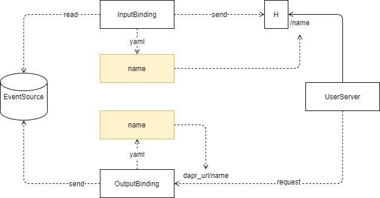

\## Overview

Hello guys, I'll tell you about the Dapr's source code. Dapr is a distributed application runtime. On its official website. It's introduced as: [An event-driven, portable runtime for building microservices on cloud and edge.](https://www.yuque.com/abser/blog/qbw6vc/edit#PBQVJ) I have followed Dapr for almost one year. When it was published to the public, I wrote two blogs to introduce how I got familiar with Dapr and recorded my steps.

\- [分布式应用运行时 Dapr X Kubernetes](https://www.yuque.com/abser/blog/eh303f)
\- [微服务 Dapr HelloWorld](https://www.yuque.com/abser/blog/fa0ntp)

Today, I'm curious about how Dapr have these features: portable, event-driven, etc. so I dig into the source code and wonder if I could learn something from its architecture.

I drew some pictures and stored them [here](assert/1598163774228-e69ca967-876d-43c3-97cf-94793544c4f3.png)

Below we would run a sample called pub-sub sample and explain how the components like pub-sub could be portable to Dapr.

\## Prerequisites
We need to get Dapr installed. If not, follow [https://dapr.io/](https://dapr.io/) or my blog. If you have Mac
\`\`\`bash
$ curl -fsSL https://raw.githubusercontent.com/dapr/cli/master/install/install.sh \| /bin/bash
\`\`\`
\`\`\`bash
 $ dapr init
⌛ Making the jump to hyperspace...
 Downloading binaries and setting up
 components
✅ Success! Dapr is up and running
\`\`\`
hint: you should have docker installed, too.

\### Get the code
\`\`\`bash
$ git clone https://github.com/abserari/go-sdk
\`\`\`
I wrote a simpler example in [https://github.com/abserari/go-sdk/example/pubsub](https://github.com/abserari/go-sdk)

\## SDK-Source Code

\### Configuration
In the configuration, we specify the metadata of the component, like our pub-sub component below:
\`\`\`yaml
apiVersion: dapr.io/v1alpha1
kind: Component
metadata:
 name: messagebus
spec:
 type: pubsub.redis
 metadata:
 \- name: redisHost
 value: 192.168.0.253:32220
 \- name: redisPassword
 value: "123456"
\`\`\`

\#### name: messagebus
Dapr needs the name to configure the API.

\#### spec:
This config is to init the components so Dapr could connect.

\### Pub.go
After we init the Dapr runtime. we could use pub-sub with go-sdk quickly.

We use this function to publish data to target pub-sub components with pubsubName and specific topicName.
\`\`\`go
client.PublishEvent(ctx, pubsubName, topicName, data)
\`\`\`

\### Sub.go
It's a little unfamiliar with the way of subscribing to Dapr. you should have a server with some handler to tell Dapr runtime what topic you care about and how to notify you with the specific route when Dapr has a message to publish to the topic your concern.

\#### config subscription
\`\`\`go
var sub := &common.Subscription{
 PubsubName: "messagebus",
 Topic: "neworder",
 Route: "/orders",
}
\`\`\`

\#### add to server
\`\`\`go
if err := s.AddTopicEventHandler(sub, eventHandler); err != nil {
 log.Fatalf("error adding topic subscription: %v", err)
}
\`\`\`

\## Run
This [https://github.com/abserari/go-sdk](https://github.com/abserari/go-sdk)/example/pubsub folder contains two go files that use this go-SDK to invoke the Dapr PubSub API.

\### Architecture

\### Steps

\#### Preparation

\- Get Dapr installed

\#### Run Subscriber Server
When we use Dapr PubSub to subscribe, we should have an http or gRPC server to receive the requests from Dapr.

Please change directory to pubsub/ and run the following command:
\`\`\`bash
dapr run --app-id sub \
 --app-protocol http \
 --app-port 8080 \
 --port 3500 \
 --log-level debug \
 --components-path ./config \
 go run sub.go
\`\`\`

\#### Run Publisher
Publish is more simple than subscribe. Just Publish the data to target pubsub component with its' name.

After you start a server by above guide. Please change directory to pubsub/ and run the following command:
\`\`\`bash
dapr run --app-id pub \
 --log-level debug \
 --components-path ./config \
 go run pub.go
\`\`\`

\### Result
You would see the log in the terminal which runs the server(subscriber) code.
\`\`\`bash
== APP == 2020/08/23 13:21:58 event - PubsubName: messagebus, Topic: demo, ID: 11acaa82-23c4-4244-8969-7360dae52e5d, Data: ping
\`\`\`

\## Dapr Source Code

\### Registry
We have to know about the Dapr runtime in the real world. Then we talk about how Dapr runtime registers the components.

It's an interface in Dapr source code and the different realize of components is in github.com/dapr/components-contrib.

Then Dapr has a registry struct to store the method that is used to create a new component instance.

\### Runtime

When we run the Dapr. runtime init all the components with YAML files in your path. if in Kubernetes mode, it would read the yaml from Kubernetes.

I'm happy to chat with on your questions about Dapr or this article. Please comment or contact me.