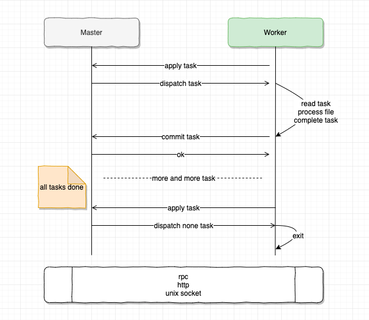
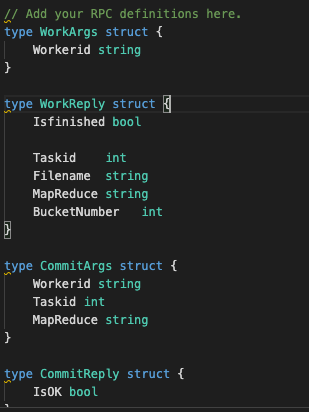

--- 
layout: category-post
title:  "Welcome to blog!"
date:   2016-08-05 20:20:56 -0400
categories: writing
---

\### 简单总结
[6.824 lab 1 MapReduce](https://pdos.csail.mit.edu/6.824/labs/lab-mr.html)

\`\`\`markdown
最近好几个学弟提到了 6.824, 今天下午有时间,我也学习一下.

花了大概 4 小时做了初版通过了所有测试,
一小时看代码设计,两个小时编码,一个小时编码加测试. 大概也就 300 行代码.

总体难度,对我来说正好能学习其中讲授知识部分. 我正好使用 go 语言(快两年),了解 rpc(自己设计过也给 grpc 贡献有代码), 看过一点 MapReduce paper (之前看 chubby spanner 的时候)
遇到了问题还比较多,其中 IDE 能力不同的问题还挺奇特的,也就现在有.
\`\`\`
先花时间整理一下大概有哪些问题,

然后描述设计和编码是遇到的问题和解决方案,

最后展示一下关键代码和测试结果.

希望能够总结一些适合复用的解决方案,提醒自己.也帮助他人学习如何解决相应种类问题.

\### 编码问题

1\. 首先是 vscode 对 golang 的支持,在 你的代码不符合 golang 规范的时候, vscode 对于代码提示的功能非常小,相当于白板编程(那我要 gopls 有什么用?). 比较重要的问题是 代码跳转 用不了,另外是 类型检查 和 拼写错误会较多.

这个时候只能凭经验来补代码提示和库函数运用, 这里我用了 tabnine 这个插件用作代码提示. tabnine 用 ai 的方式预测接下来的输入,对于重复的代码片段很有用,尽量保证了我拼写的正确.

最后迫于更快的代码检查,还是转用了 goland. [goland](https://www.jetbrains.com/go/) 对于开源项目工作者是免费的,可以了解一下.

2\. go 1.14 版本的问题, 我遇到的问题有两个,
 1\. 一个是 从 1.11 开始启用的 go module 后,引用本地包里的文件无法通过编译的问题 如 6.824 中 \`"../mr"\` 这种相对目录的方式通不过编译.
 1\. 另一个是 goland 2019.3 这个版本,对于 1.14 的 gomodule 是不支持的(因为 go 1.14 刚出),这个在 2019.3.3 修复了

于是我在 6.824 的根目录下\`go mod init ds\` 并把 \`"../mr"\`改为了 \`"ds/mr"\` ,并且在运行调试的时候又转为了 vscode

\### 原有代码和工作要求
解决了环境问题,接下来明晰一下工作要求. 首先 6.824 提供了串行执行的 MapReduce 示例, 对 MapReduce 了解更多请看论文, 对 [本 lab ](https://pdos.csail.mit.edu/6.824/labs/lab-mr.html)了解更多请直接看最上链接.我们直接简要分析,提出主要问题和解决方案.

我们的主要问题就是,分布式设计和串行化设计的差异和考虑的问题,以及我们的方案,除此之外, go 语法啊, 怎样更优雅更好看, go 的插件工作模式啊,属于其他问题,自己下来日常养成.首先你应该先看 lab, paper, 执行 lab 中的程序直到开始自己编码.

我们看 lab 1 中的 Your Job部分.

要求是, 实现一个系统,其中 master 用于分配 map 和 reduce 任务, worker 负责申请任务并执行.

这里有个特别的参数 nReduce ,他可以理解为我们需要 nReduce 个桶.一个桶负责装一类信息,在这里我们使用桶来保证相同 key 的 keyvalue 对放在同一个文件中等待处理.

\### 问题一:网络通信
通信问题,首先我们分析 master 和 worker 需要通信, 如何通信是首要问题.

\#### 解决:
lab 帮我们决定了使用 rpc 通信,同时 master 和 worker 通过 unix domain socket 作为通信方式, 用 http 服务器提供 rpc 服务. unix 通信我写过[例子代码](https://github.com/yhyddr/quicksilver/tree/master/unixdomainsocket). 由于代码编写 lab 中已经完成,理解即可.需要注意的是,
\`\`\`go
//
// start a thread that listens for RPCs from worker.go
//
func (m \*Master) server() {
 rpc.Register(m)
 rpc.HandleHTTP()
 sockname := masterSock()
 os.Remove(sockname)
 l, e := net.Listen("unix", sockname)
 if e != nil {
 log.Fatal("listen error:", e)
 }
 go http.Serve(l, nil)
}
\`\`\`
以上是 golang 标准库 rpc 包的便利操作.快速启动了一个 rpc 服务.

\### 问题二:共享文件
存储问题, 我们需要的工作是处理文件啊,文件内容跟着网络到处传输吗?这样网络开销也太大了,我们看过 paper 知道,当年的瓶颈就是网络传输的带宽.

\#### 解决:
我们现在实现的版本是在本地执行的一个分布式设计.这是因为 MapReduce 论文中提到, 所有实例应该共享文件系统, paper 中是 GFS, 我们本地设计就是本机的文件系统.同样解决了这个问题.

解决了以上问题,意味着这个系统的数据能具有一致性了.接下来设计该系统的处理逻辑.

\### 问题三:任务切分
我们知道, map 和 reduce 的输入输出都是文件, 我们现在同一文件系统,能够相互交流,我们在交流中携带需要处理的文件路径即可.  根据 MapReduce 的思想,首先我们需要切分任务.

\##### 解决:

1\. 我们程序的输入是 n 个文件, \`go run mrsequential.go wc.so pg\*.txt\` 命令还记得吗, 其中 pg\*.txt 就是我们的输入文件, \* 是通配符.意思是下面这 8 个文件名都会输入到我们程序里

 \`for \_, filename := range os.Args[2:]\`用了这行代码读取

那么根据 paper, 这里就有 8 个 map 任务, 每个 map 任务读取一个文件中的内容并处理后输出.

2\. 这里输出需要注意,为什么要给你 nReduce 这个参数啊? 你想你从各个文章中读取的数据 (KV 对), reduce 要怎样工作才能把 map 的输出都 reduce 呢?

我们先看之前 串行化程序 \`mrsequential.go\`怎么处理的. 他用 \` sort.Sort(ByKey(intermediate))\`排了序,这意味着, Key 一样的 kv 对聚集在一起了, 这样 reduce 工作代码很好写对吧.一溜下来保证相同 key 的 kv 对都能处理到.

而在分布式设计中,我们使用 桶 和 hash key (hash 保证了相同的 key 算出的结果一样)的设计,将相应的 key 保证分在同一组文件中,保证了 reduce 编码的简单.(注意, paper 中说了,系统的目的就是让编码人员只关注 map function 和 reduce function 就能完成工作,所以保证 reduce 编码的简单是非常有意义的)

具体为我们首先对 key 做 hash 编码.将 string 编码为 数字, 并对数字结果 取模 N 运算, N 为传入的 nReduce 值.运算的结果代表了相应 kv 对应该放于第几个桶中,在这里就是归入哪一个输出文件.

综上,我们有 nReduce 个 reduce 任务.

3\. lab 中有指导文件命名方式,所以这里不把他作为单独的一个问题展示,但规范文件命名其实也能简化系统,也是通信消息设计的一部分.假如我们有 2 个 map 任务, nReduce 值为 2. 那么我们的流程如下:
 1\. 首先我们执行完 map 任务, 会有 map \* nReduce 个文件生成.格式为 \`mr-tmp-X-Y\` 其中 X 是 map 的任务号,代表第几个输入文件, Y 是 Reduce 的任务号,也代表着这是第几个桶.

这四个文件是 paper 中说的中间文件.

b.  执行 reduce 任务.将 reduce 任务号相同的,即一个桶中的数据进行处理,一个桶所有数据处理之后输出文件, 格式为 \`mr-out-N\`N 为 reduce 任务号.

4\. 这里额外提一句, 为什么输出这么多文件就结束了,不用合并吗? 确实不用.

我们查看 \`test-mr.sh\` 文件查看测试规则
\`\`\`powershell
\# generate the correct output
../mrsequential ../../mrapps/wc.so ../pg\*txt \|\| exit 1
sort mr-out-0 > mr-correct-wc.txt
rm -f mr-out\*
#......省略部分
sort mr-out\* \| grep . > mr-wc-all
if cmp mr-wc-all mr-correct-wc.txt
then
 echo '---' wc test: PASS
\`\`\`

 1\. 可以看到测试程序首先 使用 mrsequential 生成正确的解答 排序 后保存在一个文件中
 1\. 然后将我们符合 \`mr-out\*\` 格式的输出文件读取出来整体 排序 后保存为一个文件.
 1\. 最后使用 cmp 命令进行判定两个文件是否一致.

\### 问题四: 消息设计
我们完成了上述设计之后,开始实际逻辑的构建,我进行了以下设计, master 和 worker 通过 rpc 消息交互来分配任务,任务完成之后 worker 通知 master,并进行下一次任务分配.直到没有任务的时候,worker 退出.(如果没有任务的同时,所有任务都已完成 Master 也会退出)

1\. 这里看两个设计,一个是 commit 设计,worker 在完成 相应任务之后需要进行一次新的 rpc,这个增加了网络开销和不确定性(除了网络之外,还有安全问题,多了一个可以攻击的渠道)

但是注意 paper 中提到的是 Master 是无法得知 Worker 状态的.这里设计一个新的 rpc 服务来交换 task 是否完成的信息,这是因为我认为, worker 的边界就是收到任务处理任务, master 只需要知道 worker 有没有完成相应任务进行了.不仅如此,我认为这还简化了编码任务.

2\. Worker 退出设计, worker 在获取任务的时候,如果 Master 没有任务给他,怎么办呢? 我们挂起一个循环轮询吗?这个情况, master 是所有任务完成了吗?还是说 master 所有任务已经分配出去?
 1\. 如果任务已经完成了,我这个 worker 还要一直轮询占用资源吗? 所以选择退出.
 1\. 我们一直轮询会不会造成服务器负载?所以每一次轮询我们间隔 time.Sleep 一段时间
 1\. 如果任务都没有完成,只是当前没有任务可以分配,如果 worker 退出了,没有启动 worker 机制或者保活 n 个 worker 的机制(你懂得,就像 kubernetes 的 pods 一样),那么接下来还有任务谁来干活?(考虑当前最后一个任务正在一个 worker 处理,但是这个 worker 不给力,挂了,master 看到这个任务超时了,重新分配给另一个 worker,但是其他 worker 在这个处理时间里都已经收到没事干的消息,都退出了,谁来干呢? 我在这里针对这一个场景(设计一定要针对具体需求) 设计了一个重试机制(巧的是我给 grpc 贡献的代码也是 retry 的代码). 当没有任务时,继续重复轮询 3 次,每次间隔 0.5 s. 尽量保证当前工作量的容错(现在就是处理几个单词)

那么我们有两种 rpc 服务,分别设计 发送和返回消息. 如下

其中 Workerid 用来区分 worker 是谁,帮助 master 掌控 worker 状态.(是不是你小子领了任务从来不交!)

WorkReply 用于获取任务信息, 如当前 taskid , MapReduce 当前 工作类型是 map 还是 reduce,

BucketNumber 用于指导 map 或者 reduce 任务应读取和输出多少个文件. Isfinished 用于 Master 返回是否所有任务都已完成.

最后每有一个任务,就会有一次提交(或者提交超时),该设计也让 master 状态管理代码逻辑更简洁.

\#### 问题五 状态管理
众所周知,分布式一大问题就是时序.虽然状态是万恶之源,但现实世界就是现实世界,熵增不可改变,复杂度只能转移,我们尽量简化即可.

关于这个系统,我们需要管理

1\. map 任务状态: 有多少个 map 任务,完成了多少
1\. reduce 任务状态:有多少个 reduce 任务,完成了多少.同时 reduce 还有在 map 任务都完成后进行
1\. worker 状态: 谁在干话,干了多久?

任务则设计三个状态,

1\. TaskIdle: 任务闲置,没人管 ing o(╥﹏╥)o
1\. TaskWorking: 任务工作中, (你咋知道我在磨洋工?因为你超时了!)
1\. TaskCommit: 任务完成!

Master 则针对每一个 map 存储状态 \`mapTasks []int\`,序号代表任务编号,reduce 同理. worker 用 \`map[string]int\`这是由于 workerid 在 worker 端生成,难以掌控,所以用 string.

则如下:

\### 问题六:尽量健壮
我们希望我们的程序能处理任何问题吗?不是的.

但我们至少希望针对目标问题,具有鲁棒性,更强,更强壮.♂!

健壮的代码设计能处理很多的错误.针对意料之外的错误也有一定恢复能力.

之前提到的 重试机制,现在设计的超时机制, 共享锁机制都是增强的设计(当然正常情况下也需要更多开销 😁,但是一旦发生错误,这些开销都是值得的)

\#### 锁
所有人都知道,共享数据,并发! 不加锁, 哼哼,就会有及其稀奇古怪,难以定位调试的问题出现.我们在访问这些数据的时候记得加锁.\`m.mu.Lock()\` 也不要忘记解锁 \`m.mu.UnLock()\`

\#### 超时
Master 在每一次分配任务的时候,计时处理,如果 worker 超时依旧没有提交任务,我们认为这个 worker 已经无法完成任务,并将这个任务重新分配给另一个 worker
\`\`\`go
ctx, \_ := context.WithTimeout(context.Background(), m.timeout)
go func() {
 select {
 case <-ctx.Done():
 {
 m.mu.Lock()
 if m.workerCommit[args.Workerid] != TaskCommit && m.reduceTasks[k] != TaskCommit {
 m.reduceTasks[k] = TaskIdle
 log.Println("[Error]:", "worker:", args.Workerid, "reduce task:", k, "timeout")
 }
 m.mu.Unlock()
 }
 }
}()
\`\`\`

\### Code
mr/master.go
\`\`\`go
package mr

import (
 "context"
 "errors"
 "log"
 "net"
 "net/http"
 "net/rpc"
 "os"
 "sync"
 "time"
)

const (
 TaskIdle = iota
 TaskWorking
 TaskCommit
)

type Master struct {
 // Your definitions here.
 files []string
 nReduce int

 //init with 0
 mapTasks []int
 reduceTasks []int

 mapCount int
 //init with -1
 workerCommit map[string]int
 allCommited bool

 //init with 10 seconds
 timeout time.Duration

 mu sync.RWMutex
}

// Your code here -- RPC handlers for the worker to call.
func (m \*Master) Work(args \*WorkArgs, reply \*WorkReply) error {
 m.mu.Lock()
 defer m.mu.Unlock()

 // first for map work
 for k, v := range m.files {
 if m.mapTasks[k] != TaskIdle {
 continue
 }
 reply.Taskid = k
 reply.Filename = v
 reply.MapReduce = "map"
 reply.BucketNumber = m.nReduce
 reply.Isfinished = false
 m.workerCommit[args.Workerid] = TaskWorking
 m.mapTasks[k] = TaskWorking

 // log.Println("a worker", args.Workerid, "apply a map task:", \*reply)

 ctx, \_ := context.WithTimeout(context.Background(), m.timeout)
 go func() {
 select {
 case <-ctx.Done():
 {
 m.mu.Lock()
 defer m.mu.Unlock()
 if m.workerCommit[args.Workerid] != TaskCommit && m.mapTasks[k] != TaskCommit {
 m.mapTasks[k] = TaskIdle
 log.Println("[Error]:", "worker:", args.Workerid, "map task:", k, "timeout")
 }
 }
 }
 }()
 return nil
 }

 // then dispatch reduce work
 for k, v := range m.reduceTasks {
 if m.mapCount != len(m.files) {
 return nil
 }
 if v != TaskIdle {
 continue
 }

 reply.Taskid = k
 reply.Filename = ""
 reply.MapReduce = "reduce"
 reply.BucketNumber = len(m.files)
 reply.Isfinished = false
 m.workerCommit[args.Workerid] = TaskWorking
 m.reduceTasks[k] = TaskWorking

 ctx, \_ := context.WithTimeout(context.Background(), m.timeout)
 go func() {
 select {
 case <-ctx.Done():
 {
 m.mu.Lock()
 if m.workerCommit[args.Workerid] != TaskCommit && m.reduceTasks[k] != TaskCommit {
 m.reduceTasks[k] = TaskIdle
 log.Println("[Error]:", "worker:", args.Workerid, "reduce task:", k, "timeout")
 }
 m.mu.Unlock()
 }
 }
 }()

 log.Println("a worker", args.Workerid, "apply a reduce task:", \*reply)

 return nil
 }

 for \_, v := range m.workerCommit {
 if v == TaskWorking {
 reply.Isfinished = false
 return nil
 }
 }
 reply.Isfinished = true
 return errors.New("worker apply but no tasks to dispatch")
}

func (m \*Master) Commit(args \*CommitArgs, reply \*CommitReply) error {
 log.Println("a worker", args.Workerid, "commit a "+args.MapReduce+" task:", args.Taskid)
 m.mu.Lock()
 switch args.MapReduce {
 case "map":
 {
 m.mapTasks[args.Taskid] = TaskCommit
 m.workerCommit[args.Workerid] = TaskCommit
 m.mapCount++
 }
 case "reduce":
 {
 m.reduceTasks[args.Taskid] = TaskCommit
 m.workerCommit[args.Workerid] = TaskCommit
 }
 }
 m.mu.Unlock()

 log.Println("current", m.mapTasks, m.reduceTasks)
 for \_, v := range m.mapTasks {
 if v != TaskCommit {
 return nil
 }
 }

 for \_, v := range m.reduceTasks {
 if v != TaskCommit {
 return nil
 }
 }
 m.allCommited = true
 log.Println("all tasks completed")
 return nil
}

//
// an example RPC handler.
//
// the RPC argument and reply types are defined in rpc.go.
//
func (m \*Master) Example(args \*ExampleArgs, reply \*ExampleReply) error {
 log.Println("a worker")
 reply.Y = args.X + 1
 return nil
}

//
// start a thread that listens for RPCs from worker.go
//
func (m \*Master) server() {
 rpc.Register(m)
 rpc.HandleHTTP()
 //l, e := net.Listen("tcp", ":1234")
 sockname := masterSock()
 os.Remove(sockname)
 l, e := net.Listen("unix", sockname)
 if e != nil {
 log.Fatal("listen error:", e)
 }
 go http.Serve(l, nil)
}

//
// main/mrmaster.go calls Done() periodically to find out
// if the entire job has finished.
//
func (m \*Master) Done() bool {
 // Your code here.
 return m.allCommited
}

//
// create a Master.
// main/mrmaster.go calls this function.
// nReduce is the number of reduce tasks to use.
//
func MakeMaster(files []string, nReduce int) \*Master {
 m := Master{
 files: files,
 nReduce: nReduce,
 mapTasks: make([]int, len(files)),
 reduceTasks: make([]int, nReduce),
 workerCommit: make(map[string]int),
 allCommited: false,
 timeout: 10 \* time.Second,
 }

 log.Println("[init] with:", files, nReduce)
 m.server()
 return &m
}

\`\`\`

mr/worker.go

\`\`\`go
package mr

import (
 "crypto/rand"
 "encoding/json"
 "fmt"
 "hash/fnv"
 "io/ioutil"
 "log"
 "net/rpc"
 "os"
 "sort"
 "strconv"
 "time"
)

//
// Map functions return a slice of KeyValue.
//
type KeyValue struct {
 Key string
 Value string
}

// for sorting by key.
type ByKey []KeyValue

// for sorting by key.
func (a ByKey) Len() int { return len(a) }
func (a ByKey) Swap(i, j int) { a[i], a[j] = a[j], a[i] }
func (a ByKey) Less(i, j int) bool { return a[i].Key < a[j].Key }

//
// use ihash(key) % NReduce to choose the reduce
// task number for each KeyValue emitted by Map.
//
func ihash(key string) int {
 h := fnv.New32a()
 h.Write([]byte(key))
 return int(h.Sum32() & 0x7fffffff)
}

func genWorkerID() (uuid string) {
 // generate 32 bits timestamp
 unix32bits := uint32(time.Now().UTC().Unix())

 buff := make([]byte, 12)

 numRead, err := rand.Read(buff)

 if numRead != len(buff) \|\| err != nil {
 panic(err)
 }
 return fmt.Sprintf("%x-%x-%x-%x-%x-%x\\n", unix32bits, buff[0:2], buff[2:4], buff[4:6], buff[6:8], buff[8:])
}

//
// main/mrworker.go calls this function.
//
func Worker(mapf func(string, string) []KeyValue,
 reducef func(string, []string) string) {

 // Your worker implementation here.

 // uncomment to send the Example RPC to the master.
 // CallExample()
 workerId := genWorkerID()
 retry := 3
 // for to get tasks
 for {
 args := WorkArgs{Workerid: workerId}
 reply := WorkReply{}
 working := call("Master.Work", &args, &reply)
 // log.Println(working, reply.Isfinished)
 if reply.Isfinished \|\| !working {
 log.Println("finished")
 return
 }
 log.Println("task info:", reply)
 //working switch map or reduce
 switch reply.MapReduce {
 case "map":
 MapWork(reply, mapf)
 retry = 3
 case "reduce":
 ReduceWork(reply, reducef)
 retry = 3
 default:
 log.Println("error reply: would retry times:", retry)
 if retry < 0 {
 return
 }
 retry--
 }

 commitArgs := CommitArgs{Workerid: workerId, Taskid: reply.Taskid, MapReduce: reply.MapReduce}
 commitReply := CommitReply{}
 \_ = call("Master.Commit", &commitArgs, &commitReply)

 time.Sleep(500 \* time.Millisecond)
 }
}

// get tasks and write to mr-tmp-taskid-reduceid
func MapWork(task WorkReply, mapf func(string, string) []KeyValue) {
 // check task info
 file, err := os.Open(task.Filename)
 if err != nil {
 log.Fatalf("cannot open %v", task.Filename)
 }
 content, err := ioutil.ReadAll(file)
 if err != nil {
 log.Fatalf("cannot read %v", task.Filename)
 }
 kva := mapf(task.Filename, string(content))

 sort.Sort(ByKey(kva))

 // create file buckets
 tmpName := "mr-tmp-" + strconv.Itoa(task.Taskid)
 var fileBucket = make(map[int]\*json.Encoder)
 for i := 0; i < task.BucketNumber; i++ {
 ofile, \_ := os.Create(tmpName + "-" + strconv.Itoa(i))
 fileBucket[i] = json.NewEncoder(ofile)
 defer ofile.Close()
 }

 for \_, kv := range kva {
 key := kv.Key
 reduce\_idx := ihash(key) % task.BucketNumber
 err := fileBucket[reduce\_idx].Encode(&kv)
 if err != nil {
 log.Fatal("Unable to write to file")
 }
 }
}

// get reduce task and reduce all reduce id = task.Taskid files.
func ReduceWork(task WorkReply, reducef func(string, []string) string) {
 //check task info
 intermediate := []KeyValue{}

 // read mr-tmp n files to add inermediate then write
 for mapTaskNumber := 0; mapTaskNumber < task.BucketNumber; mapTaskNumber++ {
 filename := "mr-tmp-" + strconv.Itoa(mapTaskNumber) + "-" + strconv.Itoa(task.Taskid)
 f, err := os.Open(filename)
 if err != nil {
 log.Fatal("Unable to read from: ", filename)
 }
 defer f.Close()

 decoder := json.NewDecoder(f)
 var kv KeyValue
 for decoder.More() {
 err := decoder.Decode(&kv)
 if err != nil {
 log.Fatal("Json decode failed, ", err)
 }
 intermediate = append(intermediate, kv)
 }
 }

 sort.Sort(ByKey(intermediate))

 // write to "mr-out-Y" Y is reduce task id
 i := 0
 ofile, err := os.Create("mr-out-" + strconv.Itoa(task.Taskid+1))
 if err != nil {
 log.Fatal("Unable to create file: ", ofile)
 }
 defer ofile.Close()

 log.Println("complete to ", task.Taskid, "start to write in to ", ofile)

 for i < len(intermediate) {
 j := i + 1
 for j < len(intermediate) && intermediate[j].Key == intermediate[i].Key {
 j++
 }
 values := []string{}
 for k := i; k < j; k++ {
 values = append(values, intermediate[k].Value)
 }
 output := reducef(intermediate[i].Key, values)

 // this is the correct format for each line of Reduce output.
 fmt.Fprintf(ofile, "%v %v\\n", intermediate[i].Key, output)

 i = j
 }
 ofile.Close()

}

//
// example function to show how to make an RPC call to the master.
//
// the RPC argument and reply types are defined in rpc.go.
//
func CallExample() {

 // declare an argument structure.
 args := ExampleArgs{}

 // fill in the argument(s).
 args.X = 99

 // declare a reply structure.
 reply := ExampleReply{}

 // send the RPC request, wait for the reply.
 call("Master.Example", &args, &reply)

 // reply.Y should be 100.
 fmt.Printf("reply.Y %v\\n", reply.Y)
}

//
// send an RPC request to the master, wait for the response.
// usually returns true.
// returns false if something goes wrong.
//
func call(rpcname string, args interface{}, reply interface{}) bool {
 // c, err := rpc.DialHTTP("tcp", "127.0.0.1"+":1234")
 sockname := masterSock()
 c, err := rpc.DialHTTP("unix", sockname)
 if err != nil {
 log.Fatal("dialing:", err)
 }
 defer c.Close()

 err = c.Call(rpcname, args, reply)
 if err == nil {
 return true
 }

 fmt.Println(err)
 return false
}

\`\`\`

mr/rpc.go
\`\`\`go
package mr

//
// RPC definitions.
//
// remember to capitalize all names.
//

import (
 "os"
 "strconv"
)

//
// example to show how to declare the arguments
// and reply for an RPC.
//

type ExampleArgs struct {
 X int
}

type ExampleReply struct {
 Y int
}

// Add your RPC definitions here.
type WorkArgs struct {
 Workerid string
}

type WorkReply struct {
 Isfinished bool

 Taskid int
 Filename string
 MapReduce string
 BucketNumber int
}

type CommitArgs struct {
 Workerid string
 Taskid int
 MapReduce string
}

type CommitReply struct {
 IsOK bool
}

// Cook up a unique-ish UNIX-domain socket name
// in /var/tmp, for the master.
// Can't use the current directory since
// Athena AFS doesn't support UNIX-domain sockets.
func masterSock() string {
 s := "/var/tmp/824-mr-"
 s += strconv.Itoa(os.Getuid())
 return s
}

\`\`\`

\### 测试
\\*\\*\\* PASSED ALL TESTS
\`\`\`bash
ArideMacBook-Air:main abser$ go run mrmaster.go pg\*.txt
2020/03/06 18:24:19 [init] with: [pg-being\_ernest.txt pg-dorian\_gray.txt pg-frankenstein.txt pg-grimm.txt pg-huckleberry\_finn.txt pg-metamorphosis.txt pg-sherlock\_holmes.txt pg-tom\_sawyer.txt] 10
2020/03/06 18:24:19 rpc.Register: method "Done" has 1 input parameters; needs exactly three
2020/03/06 18:24:24 a worker 5e6224d8-32c6-36e0-9994-644d-95dc9da9
 commit a map task: 0
2020/03/06 18:24:24 current [2 0 0 0 0 0 0 0] [0 0 0 0 0 0 0 0 0 0]
2020/03/06 18:24:25 a worker 5e6224d8-32c6-36e0-9994-644d-95dc9da9
 commit a map task: 1
2020/03/06 18:24:25 current [2 2 0 0 0 0 0 0] [0 0 0 0 0 0 0 0 0 0]
2020/03/06 18:24:26 a worker 5e6224d8-32c6-36e0-9994-644d-95dc9da9
 commit a map task: 2
2020/03/06 18:24:26 current [2 2 2 0 0 0 0 0] [0 0 0 0 0 0 0 0 0 0]
2020/03/06 18:24:28 a worker 5e6224d8-32c6-36e0-9994-644d-95dc9da9
 commit a map task: 3
2020/03/06 18:24:28 current [2 2 2 2 0 0 0 0] [0 0 0 0 0 0 0 0 0 0]
2020/03/06 18:24:29 a worker 5e6224d8-32c6-36e0-9994-644d-95dc9da9
 commit a map task: 4
2020/03/06 18:24:29 current [2 2 2 2 2 0 0 0] [0 0 0 0 0 0 0 0 0 0]
2020/03/06 18:24:30 a worker 5e6224d8-32c6-36e0-9994-644d-95dc9da9
 commit a map task: 5
2020/03/06 18:24:30 current [2 2 2 2 2 2 0 0] [0 0 0 0 0 0 0 0 0 0]
2020/03/06 18:24:31 a worker 5e6224d8-32c6-36e0-9994-644d-95dc9da9
 commit a map task: 6
2020/03/06 18:24:31 current [2 2 2 2 2 2 2 0] [0 0 0 0 0 0 0 0 0 0]
2020/03/06 18:24:32 a worker 5e6224d8-32c6-36e0-9994-644d-95dc9da9
 commit a map task: 7
2020/03/06 18:24:32 current [2 2 2 2 2 2 2 2] [0 0 0 0 0 0 0 0 0 0]
2020/03/06 18:24:33 a worker 5e6224d8-32c6-36e0-9994-644d-95dc9da9
 apply a reduce task: {false 0 reduce 8}
2020/03/06 18:24:33 a worker 5e6224d8-32c6-36e0-9994-644d-95dc9da9
 commit a reduce task: 0
2020/03/06 18:24:33 current [2 2 2 2 2 2 2 2] [2 0 0 0 0 0 0 0 0 0]
2020/03/06 18:24:33 a worker 5e6224d8-32c6-36e0-9994-644d-95dc9da9
 apply a reduce task: {false 1 reduce 8}
2020/03/06 18:24:33 a worker 5e6224d8-32c6-36e0-9994-644d-95dc9da9
 commit a reduce task: 1
2020/03/06 18:24:33 current [2 2 2 2 2 2 2 2] [2 2 0 0 0 0 0 0 0 0]
2020/03/06 18:24:34 a worker 5e6224d8-32c6-36e0-9994-644d-95dc9da9
 apply a reduce task: {false 2 reduce 8}
2020/03/06 18:24:34 a worker 5e6224d8-32c6-36e0-9994-644d-95dc9da9
 commit a reduce task: 2
2020/03/06 18:24:34 current [2 2 2 2 2 2 2 2] [2 2 2 0 0 0 0 0 0 0]
2020/03/06 18:24:35 a worker 5e6224d8-32c6-36e0-9994-644d-95dc9da9
 apply a reduce task: {false 3 reduce 8}
2020/03/06 18:24:35 a worker 5e6224d8-32c6-36e0-9994-644d-95dc9da9
 commit a reduce task: 3
2020/03/06 18:24:35 current [2 2 2 2 2 2 2 2] [2 2 2 2 0 0 0 0 0 0]
2020/03/06 18:24:35 a worker 5e6224d8-32c6-36e0-9994-644d-95dc9da9
 apply a reduce task: {false 4 reduce 8}
2020/03/06 18:24:36 a worker 5e6224d8-32c6-36e0-9994-644d-95dc9da9
 commit a reduce task: 4
2020/03/06 18:24:36 current [2 2 2 2 2 2 2 2] [2 2 2 2 2 0 0 0 0 0]
2020/03/06 18:24:36 a worker 5e6224d8-32c6-36e0-9994-644d-95dc9da9
 apply a reduce task: {false 5 reduce 8}
2020/03/06 18:24:36 a worker 5e6224d8-32c6-36e0-9994-644d-95dc9da9
 commit a reduce task: 5
2020/03/06 18:24:36 current [2 2 2 2 2 2 2 2] [2 2 2 2 2 2 0 0 0 0]
2020/03/06 18:24:37 a worker 5e6224d8-32c6-36e0-9994-644d-95dc9da9
 apply a reduce task: {false 6 reduce 8}
2020/03/06 18:24:37 a worker 5e6224d8-32c6-36e0-9994-644d-95dc9da9
 commit a reduce task: 6
2020/03/06 18:24:37 current [2 2 2 2 2 2 2 2] [2 2 2 2 2 2 2 0 0 0]
2020/03/06 18:24:38 a worker 5e6224d8-32c6-36e0-9994-644d-95dc9da9
 apply a reduce task: {false 7 reduce 8}
2020/03/06 18:24:38 a worker 5e6224d8-32c6-36e0-9994-644d-95dc9da9
 commit a reduce task: 7
2020/03/06 18:24:38 current [2 2 2 2 2 2 2 2] [2 2 2 2 2 2 2 2 0 0]
2020/03/06 18:24:38 a worker 5e6224d8-32c6-36e0-9994-644d-95dc9da9
 apply a reduce task: {false 8 reduce 8}
2020/03/06 18:24:38 a worker 5e6224d8-32c6-36e0-9994-644d-95dc9da9
 commit a reduce task: 8
2020/03/06 18:24:38 current [2 2 2 2 2 2 2 2] [2 2 2 2 2 2 2 2 2 0]
2020/03/06 18:24:39 a worker 5e6224d8-32c6-36e0-9994-644d-95dc9da9
 apply a reduce task: {false 9 reduce 8}
2020/03/06 18:24:39 a worker 5e6224d8-32c6-36e0-9994-644d-95dc9da9
 commit a reduce task: 9
2020/03/06 18:24:39 current [2 2 2 2 2 2 2 2] [2 2 2 2 2 2 2 2 2 2]
\`\`\`

\### 结语
没想到写文档和编码是一比一的时间关系, 文档之后需要在表达上再做修改,同时相应的知识点再加上一些 wiki 或者 博客知识链接.希望学弟学妹能有所得.

另外遇到了更多问题请联系我,我会共同解决.