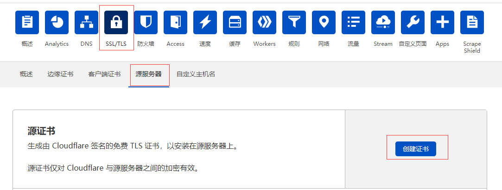
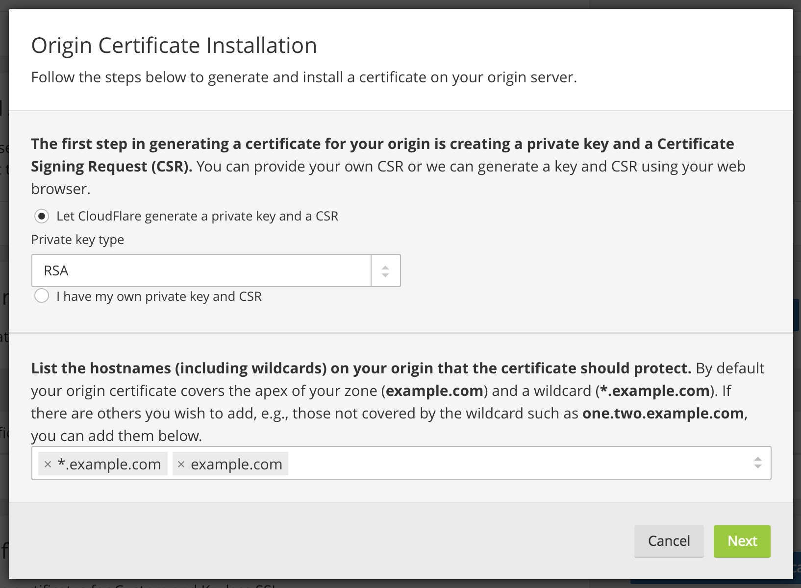
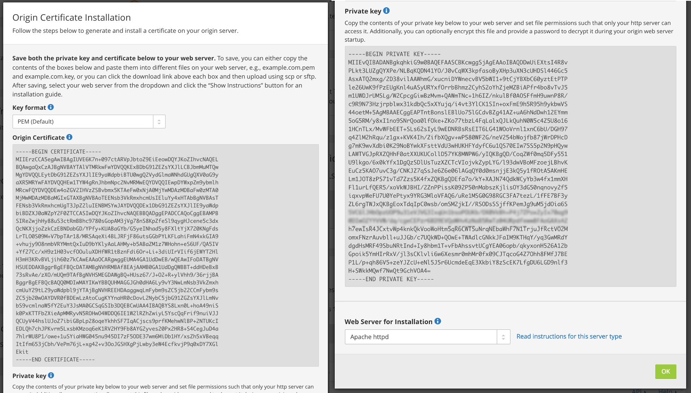
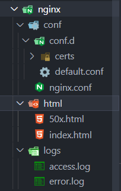
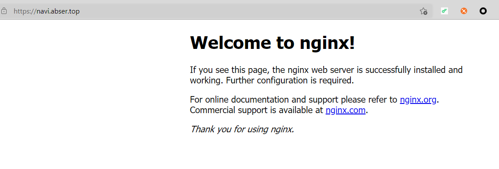

--- 
layout: category-post
title:  "Welcome to blog!"
date:   2016-08-05 20:20:56 -0400
categories: writing
---

\## CloudFlare

\### 生成证书
进入 CloudFlare 界面

\### 点击

\### 创建

\### 拷贝并保存
分别左边的证书拷贝命名成 \`cert.pem\`, 把右边的 private key 命名为 \`key.pem\`

\### 移动到指定位置
:::danger
下文中会创建一个 conf 目录, 在 conf 目录中创建一个 cert 目录, 并把这两个文件移动到里面就可以直接使用本文的 nginx 配置了.
:::

\## Nginx Docker
:::info

\### 启动 Nginx 容器
\`docker pull nginx:latest\`

\`docker run -d --name nginx nginx\`

\`mkdir conf\`

\### 拷贝容器内 Nginx 默认配置文件到本地当前目录下的 conf 目录
\`mkdir conf\`

\`docker cp nginx:/etc/nginx/nginx.conf $PWD/conf\`

\`docker cp nginx:/etc/nginx/conf.d $PWD/conf\`

\`docker cp nginx:/usr/share/nginx/html $PWD/conf\`

\### 清理容器
\`docker container stop nginx\`

\`docker container rm nginx\`
:::

\### 部署
\`\`\`bash
docker run -d --network host -v /workspace/nginx/html:/usr/share/nginx/html -v /workspace/nginx/conf/nginx.conf:/etc/nginx/nginx.conf -v /workspace/nginx/conf/conf.d:/etc/nginx/conf.d -v /workspace/nginx/logs:/var/log/nginx nginx

\`\`\`
:::success
-d # 表示在一直在后台运行容器

--network host # 表示容器使用主机的网络及端口

--name # 设置创建的容器名称

-v # 将本地目录(文件)挂载到容器指定目录；
:::
下面是 \`conf/conf.d/default.conf\`的配置该文件只有在 Docker run 之后才会在本机看到.
:::danger
将下面的 \`YOUR\_DOMAIN\` 换成你的域名.
:::
\`\`\`nginx
server {
 listen 80;
 listen 443 ssl;
 server\_name YOUR\_DOMAIN;
 ssl\_certificate /etc/nginx/conf.d/certs/cert.pem;
 ssl\_certificate\_key /etc/nginx/conf.d/certs/key.pem;
 # gzip config
 gzip on;
 gzip\_min\_length 1k;
 gzip\_comp\_level 9;
 gzip\_types text/plain text/css text/javascript application/json application/javascript application/x-javascript application/xml;
 gzip\_vary on;
 gzip\_disable "MSIE [1-6]\\.";

 root /usr/share/nginx/html;
 include /etc/nginx/mime.types;
 location / {
 try\_files $uri $uri/ /index.html;
 }
 location /api {
 proxy\_pass http://localhost:10001;
 proxy\_set\_header X-Forwarded-Proto $scheme;
 proxy\_set\_header X-Real-IP $remote\_addr;
 client\_max\_body\_size 500m;
 }
 location /files {
 proxy\_pass http://localhost:9573;
 proxy\_set\_header X-Forwarded-Proto $scheme;
 proxy\_set\_header X-Real-IP $remote\_addr;
 }
}
\`\`\`
:::success
location /api 等 # 表示该路由重定向到本地的其他端口

root # 表示网站文件存放的位置

ssl\_certificate /etc/nginx/conf.d/certs/cert.pem; #上文中保存的 cert.pem 文件的路径

ssl\_certificate\_key /etc/nginx/conf.d/certs/key.pem; # 上文中保存的私钥 key.pem 文件的路径
:::
最后的目录结构如图所示, 如果要代理自己的网页, 直接将网页文件替换 \`html \`下的\` index.html\` 等文件即可

\### 检测
访问你的域名, 尝试 \`http://你的域名\` 和 \`https://你的域名\`

