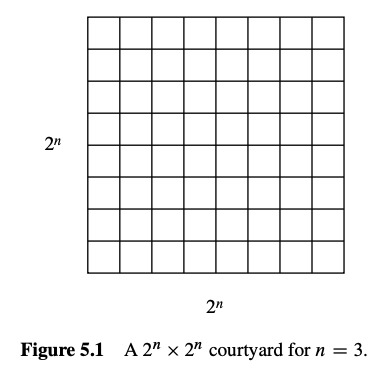
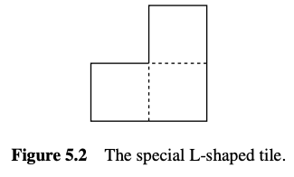
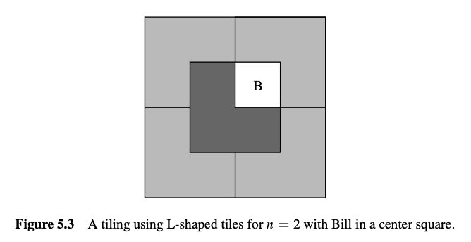
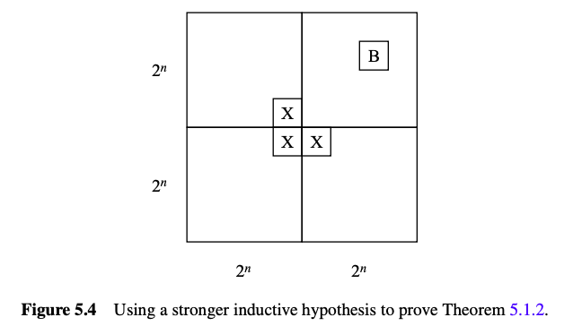
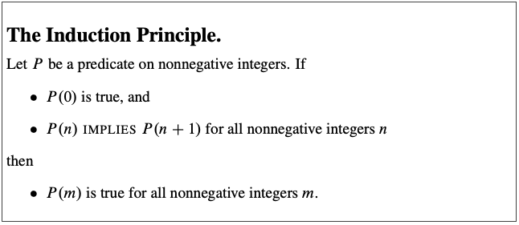

\## Learn
Today we learn how to use Ordinary Induction to prove claim. It's important to know where could we use Ordinary Induction to prove, because  somebody even don't admit it.

\## Question
\*\*Theorem 5.1.2. \*\*\_For all \_ \_there exists a tiling of a courtyard with Bill
in a central square.
\_

\_

First of all. You should try these layout on your paper and see how P(0) or P(1) like.

\## Solution
\*\*\_Proof. \_\*\*\_(doomed attempt)     \_The proof is by induction.

Let  be the proposition
that there exists a tiling of a courtyard with Bill in the center.

\*\*Base case:     \*\* is true because Bill fills the whole courtyard.

\*\*Inductive step:    \*\*

Assume that there is a tiling of a  courtyard with Bill in the
center for some . We must prove that there is a way to tile a  courtyard with Bill in the center . . . . ■

Now we’re in trouble! The ability to tile a smaller courtyard with Bill in the center isn’t much help in tiling a larger courtyard with Bill in the center. We haven’t
figured out how to bridge the gap between  and .

\-\-\-

\*\*\_Proof.\_\*\*\_ \_\_(successful attempt)\_\_.     \_The proof is by induction.

     Let  be the proposition
that for every location of Bill in a  courtyard, there exists a tiling of the
remainder.

\*\*Base case:\*\*      is true because Bill fills the whole courtyard.

\*\*Inductive step:    \*\*

\*\* \*\*Assume that  is true for some ; that is, for every location
of Bill in a courtyard, there exists a tiling of the remainder. Divide the courtyard into four quadrants, each  .

One quadrant contains Bill ( in the diagram below).

Place a temporary Bill ( in the diagram) in each of
the three central squares lying outside this quadrant as shown in Figure 5.4.

 

Now we can tile each of the four quadrants by the induction assumption. Replacing the three temporary Bills with a single L-shaped tile completes the job.

     This
proves that  implies  for all . Thus  is true for all ,
and the theorem follows as a special case where we put Bill in a central square. ■

\## Homework

1\. \*\*Theorem 5.1.1. \*\*\_For all ,\_

Use These Step to try Ordinary Induction.

\-   is true.

\-  For all .

2\. Use the Ordinary Induction to prove \*\*the \*\*\*\*False Theorem.\*\* \_All horses are the same color. \_And figure out when can I use it. You would find its solution in next article.

\## Concept & Attachment & Link

\### Ordinary Induction Rule
\*\*Rule. Induction Rule\*\*

\#### Steps
