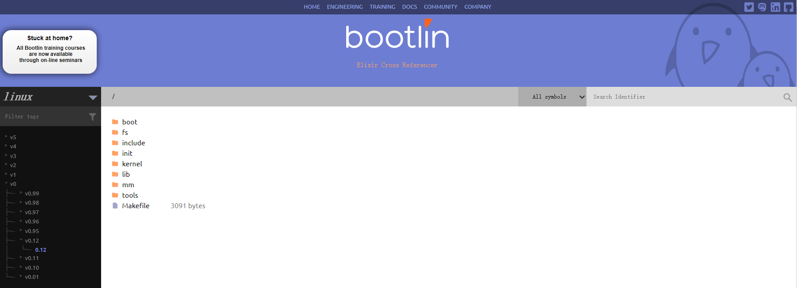
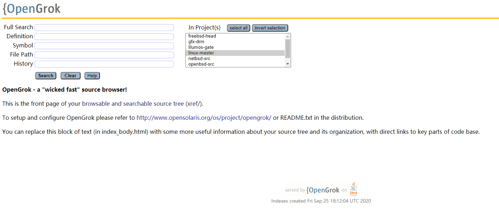
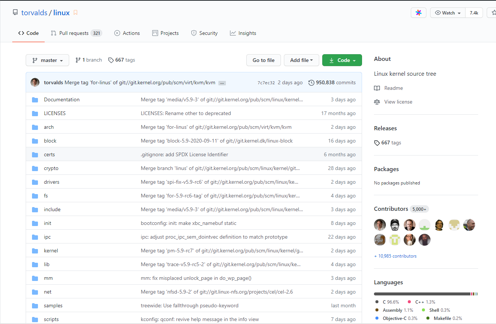

--- 
layout: category-post
title:  "Welcome to blog!"
date:   2016-08-05 20:20:56 -0400
categories: writing
---

\## Linux 源码阅读网站

\### [bootlin](https://elixir.bootlin.com/linux/latest/source): ⭐⭐⭐⭐⭐
我的阅读路线 0.12 - 2.4.0 - 5.9 . Tips: Linux 的偶数版本是稳定版. 有跳转功能.

\### [illumos.org](http://src.illumos.org/source/): ⭐⭐⭐
老样子,我们会有一个替代选择.

\### [github.com](https://github.com/torvalds/linux): ⭐⭐
当然, github 上也有代码托管. PS: Git 就是 torvalds 写的 PPS: 推荐使用 SourceGraph 进行 github 上源码的阅读.(不然没有跳转)

\## 历史邮件列表
[https://lore.kernel.org/lkml/](https://lore.kernel.org/lkml/): linux 内核邮件列表 [https://lore.kernel.org/lists.html](https://lore.kernel.org/lists.html): 该网站收集的所有邮件列表

