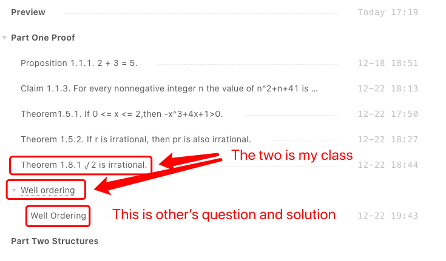
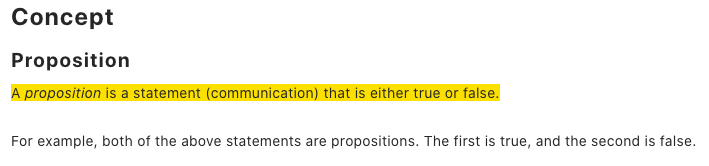
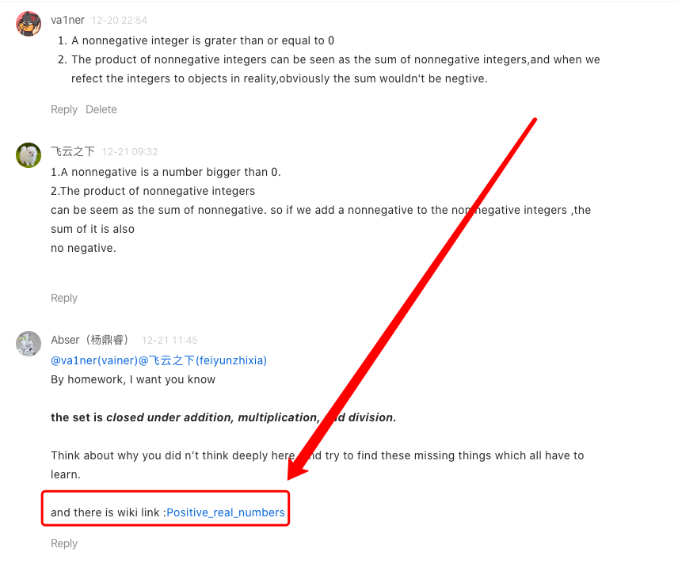

--- 
layout: category-post
title:  "Welcome to blog!"
date:   2016-08-05 20:20:56 -0400
categories: writing
---

\## Origin
We take problem from 《Mathematics for Computer Science》, study math by research these problem.

Problem would have their own post, with its' origin question, and official solutions sometimes, and we would figure out what we have learned from these. You guys could choose our way to study them or(and) do your own work on them. Read them and  search your questions on Internet, discuss under the post is good, too. Then you find out answer and write it with your view by using Yuque comments under the post.

\## Require
Do not just comment your homework！！！！

Revise the problem and try to solve it！

I'll paste your solution or your new question as a subdocument at Tertiary directory like

\## Notes
If there are any other things, I would write here.

19/12/18 New concepts are added below the article. Like this:

19/12/20 You could find more concepts and put the link in the comment.

\## PDF
we use this pdf

[mcs.pdf](https://www.yuque.com/attachments/yuque/0/2019/pdf/176280/1576665219808-b8963639-a2f4-45db-a725-865c25bd1980.pdf)

\## Join
just learn and comment.