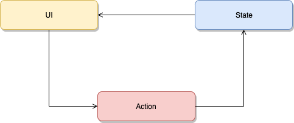

\> 本文讲述如何分析设计 通过 React Hooks 进行 State 持久化管理

\## 分析
正常前端，组件为类文件，自己维持状态，不易复用。

首先把组件中的 UI 和 状态分开，用 Action 连接，如下图。

Action 是算子

\### Function
则可成为以下函数

\- UI = \`f(S)\`
 \- 状态驱动组件重新渲染 UI
\- S =\`f(S, ∆)\`
 \- 组件会用到的 S 和 更改 S 的 ∆ 方法决定。

\#### S
每一个组件有他自己的状态集 s。

\##### s

所有组件的使用到 s共同组成一个状态 S--渲染一个 UI。

\##### s
即，收到组件影响的状态，如登录组件可能每登录一次就会增加计数器，但是对于登录组件并不会用到这个状态，虽然它会更改它。

\### 入参

\#### ∆
设计 State 框架时，让每一个组件声明 s状态时，提供一个更改自己的函数 m ，在 Action 事件时调用用于更改 State，而多个 m 的集合为 ∆。

\#### S
S =\`f(S, ∆)\` 中的 S 作为 f 的参数传入，因为并不知道 Action 会更改哪些 State 【甚至不知道有哪些】，故把所有 State 都作为入参。

\### 局部渲染
更改的状态驱动 UI 渲染，如果相同可以不改变。

如上所说，UI 由于入参为 S ，会接收所有的 State，组件自己根据自己需要的 s 变动渲染，而不是 UI 根据 S 改动分发事件。

观察 Hooks 可知，\`useState()\` 方法使用[\`Object.is\` 比较算法](https://developer.mozilla.org/en-US/docs/Web/JavaScript/Reference/Global\_Objects/Object/is#Description) 来比较 state。

而 \`useEffect()\`则提供选择让它 [在只有某些值改变的时候](https://zh-hans.reactjs.org/docs/hooks-reference.html#conditionally-firing-an-effect) 才执行的参数。

\## 设计

\### 实虚部数学模型
实数并不完备，引入虚部。

虚数，只需要去掉虚部就可以表示实数。

Curry Func 也如此。

以上同理：\`f(S,∆)\`中\`f(S)\` 代表实数，不完备，加入 ∆ ，可以表达所有情况。

更改的维度从一维的 线 成为了 二维的平面。

另：框架使用的\`f(S, ∆)\`还是一维的线，但其实是该平面 任意一条线 ，因为 f(S,∆) 已经中的 ∆ 和 S 已经经由使用者确定，即在多维度选择了一个平面降维实现在代码中了。

\### Persistence
需要一个地方存储数据，local，session，remote 等.

\### Connector
组件如何把触发的事件分发给 State 处理？需要通信。

由于 js 单线程模型，选择共享内存设计新增一个 Connector 用于通信。

组件 Component 如何通知 State 改动。共享内存，采用 Connector 中间层。

\### Action by CurryFunc
State 如何知道框架使用者定义的 Action 改动了哪些 State ？即不知道 ∆ 的具体值。采用 Curry Func 满足延迟求值的需求。

使用 \`fg(S){return f(∆)\`} 代替 \`f(S,∆)\`

State 框架使用者自己使用 \`f(∆)\` 注册自己的状态更改算子 ∆。

State 框架开发者使用\` fg(S)\` ，只管自己传入所有的 State 即可。

由于 React Hooks 的存在，state 自带使用 \`f(S,∆)\` 进行更新的功能。故框架留出 useState() 接口，返回 \`f(∆) \`，供使用者进行状态管理。

\#### Redux
Redux 也是基于此函数模型，而在 Hooks 中官方已经使用 \`useReducer(reducer, initialState)\` 实现了它。其中 reducer 是设定好的 \`f(S，∆)\` ，而它返回 state 和 dispatch，其中 state 就是 S而 dispatch 就是 \`f(∆)\`。
\`\`\`javascript
function useReducer(reducer, initialState) {
 const [state, setState] = useState(initialState);
 function dispatch(action) {
 const nextState = reducer(state, action);
 setState(nextState);
 }
 return [state, dispatch];
}
\`\`\`
在我们看来，它也内部实现了 Connector 的作用。

\## 实现

\### Persistence
首先是通过 Hooks 实现存储, 使用 Local Store
\`\`\`javascript
function useLocalJSONStore(key, defaultValue) {
 const [state, setState] = useState(
 () =\> JSON.parse(localStorage.getItem(key)) \|\| defaultValue
 );
 useEffect(() => {
 localStorage.setItem(key, JSON.stringify(state));
 }, [key, state]);
 return [state, setState];
}
\`\`\`

\#### 存储位置
解决了持久化存储，提供外在的状态管理支持。考虑到我们会使用 Go 来做前端：

1\. 使用 Hooks 加 sqlite3 库本地存储
1\. 使用 Hooks 和 Go 通信完成

\### Connector
为了使用 Hooks 实现全局的状态通知。

首先明白 \`useState()\` 获取到的 \`setState()\` 会触发当前组件的渲染：[https://zh-hans.reactjs.org/docs/hooks-state.html](https://zh-hans.reactjs.org/docs/hooks-state.html)

Connector 让使用全局状态的组件订阅来连接上全局的状态更新，将自己的 \`setState()\` 传入更新队列，当其中任何一个组件使用 \`dispatch()\` 更改状态时会触发这个命名空间下的全部状态更新，从而达到刷新所有状态组件的目的。
\`\`\`javascript
import { useEffect } from "react"

const Connector = {}

const Broadcast = (name, state) => {
 if (!Connector[name]) return;
 Connector[name].forEach(setter => setter(state))
}

const Subscribe = (name, setter) => {
 if (!Connector[name]) Connector[name] =[];
 Connector[name].push(setter)
}

const UnSubscribe = (name, setter) => {
 if (!Connector[name]) return
 const index = Connector[name].indexOf(setter)
 if (index !== -1) Connector[name].splice(index, 1)
}

const connect = (name,setState) => {
 console.log('connect')
 useEffect(() =>{
 Subscribe(name, setState)
 console.log('subscirbe',name)
 return () => {
 UnSubscribe(name,setState)
 console.log('unsubscribe',name)
 }
 },[])
}
\`\`\`

\### useStore
使用者使用 \`useStore()\` 来获取全局状态和 \`dispatch()\` 函数。内部实现就是 State Hook ，并拿到 \`setState()\`注册到订阅列表中。
\`\`\`javascript
import {Broadcast,connect} from './Connector'
import {useState} from 'react'

export function useStore(key,value) {
 const [state,setState] = useState(value)
 connect(key,setState)

 return [state, (key,value) => {
 Broadcast(key,value)
 }]
}

\`\`\`

\### 目前状况

\## 使用
使用 \`useStore(key, value)\` 即可。
\`\`\`javascript
import {useStore} from './useStore'

export function Counter({key,initialCount}) {
 // const [count, setCount] = useLocalJSONStore(keyname, initialCount);
 const [state, dispatch] = useStore(key,initialCount)
 return (
 <>
 Count: {state}
  dispatch(keyname,initialCount)}>Reset dispatch(keyname,state-1)}>- dispatch(keyname,state+1)}>+
 );
 }
\`\`\`

\## 进阶

\- [ ] 异步状态
\- [ ] 装饰器