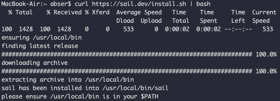
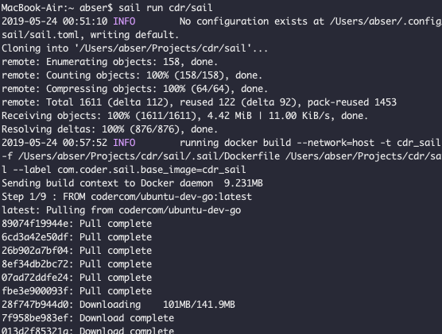

\## First For Sail
\`\`\`bash
curl https://sail.dev/install.sh \| bash
\`\`\`

\### For Environment
如果你想运行某一个项目的 Sail
\`\`\`bash
sail run cdr/sail
\`\`\`

你也可以选择 Chrome 插件

\### For Chrome & extension

1\. Run \`sail install-for-chrome-ext\` to install the chrome extension manifest.json
1\. [Install the extension from the Chrome Marketplace](https://chrome.google.com/webstore/detail/sail/deeepphleikpinikcbjplcgojfhkcmna)
[](https://www.yuque.com/abs/vsbiqa/lsgnht?\_lake\_card=%7B%22status%22%3A%22done%22%2C%22name%22%3A%22github-open.mp4%22%2C%22size%22%3A216416%2C%22percent%22%3A0%2C%22id%22%3A%22MfV9Q%22%2C%22videoId%22%3A%22e203e87fdd294f2cb6be1cd043c278ee%22%2C%22aliyunVideoSrc%22%3A%22https%3A%2F%2Fvod.yuque.com%2Fe203e87fdd294f2cb6be1cd043c278ee%2Fc74f349997d14d8aa9728ff384e40959-16bec048b2d8e2eedfaeb1b7fca141a8-ld.mp4%3Fauth\_key%3D1558630430-3510605468d9451b8451f88c3ac00dc9-0-1aa10a1defd78e1efab4def50cfe7cd4%22%2C%22taobaoVideoId%22%3Anull%2C%22uploaderId%22%3Anull%2C%22authKey%22%3Anull%2C%22docUrl%22%3A%22https%3A%2F%2Fwww.yuque.com%2Fabs%2Fvsbiqa%2Flsgnht%22%2C%22coverUrl%22%3A%22https%3A%2F%2Fcdn.nlark.com%2Fyuque%2F0%2F2019%2Fjpeg%2F176280%2F1558630430612-8a0b3406-e2ad-4368-954a-f0cf23bb2501.jpeg%22%2C%22card%22%3A%22video%22%7D#MfV9Q)

\## 2021年2月21日 更新
现在使用 GitHub 官方自己的 codespace 是更好的选择.