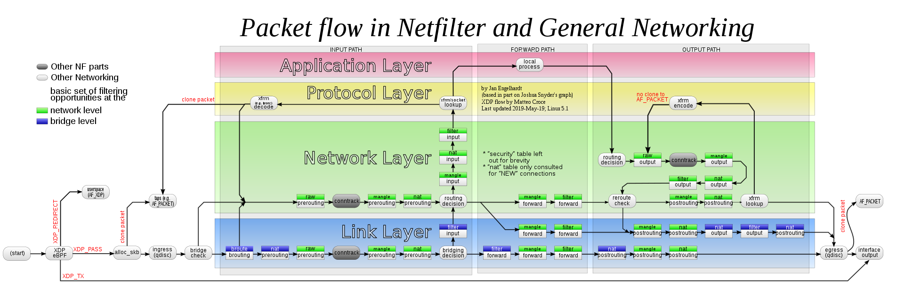
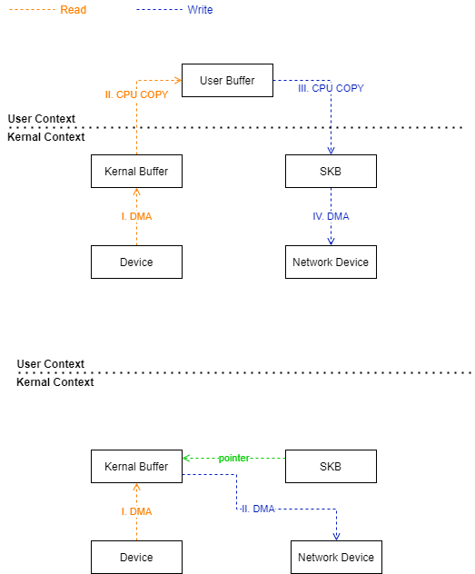
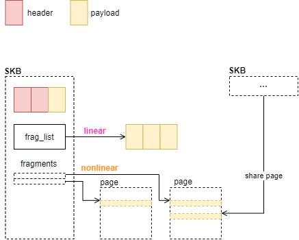

\## Read
\- [Kernel Korner - Why and How to Use Netlink Socket](https://www.linuxjournal.com/article/7356)
\- [IP-XFRM-8](https://man7.org/linux/man-pages/man8/ip-xfrm.8.html)

\- [torvalds/linux/tools/lib/bpf](https://github.com/torvalds/linux/tree/master/tools/lib/bpf)

\## Socket Copy

\## Fragments
