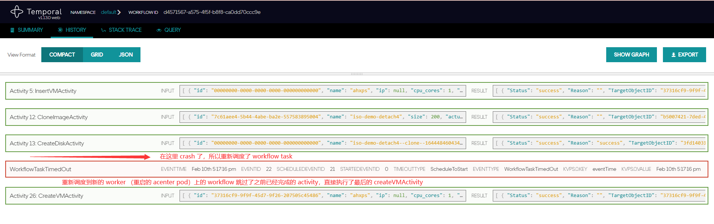
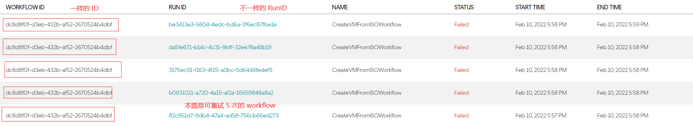
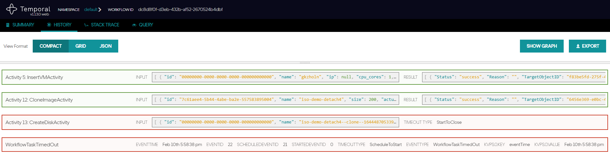
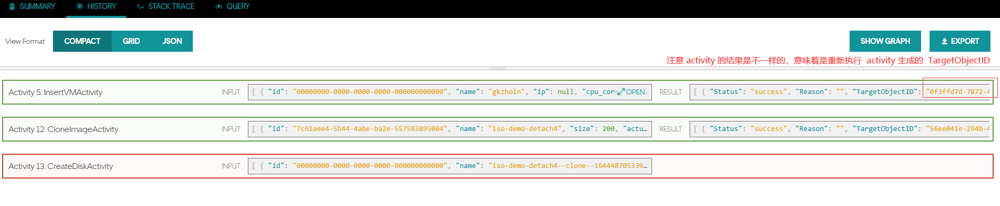
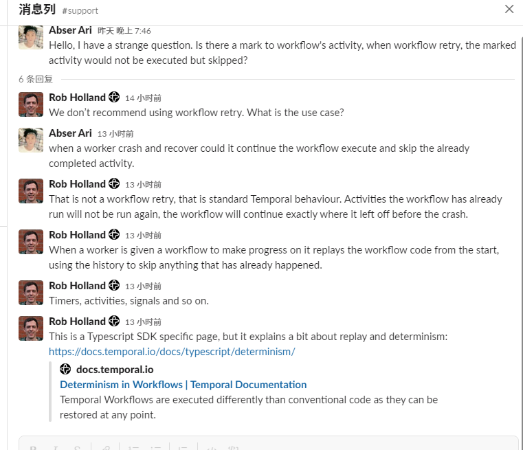

--- 
layout: category-post
title:  "Welcome to blog!"
date:   2016-08-05 20:20:56 -0400
categories: writing
---

\### 问题
Temporal 在执行 workflow 的时候是藉由 worker 完成的实际执行，在 temporal server 端则是 virtual function 来代表的。 当我们的 worker crash 的时候，temporal 是否能够重新调度 workflow task 让 worker 继续 workflow 的运行（即跳过已经执行过的 activity）呢？

\### 结论
Tl;dr 重放可以跳过，重试不可以跳过，所以当我们需要可以跳过的功能的时候，我们应该让可以失败的 activity 增加重试机制，甚至无限重试，同时要求的可能是要该 activity 幂等，否则就 let it crash，让这个 workflow 失败以保证程序逻辑。

\### 概念解析
首先要明晰以下几个概念

1\. workflow task 和 activity task 都是一种 task，会被 temporal server push 到 task queue 中等待满足条件的 worker 去 pull 获得。
1\. task 有三个事件，标志着它在 temporal 中的生命周期，scheduled，started，closed，同时这些事件由 temporal server 进行持久化保证。

\### 重试与重放
任务有三个事件生命周期，分别是 scheduled， started 和 completed

重放： 在 workflow 多个 activities 执行之间中断（即上一个 activity 完成了，还没把下个 activity 的 task 发送到 taskqueue 中，还在 scheduled 状态），在程序中断后，间隔一段时间内（这段时间是可以设置的）重新启动，会自动继续运行未完成的 workflow。

replay 是指的 activity task 还在 scheduled ，没有被一个 worker 捕获并执行的时候，即 workflow 运行到了 两个 activity，（或者 sideeffect，或者 timer） 之间，这个时候 workflow 的 worker 崩溃了，就会把这个 workflow task 重新调度到另外的 worker （也可能是重启了后的 worker）上执行，这个时候已经执行了的 activity 就会跳过。这些数据是持久化在 temporal 服务器中的，甚至可以导出成 json 文件再任意地方 replay 重新执行某一个 workflow 的 execution，然后会跳过已经执行的 activity。

重试： workflow 在执行 activity 的时候中断：（在 started 状态）

 1\. 如果是异步的 activity，可能 worker 中断后又恢复，该 activity 有可能不会失败，因为外部系统依旧可以在超时时间内完成这个 activity，然后 workflow 也继续运行
 1\. 非异步的 activity， 因为 task 已经被 worker 从 taskqueue 中取出来了，temporal 无法感知 client 端的 failure，会等待 activity 设置中的 StartToCloseTimeout配置的时间结束后，按重试规则进行重试 activity。
 1\. 这里如果重试次数设置为 1 （不重试）activity 会失败，然后进入 workflow 的重试，如果 workflow 的重试次数也用完了，该未完成的 workflow 也会失败
 1\. 如果还可以重试，就会继续重试

\*\*查阅两次 workflow 的执行 history event ， 会发现每一个 activity 又重新执行了一遍\*\*

注解： workflow 重试时，之前的 workflow execution 会失败，然后创建一个新的 workflow 进行重试，temporal 会标明失败的 workflow 重试创建的 workflow 是哪一个。

\### Refer

\- [01:48:50](https://www.youtube.com/watch?v=UwdGmdTO3Ts&t=6530s) - Workflow Replay and misc topics 官方的视频解释
\- 