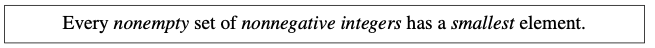

--- 
layout: category-post
title:  "Welcome to blog!"
date:   2016-08-05 20:20:56 -0400
categories: writing
---

\## Question
Prove that

\*\*For any positive integers m and n, the fraction m/n can be written in lowest terms, that is, in the form m' /n' where m' and n' are positive integers with no common prime factors.\*\*

You could read the Concept first:

Every \_nonempty\_\_ \_set of \_nonnegative\_\_ \_\_integers\_\_ \_has a \_smallest \_element.

\## Solution
\*\*Proof:\*\*

Suppose to the contrary that there are positive integers m and n such that the
fraction m/n cannot be written in lowest terms.

Now let  be the set of positive
integers that are \*\*numerators \*\*of such fractions. \*\*why use numerators?\*\*

Then  , so  is nonempty. By
Well Ordering Principle, there must be a smallest integer . So by definition of  , there is an
integer  such that

the fraction  cannot be written in lowest terms.

This means that  and  must have a common prime factor, we call it p and must have p > 1. But

so any way of expressing the left-hand fraction in lowest terms would also work for
, which implies

the fraction  cannot be in written in lowest terms either.

So by definition of , the numerator m0=p is in . But , which
contradicts the fact that  is the smallest element of .

Since the assumption that  is \*\*nonempty\*\* leads to a contradiction, it follows that
 must be empty. That is, that there are no numerators of fractions that can’t be
written in lowest terms, and hence there are no such fractions at all.                                                                                                                        ■

\## Learn & Homework

1\. Learn about \_Well Ordering \_concept.
1\. We prove by using a well-ordered set in the numerator, can we use the denominator?
1\. Please summarize the template of good order proof, listed like 1,2,3···
1\. Are there any other sets that are also well-ordered. Like 0/1、1/2、2/3 ··· n-1/n. If they are well-ordered, why?
1\. For good order, search more information, ask more questions.

\## Concept

\### The Well Ordering Principle

This statement is known as The \_Well Ordering Principle (WOP)\_.

Do you believe
it? Seems sort of obvious, right?

But notice how tight it is: it requires a \*\*\_nonempty\_\*\*
set—it’s false for the empty set which has \_no \_smallest element because it has no
elements at all.

 And it requires a set of \*\*\_nonnegative\_\*\*\_ \_integers—it’s false for the
set of \_negative \_integers and also false for some sets of nonnegative \_rationals\_—for
example, the set of positive rationals.

So, the Well Ordering Principle captures
something special about the nonnegative integers.