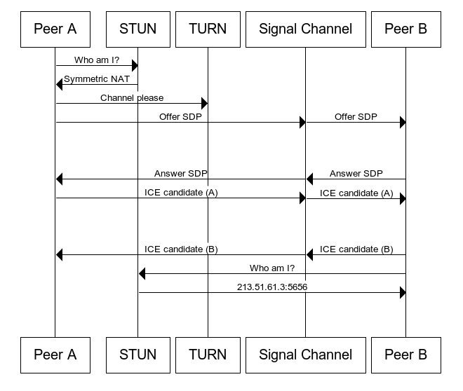

\> webRTC 学习笔记：相关概念，和建立视频通话的流程。

\#### Signal - Middle server
WebRTC establish connection on already communication. We call it\*\* \*\*\*\*signal channel\*\*\*\* \*\*or \*\*signaling service\*\*。

\#### Component

\- [SDP](https://developer.mozilla.org/en-US/docs/Glossary/SDP)：协议，WebRTC 的组件，SDP包含音频和视频的[编解码器](https://developer.mozilla.org/en-US/docs/Glossary/codec)，源地址和时序信息。

\- [ICE](https://developer.mozilla.org/en-US/docs/Glossary/ICE)：（\_交互式连接建立\_）是[WebRTC](https://developer.mozilla.org/en-US/docs/Glossary/WebRTC)（以及其他技术）使用的框架，用于将两个对等方彼此连接，而与网络拓扑结构无关（通常用于音频和/或视频聊天）。即使两个对等方可能都使用网络地址转换器（[NAT](https://developer.mozilla.org/en-US/docs/Glossary/NAT)）与各自本地网络上的其他设备共享全局IP地址，该协议也可以使两个对等方之间找到并建立连接。
\- ICE candidates: details the available methods the peer is able to communicate (directly or through a TURN server)
\- [STUN/TURN](http://www.52im.net/thread-557-1-1.html)：a protocol over NAT

\### [Video Call Process](https://developer.mozilla.org/en-US/docs/Web/API/WebRTC\_API/Connectivity)

\#### Description

1\. The caller captures local Media via [\`navigator.mediaDevices.getUserMedia()\`](https://developer.mozilla.org/en-US/docs/Web/API/Navigator/mediaDevices/getUserMedia)

2\. The caller creates \`RTCPeerConnection\` and called [\`RTCPeerConnection.addTrack()\`](https://developer.mozilla.org/en-US/docs/Web/API/RTCPeerConnection/addTrack) (Since \`addStream\` is deprecating)

3\. The caller calls [\`RTCPeerConnection.createOffer()\`](https://developer.mozilla.org/en-US/docs/Web/API/RTCPeerConnection/createOffer) to create an offer.

4\. The caller calls [\`RTCPeerConnection.setLocalDescription()\`](https://developer.mozilla.org/en-US/docs/Web/API/RTCPeerConnection/setLocalDescription) to set that offer as the \_local description\_ (that is, the description of the local end of the connection).

5\. After setLocalDescription(), the caller asks STUN servers to generate the ice candidates

6\. The caller uses the signaling server to transmit the offer to the intended receiver of the call.

7\. The recipient receives the offer and calls [\`RTCPeerConnection.setRemoteDescription()\`](https://developer.mozilla.org/en-US/docs/Web/API/RTCPeerConnection/setRemoteDescription) to record it as the \_remote description\_ (the description of the other end of the connection).

8\. The recipient does any setup it needs to do for its end of the call: capture its local media, and attach each media tracks into the peer connection via [\`RTCPeerConnection.addTrack()\`](https://developer.mozilla.org/en-US/docs/Web/API/RTCPeerConnection/addTrack)

\`

\`

9\. The recipient then creates an answer by calling [\`RTCPeerConnection.createAnswer()\`](https://developer.mozilla.org/en-US/docs/Web/API/RTCPeerConnection/createAnswer).

10\. The recipient calls [\`RTCPeerConnection.setLocalDescription()\`](https://developer.mozilla.org/en-US/docs/Web/API/RTCPeerConnection/setLocalDescription), passing in the created answer, to set the answer as its local description. The recipient now knows the configuration of both ends of the connection.

11\. The recipient uses the signaling server to send the answer to the caller.

12\. The caller receives the answer.

13\. The caller calls [\`RTCPeerConnection.setRemoteDescription()\`](https://developer.mozilla.org/en-US/docs/Web/API/RTCPeerConnection/setRemoteDescription) to set the answer as the remote description for its end of the call. It now knows the configuration of both peers. Media begins to flow as configured.

\#### Process Picture

\### Guide

\- [Google Codelab about video call by webRTC](https://codelabs.developers.google.com/codelabs/webrtc-web/#4)

\- [视频通话聊天室](https://developer.mozilla.org/en-US/docs/Web/API/WebRTC\_API/Signaling\_and\_video\_calling)：A example display how to create a room which could chat and video call.