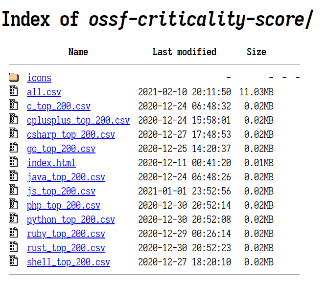

--- 
layout: category-post
title:  "Welcome to blog!"
date:   2016-08-05 20:20:56 -0400
categories: writing
---

\## 起源
\- [Google 支持用 Rust 重写开源软件](https://www.google.com/search?biw=1602&bih=920&sxsrf=ALeKk01AR9bTqQtrufFyZKnRNG0tyTwsNQ%3A1614061137958&ei=UZ40YMb1OYn5tAbkg76gDA&q=google+rust+%E9%87%8D%E5%86%99+opensource&oq=google+rust+%E9%87%8D%E5%86%99+opensource&gs\_lcp=Cgdnd3Mtd2l6EANQ8G5Y8nVg-3poAnAAeACAAdQCiAHPEZIBAzMtN5gBAKABAaoBB2d3cy13aXrAAQE&sclient=gws-wiz&ved=0ahUKEwiG4pemrv\_uAhWJPM0KHeSBD8QQ4dUDCA0&uact=5)
\- [官网原文](https://security.googleblog.com/2021/02/mitigating-memory-safety-issues-in-open.html)

无论 Google 的具体得益打算是什么, Rust 无疑又成为了下一代语言的可选项.

那么哪些开源软件最有价值或者可能能够被支持 Rust 重写呢.

\## 评判标准
[criticality\_score](assert/formula.png) 计算出不同语言的关键项目.

\## 可选项目
除了自己 clone 这个项目来应用这个算法计算之外, 在该 repo 中, 我们可以找到各语言已经预先计算好的版本, 网址如下:

[下载网址](https://commondatastorage.googleapis.com/ossf-criticality-score/index.html)

作为 Go 和 Rust 开发者, 我关心的 top\_200 中感兴趣的如下

[go\_top\_200.csv](https://www.yuque.com/attachments/yuque/0/2021/xls/176280/1614061906534-0899fb31-52c9-4a74-b361-d65f716a704d.xls)

[rust\_top\_200.csv](https://www.yuque.com/attachments/yuque/0/2021/xls/176280/1614061907084-2bea6cf5-f757-489a-a2fc-7c098f8069f9.xls)

值得注意的是, 作为开发人员, 选择相应语言的高价值关键开源项目投入, 能够给大家提供更多的价值.

\## 扩展
如果有兴趣，可以下载这个库为自己感兴趣的开源项目评分， 也可以从 all.csv 中直接找.

如果有更多想法, 还可以尝试为他们构建图数据分析, 或者做一个更好看的前端展示这个排行榜(类似 [https://bestgo.abser.top/](https://bestgo.abser.top/)), 相比其他的排行榜, 我相信这个计算机算出来的排行榜会更让人接受.

\## 结束