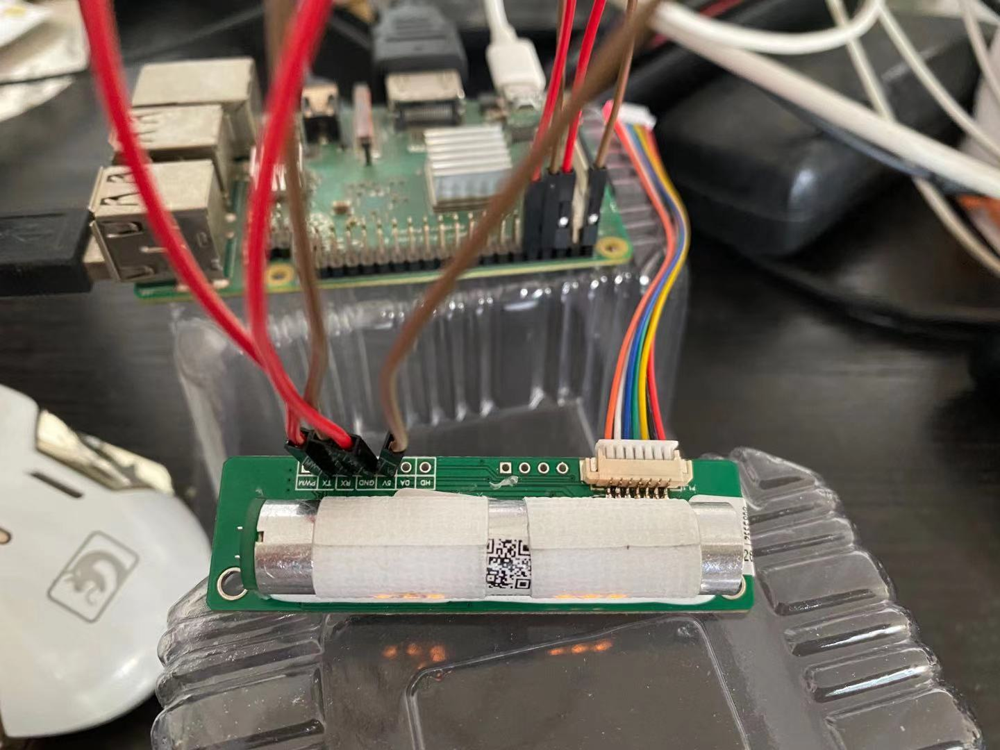
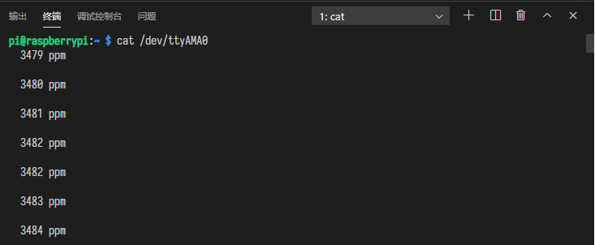
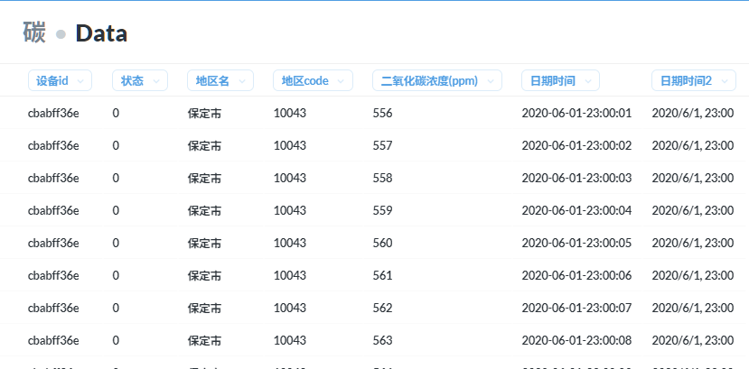
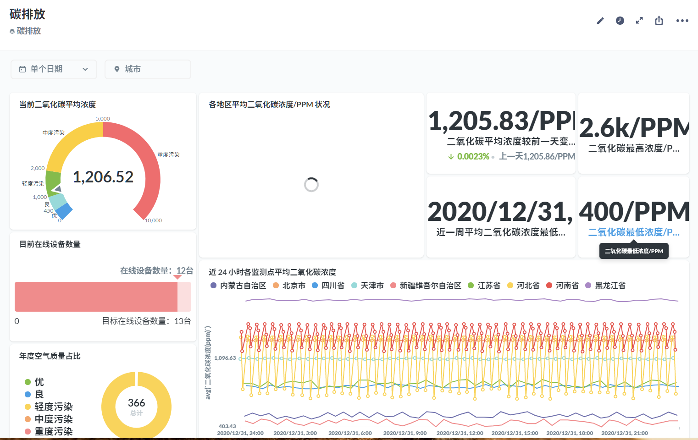

\##

\## Overview

\### Snap

\#### Raspberry

\#### CO2 Sensor

\#### 4G HAT

\### Reading Data
\`\`\`bash
cat /dev/ttyAMA0
\`\`\`

\## Step

\### RasberryPi 3B+ install golang
\`\`\`bash
wget https://golang.org/dl/go1.15.8.linux-armv6l.tar.gz
tar -C /usr/local -xzf go1.15.8.linux-armv6l.tar.gz && rm -f go1.15.8.linux-armv6l.tar.gz
echo "export PATH=$PATH:/usr/local/go/bin" >> ~/.bash\_profile
export PATH=$PATH:/usr/local/go/bin
go version
\`\`\`

\### Read Serial Data
\`\`\`go
package main

import (
 "log"
 "time"

 "github.com/tarm/serial"
)

// pi3 should open uart and communicate with device: /dev/ttyAMA0 \| /dev/serial0
func main() {
 c := &serial.Config{Name: "/dev/ttyAMA0", Baud: 9600, ReadTimeout: time.Second \* 5}
 s, err := serial.OpenPort(c)
 if err != nil {
 log.Fatal(err)
 }

 n, err := s.Write([]byte{0xff, 0x01, 0x03, 0x02, 0x00, 0x00, 0x00, 0x00, 0xfb})
 log.Println("write n", n)
 if err != nil {
 log.Fatal(err)
 }

 buf := make([]byte, 128)
 n, err = s.ReadAll(buf)
 if err != nil {
 log.Fatal(err)
 }
 log.Printf("%q", buf[:n])
}

\`\`\`

\### Server
receive data from edge device
\`\`\`go
func (d dioxideDensity) RegistRouter(r gin.IRouter) {
 r.POST("/dioxide", d.Add)
}

func (d dioxideDensity) Add(c \*gin.Context) {
 var req struct {
 DioxideDensity int \`json: "dioxide" binding:"required"\`
 DeviceId string \`json: "deviceId" binding:"required"\`
 // Status int \`json: "status" binding:"required"\`
 ZoneName string \`json: "zoneName" binding:"required"\`
 }

 if err := c.ShouldBind(&req); err != nil {
 c.Error(err)
 c.JSON(http.StatusBadRequest, gin.H{"status": http.StatusBadRequest})
 return
 }

 err := mysql.InsertDioxide(d.db, req.DioxideDensity, 0, req.ZoneName, req.DeviceId)
 if err != nil {
 log.Println(err)
 }
 c.JSON(http.StatusOK, gin.H{"status": http.StatusOK})
}
\`\`\`

\### Data Model
A. 园区省市模式

B. 经纬度地点模式

\- 需要通过 4G 模块上报 GPS 位置

\### Display

\## Resource
适合嵌入 PPT 的代码图片生成

\- [https://codeimg.io/](https://codeimg.io/)
\- [https://carbon.now.sh/](https://carbon.now.sh/)