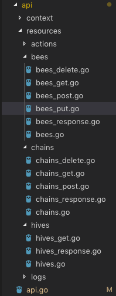

\## Overview
看一下作者本人的注释

\`// Package bees is Beehive's central module system.\`

beehive 非常有趣的在于各逻辑的解耦设计，这不仅让本身功能操作简单，也让扩展变得关注点少了很多，只需要一点学习成本就可以扩展自己的 beehive

首先解释一下 bee hive 中 的概念

\`bee\` 代表的是我们常见的 \`Worker\` 也就是说，实际的行为是由这些 小蜜蜂执行的。他们就类似于采蜜的工人，采集到了之后统一放回来处理

\`hive\` 是蜂房，也就是我们常见的 \`WorkerPool\` 不同的是，她更像一个 \`Facotry\` ，什么意思呢？她可以创建专属的 \`bee\` 。在极少的配置下，比如只需要配置上一个 \`token\` 即可。就可以生成一只 \`bee\` 专门针对某一种蜜工作了。

\`chain\` 又是什么？ \`chain\` 就是链接事件与处理的工具，我们认为 \`bee\` 采回蜜是一个事件，总不可能采回来啥都不干吧。针对不同的 蜜 我们就有不同的反应，就有不同的 \`action\`

比如某人的 blog 更新了 ，rss bee 接收到了之后飞回来，我们就可以再要求 email bee 把这其中的信息通过邮件发给我们或者我们想发给的人。

这就需要 \`chain\` 来联系 \`event\` 和 \`action\` 了

\## Landscape

\### API Register

成组的 API 实现了 Resource 接口注册到 Container 的路由 Route 中。

\#### 帮助理解
在文件中写好了 作者 实现的 Handle 的实现来注册 http 请求

API 只是供调用，逻辑重点在 bees 这个包里的实现。

\### Bee
首先是有的接口
\`\`\`go

// BeeInterface is an interface all bees implement.
type BeeInterface interface {
 // Name of the bee
 Name() string
 // Namespace of the bee
 Namespace() string

 // Description of the bee
 Description() string
 // SetDescription sets a description
 SetDescription(s string)

 // Config returns this bees config
 Config() BeeConfig
 // Options of the bee
 Options() BeeOptions
 // SetOptions to configure the bee
 SetOptions(options BeeOptions)

 // ReloadOptions gets called after a bee's options get updated
 ReloadOptions(options BeeOptions)

 // Activates the bee
 Run(eventChannel chan Event)
 // Running returns the current state of the bee
 IsRunning() bool
 // Start the bee
 Start()
 // Stop the bee
 Stop()

 LastEvent() time.Time
 LogEvent()
 LastAction() time.Time
 LogAction()

 Logln(args ...interface{})
 Logf(format string, args ...interface{})
 LogErrorf(format string, args ...interface{})
 LogFatal(args ...interface{})

 SetSigChan(c chan bool)
 WaitGroup() \*sync.WaitGroup

 // Handles an action
 Action(action Action) []Placeholder
}

\`\`\`

和他的基础实现

\`\`\`go
// Bee is the base-struct to be embedded by bee implementations.
type Bee struct {
 config BeeConfig

 lastEvent time.Time
 lastAction time.Time

 Running bool
 SigChan chan bool
 waitGroup \*sync.WaitGroup
}
\`\`\`

这里需要注意的是 Run 接口，在 Base-Struct \`Bee 中该方法\` 是空的实现，因为 Run 是 Bee 的生命周期开始处，是自动开始的。

\#### WebBee 实现
简单的看某一个实现即可

\`\`\`go
// WebBee is a Bee that starts an HTTP server and fires events for incoming
// requests.
type WebBee struct {
 bees.Bee

 addr string

 eventChan chan bees.Event
}
\`\`\`

可以很清楚的指导，这个 WebBee 中的 eventChan 正是通知的地方，也就是上文所说的 Chain 的开始处。注意的是由于松耦合的设计，任何 Bee 都可以成为 Chain 上的一环，只要它能触发事件。或者监听事件。

\##### func (mod \*WebBee) Run(cin chan bees.Event)

\`\`\`go

// Run executes the Bee's event loop.
func (mod \*WebBee) Run(cin chan bees.Event) {
 mod.eventChan = cin

 srv := &http.Server{Addr: mod.addr, Handler: mod}
 l, err := net.Listen("tcp", mod.addr)
 if err != nil {
 mod.LogErrorf("Can't listen on %s", mod.addr)
 return
 }
 defer l.Close()

 go func() {
 err := srv.Serve(l)
 if err != nil {
 mod.LogErrorf("Server error: %v", err)
 }
 // Go 1.8+: srv.Close()
 }()

 select {
 case <-mod.SigChan:
 return
 }
}
\`\`\`

同时 WebBee 也有一个方法 ServeHTTP 来实现 http.Handle 来处理请求。

这里也就是前文所说的 注册的那些 API 的部分来源，每一个 bee 自身实现的自动注册暴露给外界调用。
\`\`\`go
func (mod \*WebBee) ServeHTTP(w http.ResponseWriter, req \*http.Request)
\`\`\`

\#### Event
\`package：beehive/bees/event.go\`

刚才讲到了 触发事件 event 的 WebBee 实现，现在我们来看 event 的实现

实际上是通过 这个函数实现的

\`\`\`go
// handleEvents handles incoming events and executes matching Chains.
func handleEvents() {
 for {
 event, ok := <-eventsIn
 ···
 bee := GetBee(event.Bee)
 (\*bee).LogEvent()

 ···
 go func() {
 defer func() {
 if e := recover(); e != nil {
 log.Printf("Fatal chain event: %s %s", e, debug.Stack())
 }
 }()

 execChains(&event)
 }()
 }
}
\`\`\`
省略了 日志部分。可以看到 handleEvents 通过接受通道里的 \`event\`，并检查 \`event\` 中的 \`Bee\` 作为 标志找到对应的 Bee 唤醒。

这里我们可以看到 最后进入了 Chains 中执行，即上文所说的 Chain 将 Event 和 Action 链接了起来，让 Bee 之间能够协作。

\##### chain
\`package：beehive/bees/chains.go\`

chain 中实际上是调用 Actions 通过下面的 execActions 函数
\`\`\`go
 for \_, el := range c.Actions {
 action := GetAction(el)
 if action == nil {
 log.Println("\\t\\tERROR: Unknown action referenced!")
 continue
 }
 execAction(\*action, m)
 }
\`\`\`

我们来看看 Action 的执行。

\#### Action Exec
\`package: beehive/bees/actions.go\`

actions 既可以运行设置中的 options 也可以直接在 运行函数中传入需要运行的 options

\`func execAction(action Action, opts map[string]interface{}) bool \`

\### Summary
整个执行逻辑是如此了，其他还有一些

\- 日志处理：用于跟踪 bee 和 hive 的情况
\- Config：保存配置文件，每一次启动可以重新放飞以前的 Bee 们
\- Signal：beehive 拦截了一些 Signal 的 Kill 等信号来执行优雅退出，避免了 Config 等的丢失。
\- Run Flag：执行的附带参数，设定 Beehive 整个应用的监听端口和版本配置。