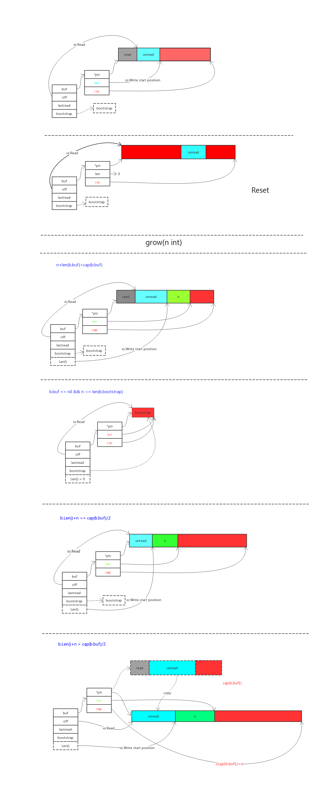

\# Overview buffer.go
这是 bytes 包里的 buffer 实现

\## 一图胜千言
看不懂图的再看下面吧

\## 核心函数

\### Buffer 结构
这是 buffer 的内部结构

buf 字节切片，用来存储 buffer 的内容

off 是代表从哪里开始读

bootstrap 用来作为字节切片过小的时候防止多次申请空间减小开销

lastRead 用来记录上一次的操作
\`\`\`go
// A Buffer is a variable-sized buffer of bytes with Read and Write methods.
// The zero value for Buffer is an empty buffer ready to use.
// 注意 buffer 的零值是空的 buf
type Buffer struct {
 buf []byte // contents are the bytes buf[off : len(buf)]
 off int // read at &buf[off], write at &buf[len(buf)]
 bootstrap [64]byte // memory to hold first slice; helps small buffers avoid allocation.
 lastRead readOp // last read operation, so that Unread\* can work correctly.

 // FIXME: it would be advisable to align Buffer to cachelines to avoid false
 // sharing.
}

\`\`\`

\### Grow(n int)
申请扩展缓冲区
\`\`\`go
// Grow grows the buffer's capacity, if necessary, to guarantee space for
// another n bytes. After Grow(n), at least n bytes can be written to the
// buffer without another allocation.
// If n is negative, Grow will panic.
// If the buffer can't grow it will panic with ErrTooLarge.
// 增加容量 n byte
func (b \*Buffer) Grow(n int) {
 if n < 0 {
 panic("bytes.Buffer.Grow: negative count")
 }
 m := b.grow(n)
 b.buf = b.buf[:m]
}
\`\`\`

\### WriteString(s string) (n int, err error)
向 buffer 中写字符串
\`\`\`go
// WriteString appends the contents of s to the buffer, growing the buffer as
// needed. The return value n is the length of s; err is always nil. If the
// buffer becomes too large, WriteString will panic with ErrTooLarge.
// 直接写 string 也行，同时自动扩展
func (b \*Buffer) WriteString(s string) (n int, err error) {
 b.lastRead = opInvalid
 //先尝试不用扩展容量的写法
 m, ok := b.tryGrowByReslice(len(s))
 if !ok {
 m = b.grow(len(s))
 }
 // copy 可以直接把 string 类型作为 字节切片拷贝过去
 return copy(b.buf[m:], s), nil
}

\`\`\`

也有写字节切片的形式  \`Write(p []byte) (n int, err error)\`

\### ReadFrom(r io.Reader) (n int64, err error)
从 io.Reader 读取数据到 buffer 中

\`\`\`go
// ReadFrom reads data from r until EOF and appends it to the buffer, growing
// the buffer as needed. The return value n is the number of bytes read. Any
// error except io.EOF encountered during the read is also returned. If the
// buffer becomes too large, ReadFrom will panic with ErrTooLarge.
// 从实现了 io.Reader 接口的 r 中读取到 EOF 为止，如果超出了 maxInt 那么大就会返回太
// 大不能通过一个 [maxInt]byte 字节切片来存储了
func (b \*Buffer) ReadFrom(r io.Reader) (n int64, err error) {
 b.lastRead = opInvalid
 for {
 i := b.grow(MinRead)
 // grow 申请了 n 个空间之后，会将 buffer 中的字节切片延长长度到 n 个字节之后
 // 所以需要重新赋值一下长度，避免一些误解，保证长度都是有效数据提供的
 b.buf = b.buf[:i]
 // 将 r 中的数据读到 buffer 中去
 m, e := r.Read(b.buf[i:cap(b.buf)])
 if m < 0 {
 panic(errNegativeRead)
 }

 // 手动更改长度
 b.buf = b.buf[:i+m]
 n += int64(m)
 if e == io.EOF {
 return n, nil // e is EOF, so return nil explicitly
 }
 if e != nil {
 return n, e
 }
 }
}
\`\`\`

\### WriteTo(w io.Writer) (n int64, err error)
向 io.Writer 中写数据

\`\`\`go
// WriteTo writes data to w until the buffer is drained or an error occurs.
// The return value n is the number of bytes written; it always fits into an
// int, but it is int64 to match the io.WriterTo interface. Any error
// encountered during the write is also returned.
func (b \*Buffer) WriteTo(w io.Writer) (n int64, err error) {
 b.lastRead = opInvalid
 if nBytes := b.Len(); nBytes > 0 {
 //从 off 开始读的地方算起，全部写到 io.Writer 中去
 m, e := w.Write(b.buf[b.off:])
 //写的多了就报错
 if m > nBytes {
 panic("bytes.Buffer.WriteTo: invalid Write count")
 }
 //记录写过了多少，位移 offset 指针
 b.off += m

 n = int64(m)
 if e != nil {
 return n, e
 }
 // all bytes should have been written, by definition of
 // Write method in io.Writer
 // 因为刚才判断过写多了的情况，所以这里是写少了
 if m != nBytes {
 return n, io.ErrShortWrite
 }
 }
 // Buffer is now empty; reset.
 // 写完之后重置
 b.Reset()
 return n, nil
}
\`\`\`

\### ReadBytes(delim byte) (line []byte, err error)
用来读到终止符就结束，返回的是一个 line 字节切片包含终止符前的数据

\`\`\`go
// ReadBytes reads until the first occurrence of delim in the input,
// returning a slice containing the data up to and including the delimiter.
// If ReadBytes encounters an error before finding a delimiter,
// it returns the data read before the error and the error itself (often io.EOF).
// ReadBytes returns err != nil if and only if the returned data does not end in
// delim.
// 读取到终止符为止，就结束
func (b \*Buffer) ReadBytes(delim byte) (line []byte, err error) {
 slice, err := b.readSlice(delim)
 // return a copy of slice. The buffer's backing array may
 // be overwritten by later calls.
 line = append(line, slice...)
 return line, err
}

\`\`\`

\### NewBuffer(buf []byte) \*Buffer
用来新建一个新的 Buffer ，其实也可以使用 new 和 var 来声明

\`\`\`go
// NewBuffer creates and initializes a new Buffer using buf as its
// initial contents. The new Buffer takes ownership of buf, and the
// caller should not use buf after this call. NewBuffer is intended to
// prepare a Buffer to read existing data. It can also be used to size
// the internal buffer for writing. To do that, buf should have the
// desired capacity but a length of zero.
//
// In most cases, new(Buffer) (or just declaring a Buffer variable) is
// sufficient to initialize a Buffer.
// 通过字节切片创建一个 buffer ，字节切片会保留初始值
// 在渴望容量但是长度为 0？的情况下
// 也可以当作内核的 buffer 来写入
func NewBuffer(buf []byte) \*Buffer { return &Buffer{buf: buf} }
\`\`\`

同时也有通过 string 类型的实现

\`\*\*func NewBufferString(s string) \*Buffer {return &Buffer{buf: []byte(s)}}\*\*\`

\## 总结
缓冲区，实现了大小控制，字节切片和 string 类型的读写，同时还对情况进行了优化，比如存在 bootstrap，比如 grow 函数中的多次检定。适合多读精读来学习

\# Overview reader.go
这个太简单，没什么核心的东西，就是实现了reader的接口实例

\## 结构
\`\`\`go
// A Reader implements the io.Reader, io.ReaderAt, io.WriterTo, io.Seeker,
// io.ByteScanner, and io.RuneScanner interfaces by reading from
// a byte slice.
// Unlike a Buffer, a Reader is read-only and supports seeking.
// 实现了读取的各种方法，与 buffer 不同的是，只读同时支持位置
type Reader struct {
 s []byte
 i int64 // current reading index
 prevRune int // index of previous rune; or < 0
}
\`\`\`

\## 总结
注意该 bytes.Reader 是只读的。

\# Overview bytes.go
操作字节切片的函数，与字符串 \`strings\`  包类似。

\## 核心函数

\### genSplit(s, sep []byte, sepSave, n int) [][]byte
切分切片使用的最核心的函数。

有四个参数，第一个是被切切片，第二个是分隔符，第三个是选择包含分隔符在内往后几个字节一起作为子切片，最后一个是最多通过n个分隔符来切分
\`\`\`go
// Generic split: splits after each instance of sep,
// including sepSave bytes of sep in the subslices.
// 将含有 sep 的字节切片全部单独切开，最多切 n 个，同时 匹配到时候多切 sepSave 个字节一起切进同一个切片
func genSplit(s, sep []byte, sepSave, n int) [][]byte {
 if n == 0 {
 return nil
 }
 if len(sep) == 0 {
 return explode(s, n)
 }
 if n < 0 {
 n = Count(s, sep) + 1
 }

 a := make([][]byte, n)
 n--
 i := 0
 for i < n {
 m := Index(s, sep)
 if m < 0 {
 break
 }
 a[i] = s[: m+sepSave : m+sepSave]
 s = s[m+len(sep):]
 i++
 }
 a[i] = s
 return a[:i+1]
}

\`\`\`

\### Fields(s []byte) [][]byte
主要是可以消除多个分隔符连续的噪声

这里的巧妙的地方时通过了一个 uint8 数组来实现了 ASCII 编码的空格的判定，还是使用位来判定是否存在非ASCII编码加快分隔速度。

有一个 FieldsFunc 函数来自定义规则
\`\`\`go
var asciiSpace = [256]uint8{'\\t': 1, '\\n': 1, '\\v': 1, '\\f': 1, '\\r': 1, ' ': 1}

// Fields interprets s as a sequence of UTF-8-encoded code points.
// It splits the slice s around each instance of one or more consecutive white space
// characters, as defined by unicode.IsSpace, returning a slice of subslices of s or an
// empty slice if s contains only white space.
func Fields(s []byte) [][]byte {
 // First count the fields.
 // This is an exact count if s is ASCII, otherwise it is an approximation.
 n := 0
 wasSpace := 1
 // setBits is used to track which bits are set in the bytes of s.
 // 意思就是通过位来判断是否所有的都可以通过字节来表示而不是需要utf-8编码
 setBits := uint8(0)
 // 这里实现了如果连续出现空格不会多次计数的除噪，通过 wasSpace
 for i := 0; i < len(s); i++ {
 r := s[i]
 setBits \|= r
 isSpace := int(asciiSpace[r])
 n += wasSpace & ^isSpace
 wasSpace = isSpace
 }
 //不能通过ASCII码了就用utf-8
 if setBits >= utf8.RuneSelf {
 // Some runes in the input slice are not ASCII.
 return FieldsFunc(s, unicode.IsSpace)
 }

 // ASCII fast path 更快
 a := make([][]byte, n)
 na := 0
 fieldStart := 0
 i := 0
 // Skip spaces in the front of the input.
 // 跳过开头的空格
 for i < len(s) && asciiSpace[s[i]] != 0 {
 i++
 }
 fieldStart = i
 for i < len(s) {
 if asciiSpace[s[i]] == 0 {
 i++
 continue
 }
 a[na] = s[fieldStart:i:i]
 na++
 i++
 // Skip spaces in between fields.
 for i < len(s) && asciiSpace[s[i]] != 0 {
 i++
 }
 fieldStart = i
 }
 // 弥补上面的判断可能最后的EOF会忽略
 if fieldStart < len(s) { // Last field might end at EOF.
 a[na] = s[fieldStart:len(s):len(s)]
 }
 return a
}

\`\`\`

\### Join(s [][]byte, sep []byte) []byte
有分离就有连结，通过 sep 分隔符插在中间。
\`\`\`go
// Join concatenates the elements of s to create a new byte slice. The separator
// sep is placed between elements in the resulting slice.
func Join(s [][]byte, sep []byte) []byte {
 if len(s) == 0 {
 return []byte{}
 }
 if len(s) == 1 {
 // Just return a copy.
 return append([]byte(nil), s[0]...)
 }
 //判断需要多长的切片
 n := len(sep) \* (len(s) - 1)
 for \_, v := range s {
 n += len(v)
 }

 b := make([]byte, n)
 bp := copy(b, s[0])
 for \_, v := range s[1:] {
 bp += copy(b[bp:], sep)
 bp += copy(b[bp:], v)
 }
 return b
}
\`\`\`

\### Map(mapping func(r rune) rune, s []byte) []byte
通过映射函数替换切片中满足条件的字节
\`\`\`go
// Map returns a copy of the byte slice s with all its characters modified
// according to the mapping function. If mapping returns a negative value, the character is
// dropped from the byte slice with no replacement. The characters in s and the
// output are interpreted as UTF-8-encoded code points.

func Map(mapping func(r rune) rune, s []byte) []byte {
 // In the worst case, the slice can grow when mapped, making
 // things unpleasant. But it's so rare we barge in assuming it's
 // fine. It could also shrink but that falls out naturally.
 maxbytes := len(s) // length of b
 nbytes := 0 // number of bytes encoded in b
 b := make([]byte, maxbytes)
 for i := 0; i < len(s); {
 wid := 1
 r := rune(s[i])
 if r >= utf8.RuneSelf {
 r, wid = utf8.DecodeRune(s[i:])
 }
 r = mapping(r)
 if r >= 0 {
 rl := utf8.RuneLen(r)
 if rl < 0 {
 rl = len(string(utf8.RuneError))
 }
 if nbytes+rl > maxbytes {
 // Grow the buffer.
 maxbytes = maxbytes\*2 + utf8.UTFMax
 nb := make([]byte, maxbytes)
 copy(nb, b[0:nbytes])
 b = nb
 }
 nbytes += utf8.EncodeRune(b[nbytes:maxbytes], r)
 }
 i += wid
 }
 return b[0:nbytes]
}
\`\`\`

\### indexFunc(s []byte, f func(r rune) bool, truth bool) int
返回满足条件函数的 rune 的下标，未找到就返回-1

条件函数可以是满足条件，可以是不满足条件，看变量 truth 的使用
\`\`\`go
// indexFunc is the same as IndexFunc except that if
// truth==false, the sense of the predicate function is
// inverted.
func indexFunc(s []byte, f func(r rune) bool, truth bool) int {
 start := 0
 for start < len(s) {
 wid := 1
 r := rune(s[start])
 //如果是utf-8编码才能识别，则调用utf-8.DecodeRune(s[start:])
 if r >= utf8.RuneSelf {
 r, wid = utf8.DecodeRune(s[start:])
 }
 if f(r) == truth {
 return start
 }
 start += wid
 }
 return -1
}
\`\`\`

\### makeCutsetFunc(cutset string) func(r rune) bool
通过传入 的 string 类型变量，作为判断的条件函数，该函数判断 如果是 string 蕴含的返回真否则假
\`\`\`go
func makeCutsetFunc(cutset string) func(r rune) bool {
 if len(cutset) == 1 && cutset[0] < utf8.RuneSelf {
 return func(r rune) bool {
 return r == rune(cutset[0])
 }
 }
 if as, isASCII := makeASCIISet(cutset); isASCII {
 return func(r rune) bool {
 return r < utf8.RuneSelf && as.contains(byte(r))
 }
 }
 return func(r rune) bool {
 for \_, c := range cutset {
 if c == r {
 return true
 }
 }
 return false
 }
}

\`\`\`

\## 帮助实现的使用次数较多的函数

\### DecodeRune(p []byte) (r rune, size int)

\`\`\`go
// DecodeRune unpacks the first UTF-8 encoding in p and returns the rune and
// its width in bytes. If p is empty it returns (RuneError, 0). Otherwise, if
// the encoding is invalid, it returns (RuneError, 1). Both are impossible
// results for correct, non-empty UTF-8.
//
// An encoding is invalid if it is incorrect UTF-8, encodes a rune that is
// out of range, or is not the shortest possible UTF-8 encoding for the
// value. No other validation is performed.
func DecodeRune(p []byte) (r rune, size int) {
 n := len(p)
 if n < 1 {
 return RuneError, 0
 }
 p0 := p[0]
 x := first[p0]
 if x >= as {
 // The following code simulates an additional check for x == xx and
 // handling the ASCII and invalid cases accordingly. This mask-and-or
 // approach prevents an additional branch.
 mask := rune(x) << 31 >> 31 // Create 0x0000 or 0xFFFF.
 return rune(p[0])&^mask \| RuneError&mask, 1
 }
 sz := x & 7
 accept := acceptRanges[x>>4]
 if n < int(sz) {
 return RuneError, 1
 }
 b1 := p[1]
 if b1 < accept.lo \|\| accept.hi < b1 {
 return RuneError, 1
 }
 if sz == 2 {
 return rune(p0&mask2)<<6 \| rune(b1&maskx), 2
 }
 b2 := p[2]
 if b2 < locb \|\| hicb < b2 {
 return RuneError, 1
 }
 if sz == 3 {
 return rune(p0&mask3)<<12 \| rune(b1&maskx)<<6 \| rune(b2&maskx), 3
 }
 b3 := p[3]
 if b3 < locb \|\| hicb < b3 {
 return RuneError, 1
 }
 return rune(p0&mask4)<<18 \| rune(b1&maskx)<<12 \| rune(b2&maskx)<<6 \| rune(b3&maskx), 4
}
\`\`\`

\### Equal(a, b []byte) bool

\`\`\`go
//go:noescape

// Equal returns a boolean reporting whether a and b
// are the same length and contain the same bytes.
// A nil argument is equivalent to an empty slice.
func Equal(a, b []byte) bool // in internal/bytealg

\`\`\`

\## 总结
实现了几乎所有能对字节切片产生的操作，基本都是基于 utf-8 编码来判定的，或者使用 ASCII 码当可以使用的时候，实现了

\- [x] 分隔    各种规则的分隔符分隔（包括自定义规则）
\- [x] 裁剪    内置左右匹配的裁剪（自定义规则）和裁剪空格符
\- [x] 粘合
\- [x] 索引
\- [x] 替换
\- [x] 各种规则的替换
\- [x] 内置大小写和标题字体的替换
\- [x] 这些都是在包内分成了小函数来实现增强可自定义的性质，比如内置实现一些判断是否有前缀，是否包含某些编码，就像造好了手枪和一些子弹，想要更多功能直接制造特制子弹即可。如果关心这个功能模块化请看带 Func 签名的函数即可

Ps：包含有 Rabin-Karp search 的实现，被使用在 Index 这个返回索引的函数中。