\# Caddy 源码全解析

\## Preface

Caddy 是 Go 语言构建的轻量配置化服务器。同时代码结构由于 Go 语言的轻便简洁，比较易读，推荐学弟学妹学习 Go 的时候也去查看追一下它的源码。不用怕相信这篇文章能给你很大的信心。

可能会有点多，建议多看几遍。

\## Overview-CaddyMain

当然，建议看这篇文章的时候，查看上手一下 Caddy 的实际配置操作应用，对理解源码会有好处，如果没有操作过也没有关系。

\### Package

这是 caddy 包的结构

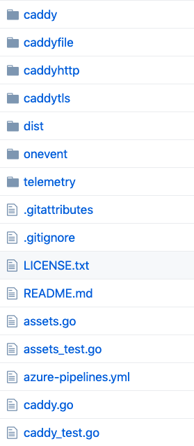

首先我们从一切的开始讲起，即平时我们程序运行的 main.go 函数。

这是 上图 caddy 文件夹下的目录结构。

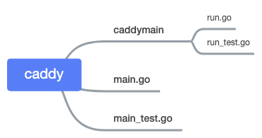

在 caddy 文件夹中的 main 函数启动 caddy 服务器。实际运行的是 run.go 中的文件，这是方便测试使用

看 [main.go ](https://sourcegraph.com/github.com/caddyserver/caddy/-/blob/caddy/main.go#L24:11)的代码

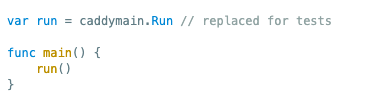

通过改变 run 变量的值来方便测试，可以学习一下。

\#### 启动流程

启动 caddy 的流程画了张图

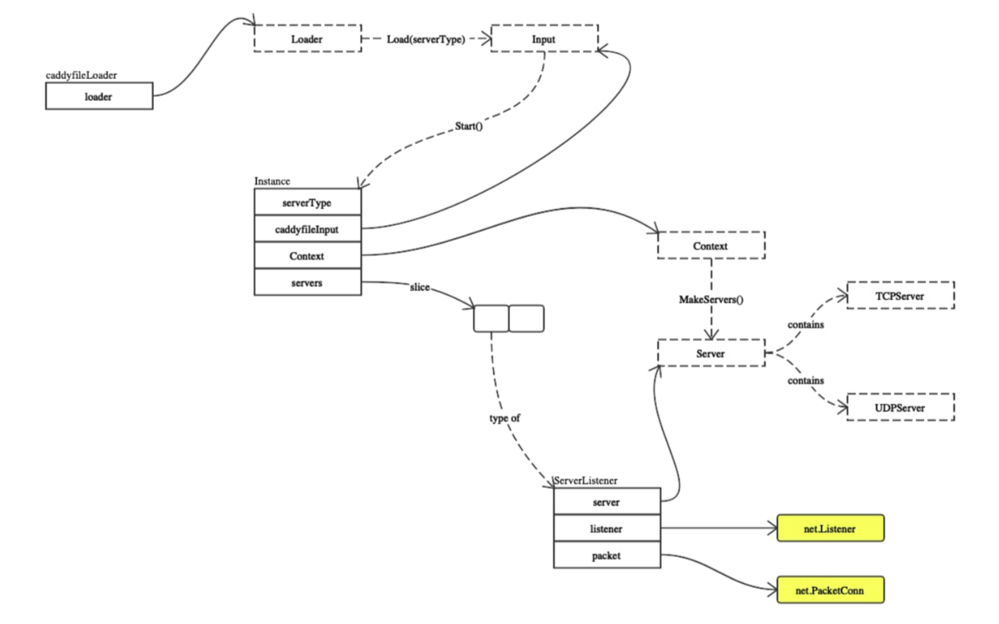

见到不认识的不用担心，查看上文的目录结构可以找到他们大概的位置，下文会详细讲解。

可以在此图中看到几个重要的点 \`caddyfileLoader\`这是加载 caddyfile 配置来启动服务器的。

如果配置使用过 caddy ，配置的 caddyfile 就是在这里被 \`Loader\` 读取后实例化服务器的。如果没有使用过，大致说一下流程，使用 caddy 非常简单，只需配置上文所说的 caddyfile 文件，按行配置选项，然后使用 caddy 运行读取该配置文件即可。简单示例就是以下的文本。

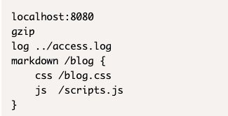

\`Instance\` 是运行操作的实例，可以看到几个主要的操作都是在他身上

\`Server\` 可以看到拥有 \`TCP\` \`UDP\` 两个 Server 的接口。

我们首先关心的是 \`Start()\` 启动服务器。

\### 启动服务器

发送 StartupEvent, 参照下文中 [Event](#Js2Dd) 理解

\`\`\`go
// Executes Startup events
caddy.EmitEvent(caddy.StartupEvent, nil)
\`\`\`

读取配置文件：

\`\`\`go
caddyfileinput, err := caddy.LoadCaddyfile(serverType)
\`\`\`

启动：

\`\`\`go
instance, err := caddy.Start(caddyfileinput)
\`\`\`

发送 InstanceStartupEvent

\`\`\`go
caddy.EmitEvent(caddy.InstanceStartupEvent, instance
\`\`\`

\#### caddy.Start()

阅读完代码，画一张图帮助理解

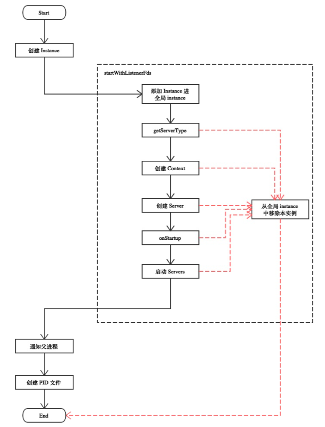

是不是很简单，来一点更详细的交互

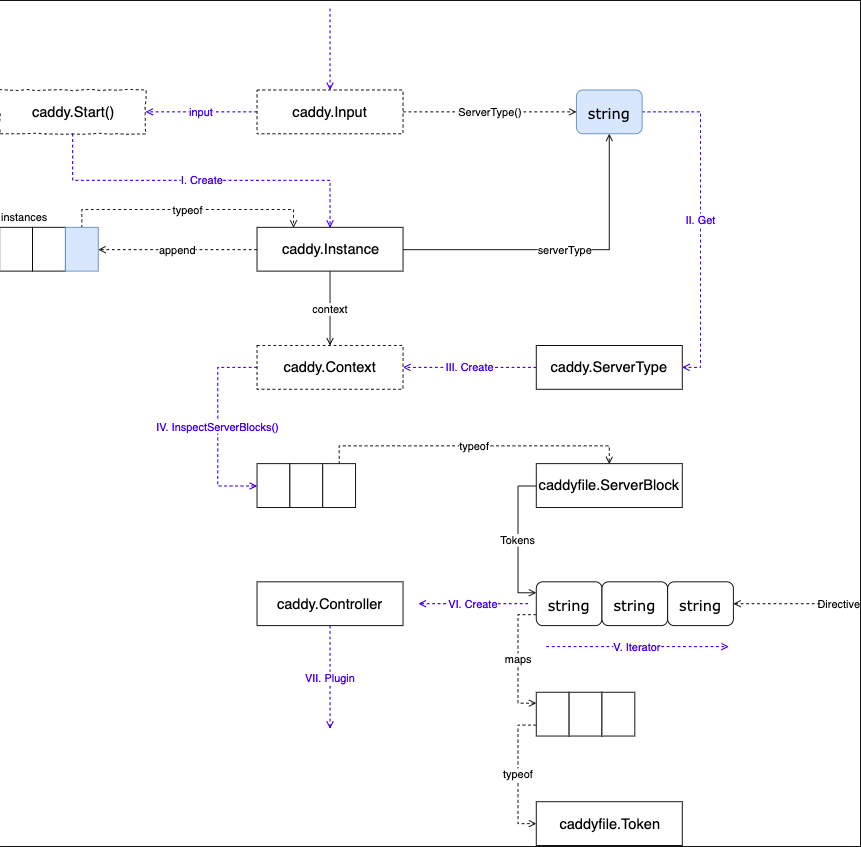

这里除了 \`Instance\` 之外还有两个新名词

 \`Controller\`：它是用来帮助 \`Directives\` 设置它自身的，通过读取 \`Token\`，这里的 \`Directives\` 实际上对应的就是上文所说的 caddyfile 中的配置文件选项。这一点请参照下文中 Loader 下的 [\`excuteDirective\`](#qGe2M) 理解。

 \`Token\` ：是 caddy 自己的 词法分析器 解析 caddyfile 配置文件出的选项的标记。这一点请参照下文中 [Loader](#xFQKc) 中的 [Parser](#vNLTs) 理解

如果不理解，首先记住 caddy 是配置化的服务器，

通过 caddyfile 配置 ->

那么肯定要读取它啦 ->

然后要解析它配置的到底是那些东西 ->

之后呢，就要让配置的目标做到 caddyfile 中声明的更改。

记住这个流程继续看几遍就能理解了。

\## Server

在 caddy.go 中定义着 \`Server\` 的接口，同时实现了优雅的退出。我们首先看图了解组织结构

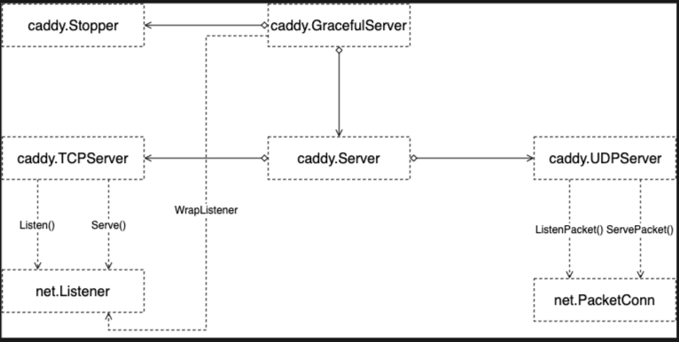

简单看一下 \`Stopper\` 的接口

\`\`\`go
// Stopper is a type that can stop serving. The stop
// does not necessarily have to be graceful.
type Stopper interface {
 // Stop stops the server. It blocks until the
 // server is completely stopped.
 Stop() error
}
\`\`\`

[\`GracefulServer\`](https://sourcegraph.com/github.com/caddyserver/caddy/-/blob/caddy.go#L345:6) 包含 \`Stopper\` 的接口实现了优雅退出，这是拦截了 系统 signal 的信号之后执行的结果，意在意外中断的时候保存好需要保存的东西。

它同时包含着 WrapListener 函数。可以看出，他用来做中间件。

\`\`\`go
// WrapListener wraps a listener with the
 // listener middlewares configured for this
 // server, if any.
 WrapListener(net.Listener) net.Listener
\`\`\`

\#### ServerType

最后看到不同 serverType 生成不同的 server

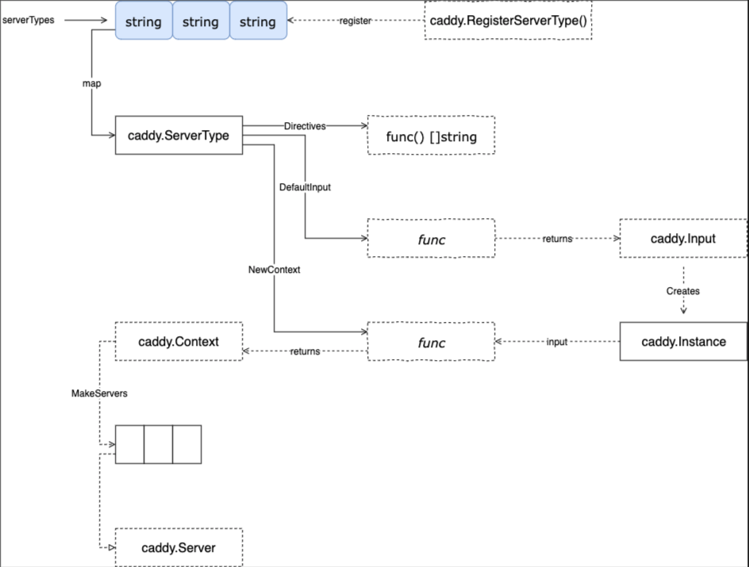

另外可以看到 这里最重要的 \`Instance\` 下面我们进一步查看 \`Instance\` 的代码

\## Instance

instance 是 Server 用来执行操作的实体。首先来看他的结构。它的代码在 主文件夹中的 [caddy.go](https://sourcegraph.com/github.com/caddyserver/caddy/-/blob/caddy.go) 中

首先我们看一下 它的结构了解下它可能有的功能

\#### [struct](https://sourcegraph.com/github.com/caddyserver/caddy/-/blob/caddy.go#L93)

\`\`\`go
type Instance struct {
 serverType string
 caddyfileInput Input
 wg \*sync.WaitGroup
 context Context
 servers []ServerListener
 OnFirstStartup []func() error // starting, not as part of a restart
 OnStartup []func() error // starting, even as part of a restart
 OnRestart []func() error // before restart commences
 OnRestartFailed []func() error // if restart failed
 OnShutdown []func() error // stopping, even as part of a restart
 OnFinalShutdown []func() error // stopping, not as part of a restart
 Storage map[interface{}]interface{}
 StorageMu sync.RWMutex
}
\`\`\`

\##### \`serverType\` 代表这个实例的服务器类型，通常是 HTTP

\##### \`caddyfileInput\` 是 \`Input\` 类型，通常我们配置 caddy 服务器的时候，就是通过编辑 caddyfileInput 的文本实现的修改配置行动。值得注意的是，生成 \`Instance\` 的参数同样是 caddyfile，这里的 caddyfile 在程序中是一个接口，一会儿继续讲解

\##### \`wg\` 是用来等待所有 \`servers\` 执行他们操作的信号量。

\##### \`context\` 是实例 \`Instance\`的上下文，其中包含 \`serverType\` 信息和服务器配置管理状态的信息。

\##### \`servers\` 是一组 \`server\` 和 他们的 \`listeners\`，两种 Server TCP/UDP，即 \`serverType\` ，两种不同的 \`serverType\` 会对应不同的 \`caddyfile\`中的选项。

\##### \`OnXXX\` 等 6 个函数是一系列回调函数，通过名字能够看出在什么时候回调触发。

\##### \`Storage\` 是存储数据的地方，本来可以设计在 全局状态中，但是设计在这里更好，考虑到垃圾回收机制，进程中重新加载时，旧的 Instance be destroyed 之后，会变成垃圾，收集。这和 [12-factor 中的 第九条 Disposability](https://12factor.net/disposability) 相符合。意思是每一次重载实例 Instance 即使是在进程中重载，也不会出现数据相互影响到情况，保持[幂等](https://www.google.com/search?q=%E4%BB%80%E4%B9%88%E6%98%AF%E5%B9%82%E7%AD%89&oq=%E4%BB%80%E4%B9%88%E6%98%AF%E5%B9%82%E7%AD%89&aqs=chrome..69i57.3848j0j7&sourceid=chrome&ie=UTF-8)。

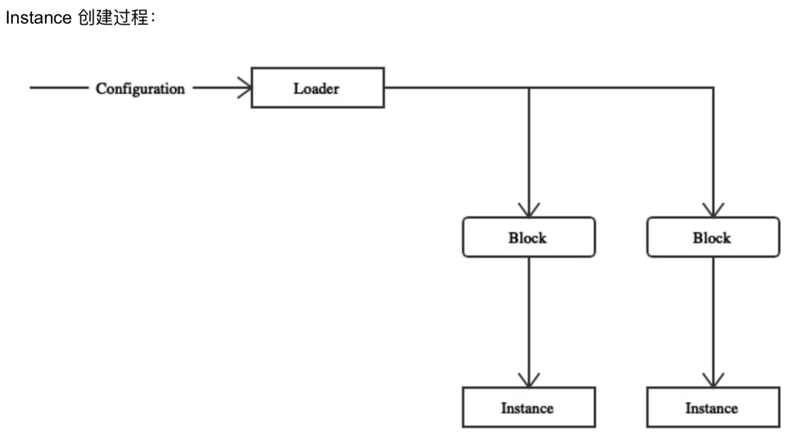

虽然 Instance 操作着众多操作，但是我们却不能从它讲起，从农村包围城市，渐渐了解 Instance 能调用的函数，自然 Instance 的功能就清晰了。

\## Event

首先上图：

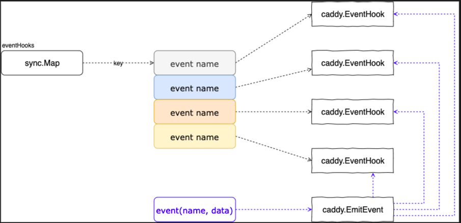

首先我们看到的是 eventHooks 这个结构，实际上他是存储 \`key：name value：EventHook\` 这样的一个 \`map[string]EventHook\` 的结构，只是从 sync 包中引入保证并发安全。

\`\`\`go
eventHooks = &sync.Map{}
\`\`\`

然后是重要的 \`caddy.EventHook\` 结构。

\`\`\`go
type EventHook func(eventType EventName, eventInfo interface{}) error
\`\`\`

然后我们关注到如何注册，和图中的 \`caddy.EmitEvent\`

\### 注册与分发

\#### 注册 EventHook

可以看到使用 \`eventHooks.LoadOrStore\`方法，不必赘述

\`\`\`go
func RegisterEventHook(name string, hook EventHook){
 if name == "" {
 panic("event hook must have a name")
 }
 \_, dup := eventHooks.LoadOrStore(name, hook)
 if dup {
 panic("hook named" + name + "already registered")
 }
}
\`\`\`

\#### 分发 [EmitEvent](https://sourcegraph.com/github.com/caddyserver/caddy/-/blob/plugins.go#L297:6)

通过传入函数为参数调用回调函数

\`\`\`go
// EmitEvent executes the different hooks passing the EventType as an
// argument. This is a blocking function. Hook developers should
// use 'go' keyword if they don't want to block Caddy.
func EmitEvent(event EventName, info interface{}) {
 eventHooks.Range(func(k, v interface{}) bool {
 err := v.(EventHook)(event, info)
 if err != nil {
 log.Printf("error on '%s' hook: %v", k.(string), err)
 }
 return true //注意这里返回的是 true
 })
}
\`\`\`

这里使用的 [Range ](https://sourcegraph.com/github.com/golang/go@go1.12.5/-/blob/src/sync/map.go#L306:15)函数，实际上是把事件信息给每一个上述提过 map 中的 EventHook 提供参数进行回调执行，按顺序调用，但是如果 传入函数返回 false ，迭代遍历执行就会中断。

可以知道，上文 [Overview中启动服务器](#4HB1R) 所说的发送 caddy.StartupEvent 事件就是调用的

\`\`\`go
caddy.EmitEvent(caddy.StartupEvent, nil)
\`\`\`

讲到这，相信已经对大致的流程有了一点框架的概念。

下面我们继续深入了解 在读取 \`caddyfile\` 文件的时候发生了什么。

\## Loader

自定义的配置文件都会有读取分析。在 caddy 中 由 \`Loader\` 执行这一项职能。首先我们看一下它的工作流程。

这个图来源于 [plugin.go](https://sourcegraph.com/github.com/caddyserver/caddy/-/blob/plugins.go#L404:6) 文件

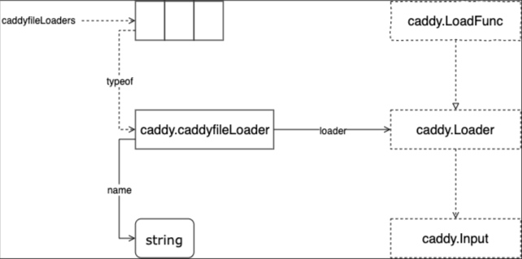

可以看到这里通过 \`Loader\` 解耦了 caddyfile 文件的读取，所以把它放在了 plugin.go 文件中，作为一个插件注册在 caddy app 中。

这里可以看到最终流程是 name -> \`caddy.Input\` 那么这个 [\`Input\`](https://sourcegraph.com/github.com/caddyserver/caddy/-/blob/caddy.go#L979:6) 是什么呢？

实际上 \`Input\` 就是 caddyfile 在代码中的映射。可以理解为，caddyfile 转化为了 \`Input\` 给 caddy 读取。谁来读取它呢？

那么干活的主角登场啦！

\### [Parser](https://sourcegraph.com/github.com/caddyserver/caddy/-/blob/caddyfile/parse.go)

\### 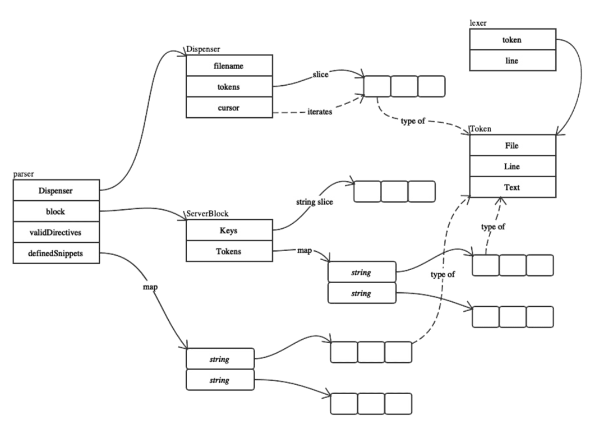

这里我们来看，各个流程的终点 \`Token\` 是如何被分析出来的,需要知道，这里的 \`Token\` 代表着 caddyfile 中的每行选项配置

\#### 词法分析

\`\`\`go
// allTokens lexes the entire input, but does not parse it.
// It returns all the tokens from the input, unstructured
// and in order.
func allTokens(input io.Reader) ([]Token, error) {
 l := new(lexer)
 err := l.load(input)
 if err != nil {
 return nil, err
 }
 var tokens []Token
 for l.next() {
 tokens = append(tokens, l.token)
 }
 return tokens, nil
}
\`\`\`

这里实际上关键在于 读取，可以看到在 \`dispenser\` 中由 \`cursor\` 来进行 \`Token\` 数组中的迭代

关键在于移动 \`cursor\` 索引的函数

[\`next()\`](https://sourcegraph.com/github.com/caddyserver/caddy/-/blob/caddyfile/lexer.go#L73:17)

\`\`\`go
// next loads the next token into the lexer.
// A token is delimited by whitespace, unless
// the token starts with a quotes character (")
// in which case the token goes until the closing
// quotes (the enclosing quotes are not included).
// Inside quoted strings, quotes may be escaped
// with a preceding \ character. No other chars
// may be escaped. The rest of the line is skipped
// if a "#" character is read in. Returns true if
// a token was loaded; false otherwise.
func (l \*lexer) next() bool {
 var val []rune
 var comment, quoted, escaped bool

 makeToken := func() bool {
 l.token.Text = string(val)
 return true
 }

 for {
 ch, \_, err := l.reader.ReadRune()
 if err != nil {
 if len(val) > 0 {
 return makeToken()
 }
 if err == io.EOF {
 return false
 }
 panic(err)
 }

 if quoted {
 if !escaped {
 if ch == '\\\' {
 escaped = true
 continue
 } else if ch == '"' {
 quoted = false
 return makeToken()
 }
 }
 if ch == '\\n' {
 l.line++
 }
 if escaped {
 // only escape quotes
 if ch != '"' {
 val = append(val, '\\\')
 }
 }
 val = append(val, ch)
 escaped = false
 continue
 }

 if unicode.IsSpace(ch) {
 if ch == '\\r' {
 continue
 }
 if ch == '\\n' {
 l.line++
 comment = false
 }
 if len(val) > 0 {
 return makeToken()
 }
 continue
 }

 if ch == '#' {
 comment = true
 }

 if comment {
 continue
 }

 if len(val) == 0 {
 l.token = Token{Line: l.line}
 if ch == '"' {
 quoted = true
 continue
 }
 }

 val = append(val, ch)
 }
}
\`\`\`

理解了 \`next\` 函数，就很容易知道如何分析一块选项的 \`token\` 了，不过都是 \`next()\` 的包装函数罢了。

\### [excuteDirective](https://sourcegraph.com/github.com/caddyserver/caddy/-/blob/caddy.go#L624:6)

\`\`\`go
func executeDirectives(inst \*Instance, filename string,
 directives []string, sblocks []caddyfile.ServerBlock, justValidate bool) error {
 // map of server block ID to map of directive name to whatever.
 storages := make(map[int]map[string]interface{})

 // It is crucial that directives are executed in the proper order.
 // We loop with the directives on the outer loop so we execute
 // a directive for all server blocks before going to the next directive.
 // This is important mainly due to the parsing callbacks (below).
 for \_, dir := range directives {
 for i, sb := range sblocks {
 var once sync.Once
 if \_, ok := storages[i]; !ok {
 storages[i] = make(map[string]interface{})
 }

 for j, key := range sb.Keys {
 // Execute directive if it is in the server block
 if tokens, ok := sb.Tokens[dir]; ok {
 controller := &Controller{
 instance: inst,
 Key: key,
 Dispenser: caddyfile.NewDispenserTokens(filename, tokens),
 OncePerServerBlock: func(f func() error) error {
 var err error
 once.Do(func() {
 err = f()
 })
 return err
 },
 ServerBlockIndex: i,
 ServerBlockKeyIndex: j,
 ServerBlockKeys: sb.Keys,
 ServerBlockStorage: storages[i][dir],
 }

 setup, err := DirectiveAction(inst.serverType, dir)
 if err != nil {
 return err
 }

 err = setup(controller)
 if err != nil {
 return err
 }

 storages[i][dir] = controller.ServerBlockStorage // persist for this server block
 }
 }
 }

 if !justValidate {
 // See if there are any callbacks to execute after this directive
 if allCallbacks, ok := parsingCallbacks[inst.serverType]; ok {
 callbacks := allCallbacks[dir]
 for \_, callback := range callbacks {
 if err := callback(inst.context); err != nil {
 return err
 }
 }
 }
 }
 }

 return nil
}
\`\`\`

caddyfile 既然被解析完毕，那么就要开始执行配置更改了，这里实际上是 caddy.go 中的 函数，最后在 caddy 的 main.go 中调用来执行更改。

\### DirectiveAction

\### 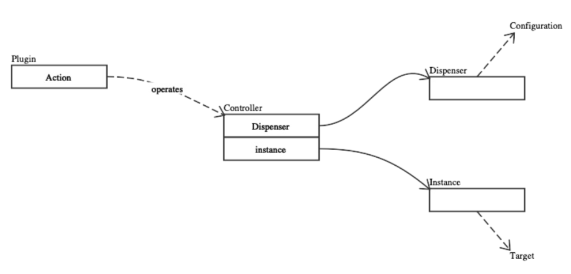

很容易发现，这里是通过 操作 Controller 来实现的，此时可以再返回最上文查看上一次提到 Controller 的时候。

\`\`\`go
// DirectiveAction gets the action for directive dir of
// server type serverType.
func DirectiveAction(serverType, dir string) (SetupFunc, error) {
 if stypePlugins, ok := plugins[serverType]; ok {
 if plugin, ok := stypePlugins[dir]; ok {
 return plugin.Action, nil
 }
 }
 if genericPlugins, ok := plugins[""]; ok {
 if plugin, ok := genericPlugins[dir]; ok {
 return plugin.Action, nil
 }
 }
 return nil, fmt.Errorf("no action found for directive '%s' with server type '%s' (missing a plugin?)",
 dir, serverType)
}
\`\`\`

了解完这些，我们注意到有一个 叫做 \`Action\` 的东西，它又是怎么来的？别急，他就在 \`Plugin\` 包中。我们知道了，配置文件实际上是配置各种 \`plugin\` 作为插件安装在 caddy 服务器上，而 caddyfile 正是被转化为了 Token，Dispenser 来执行配置更改，即不同的插件安装。那么 \`Action\` 就是 \`Plugin\` 的 \`SetupFunc\`啦，来看看吧。

\## Plugin

你会注意到，在目录中有一个 叫 caddyhttp 的文件夹中的文件夹特别多，不用问，这就是 http 的可选 \`Plugin\` 啦

\### Overview

这里概览了 \`Plugin\` 是如何注册的。

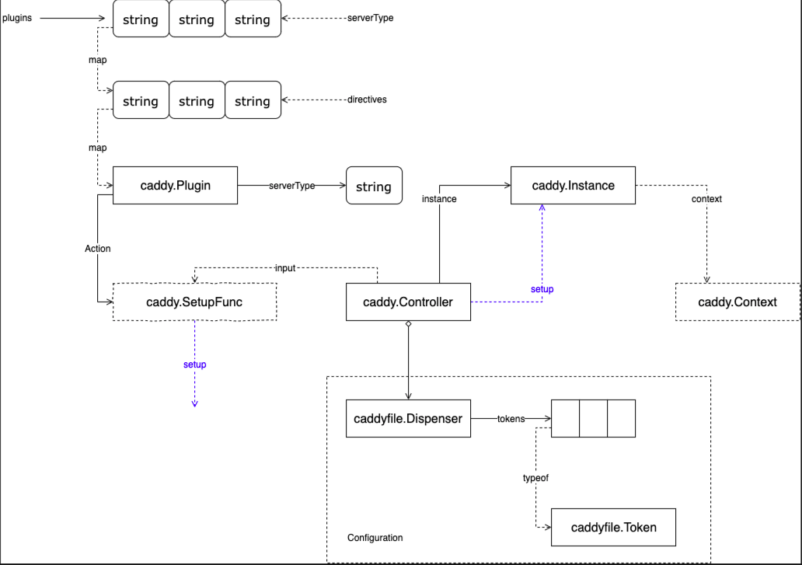

可以在这里看到我们之前讲解的很多的熟悉的概念，这是因为我们快要读完 caddy 的架构了，剩下的实际上是具体的 \`Plugin\` 的各种扩展实现了。

可以看到，\`Plugin\` 是注册在不同的 服务器类型 \`serverType\` 下的，实际上是在两重 map 映射的结构中，图中可以看出，然后是 \`Action\` ，最近的上文才说明了它，用它来进行 \`Plugin\` 的安装。

然后来到 \`Controller\` ，实际进行配置的家伙，看到了之前所说的 \`Dispenser\` 和 \`Token\` 配置，还记得吗，他们在刚才的词法分析里才出现过。

接下来我们看一个 \`HTTP\` 的 \`Plugin\` 的例子 \`errors\` 的实现

\### caddyHTTP

\#### errors

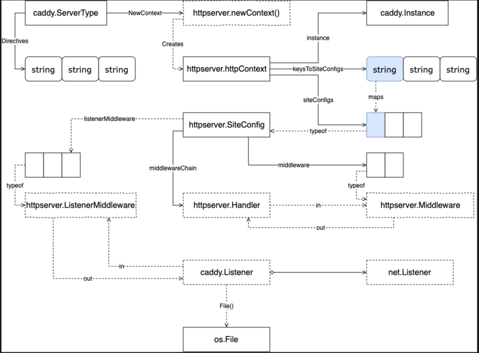

这里我们从下看，[caddy.Listener](https://sourcegraph.com/github.com/caddyserver/caddy/-/blob/caddy.go#L367:15) 定义在 caddy.go 中，用来支持 零停机时间加载。

往上看到 Middleware 调用，我们来看看 errorsHandle 的结构

\`\`\`go
// ErrorHandler handles HTTP errors (and errors from other middleware).
type ErrorHandler struct {
 Next httpserver.Handler
 GenericErrorPage string // default error page filename
 ErrorPages map[int]string // map of status code to filename
 Log \*httpserver.Logger
 Debug bool // if true, errors are written out to client rather than to a log
}
\`\`\`

可以看到，Next 字段明显是 Chain 调用的下一个 Handler 处理。事实上，每一个 Plugin 或者算是 HTTP 服务中的中间件都有这个字段用于 构建链式调用。

每一个 Plugin 值得注意的两个，

一个是他们会实现 ServeHTTP 接口进行 HTTP 请求处理。

\`\`\`go
func (h ErrorHandler) ServeHTTP(w http.ResponseWriter, r \*http.Request) (int, error) {
 defer h.recovery(w, r)

 status, err := h.Next.ServeHTTP(w, r)

 if err != nil {
 errMsg := fmt.Sprintf("%s [ERROR %d %s] %v", time.Now().Format(timeFormat), status, r.URL.Path, err)
 if h.Debug {
 // Write error to response instead of to log
 w.Header().Set("Content-Type", "text/plain; charset=utf-8")
 w.WriteHeader(status)
 fmt.Fprintln(w, errMsg)
 return 0, err // returning 0 signals that a response has been written
 }
 h.Log.Println(errMsg)
 }

 if status >= 400 {
 h.errorPage(w, r, status)
 return 0, err
 }

 return status, err
}
\`\`\`

另一个是安装到 caddy 中的 [setup.go](https://sourcegraph.com/github.com/caddyserver/caddy/-/blob/caddyhttp/errors/setup.go) 文件，我们看一下 Plugin 安装的全流程。

\### Directives

前面提到过很多次 Directives 这里做一个它的整个流程概览。上文中提到，这些注册实际上都是 Controller 执行的。下半部分是 关于 HTTP 的服务配置

这里的重点在 errors.serup() 可以看到，它创建了 errors.ErrHandler 并注册到了 httpserver 的一对中间件中

\`\`\`go
// setup configures a new errors middleware instance.
func setup(c \*caddy.Controller) error {
 handler, err := errorsParse(c)
 ···
 httpserver.GetConfig(c).AddMiddleware(func(next httpserver.Handler) httpserver.Handler {
 handler.Next = next
 return handler
 })
 return nil
}
\`\`\`

实际上这里还有一个关于 caddy.Controller 到 ErrorHandler 的一个转换 通过 [errorsParse](https://sourcegraph.com/github.com/caddyserver/caddy/-/blob/caddyhttp/errors/setup.go#L52:1) 函数

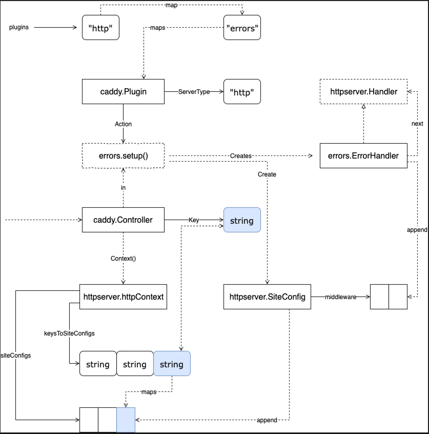

谢谢阅读，如果有不对的地方欢迎指正。