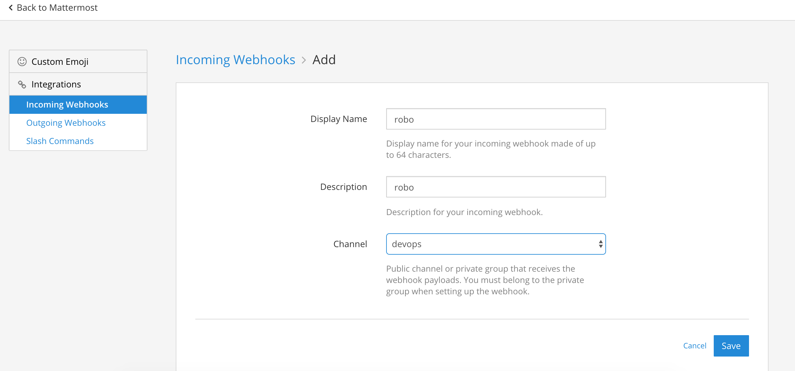
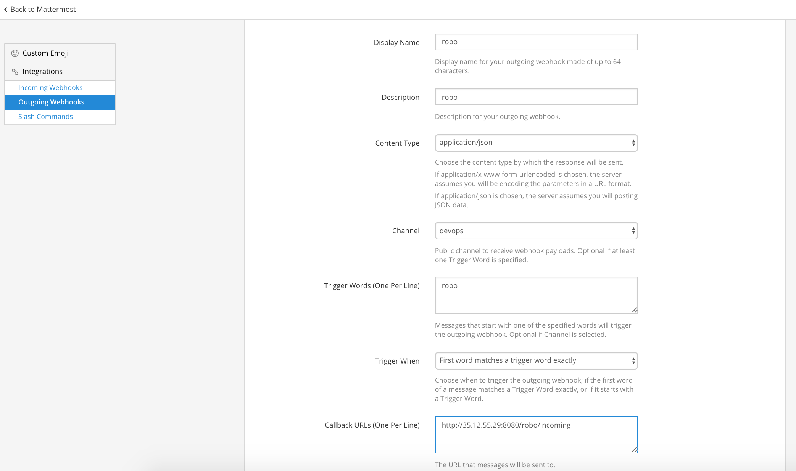

\## 安装
注意 node 的版本不要太低，16.13.1 当前使用. 不想安装 npm 和 node 环境也可以通过 alias 和 docker exec 安装。
:::warning
root 权限安装 yo 会出现权限问题。 通过 chmod -R g+rwx root/.config （或者其他对应没有权限的目录可以解决）
:::
\`\`\`bash
#local npm#
npm config set registry https://registry.npm.taobao.org
npm i -g hubot coffee-script yo generator-hubot

#docker# with Dockerfile below
docker build -t yhyddr/yo-hubot .
alias yo='docker run --rm -it -v \`pwd\`:/app yhyddr/yo-hubot'

##
mkdir ./workdir && cd ./workdir
yo hubot
\`\`\`
\`\`\`dockerfile
FROM node:16-alpine3.14

WORKDIR /app

RUN npm install -g cnpm --registry=https://registry.npmmirror.com
\# Install packages
RUN set -eux; \
 cnpm install -g yo generate-hubot\
 && \
 mkdir -p /root/.config/configstore \
 && \
 mkdir -p /root/.config/insight-nodejs \
 && \
 chmod -R g+rwx /root /root/.config

CMD ["yo"]

\`\`\`

\## integration

\### slack
yo hubot --adapter=slack

./bin/hubot -a slack

\### telegram

\- npm install --save hubot-telegram
\- Set the environment variables specified in \*\*Configuration\*\*
\- Run hubot bin/hubot -a telegram

\### mattermost

\- [loafoe/hubot-matteruser](https://github.com/loafoe/hubot-matteruser)

\- [chatops-with-mattermost-and-hubot](https://medium.com/@ahmetatalay/chatops-with-mattermost-and-hubot-59d0b141b220)

\#### add webhook

