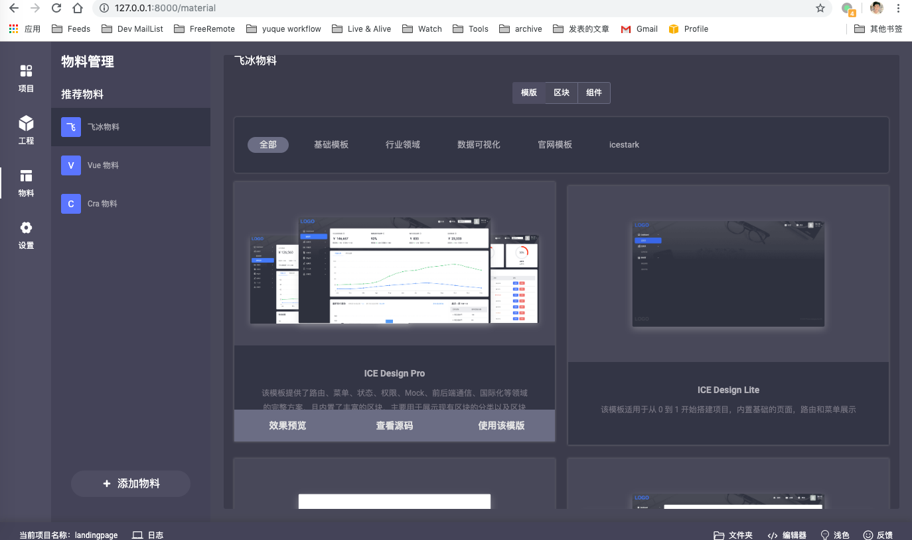
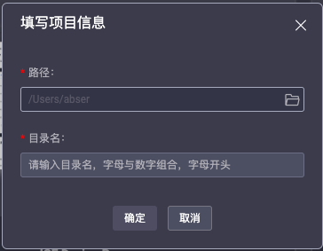
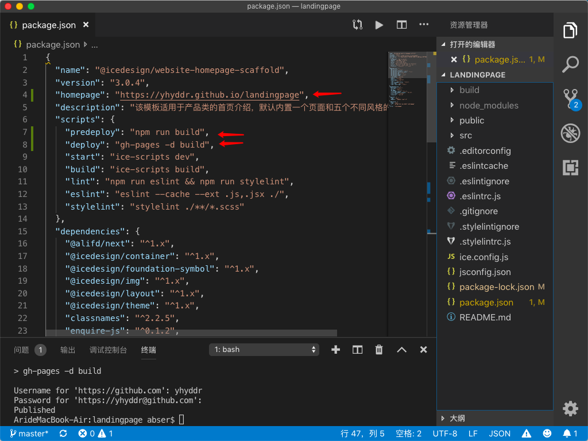
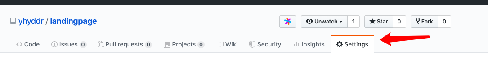
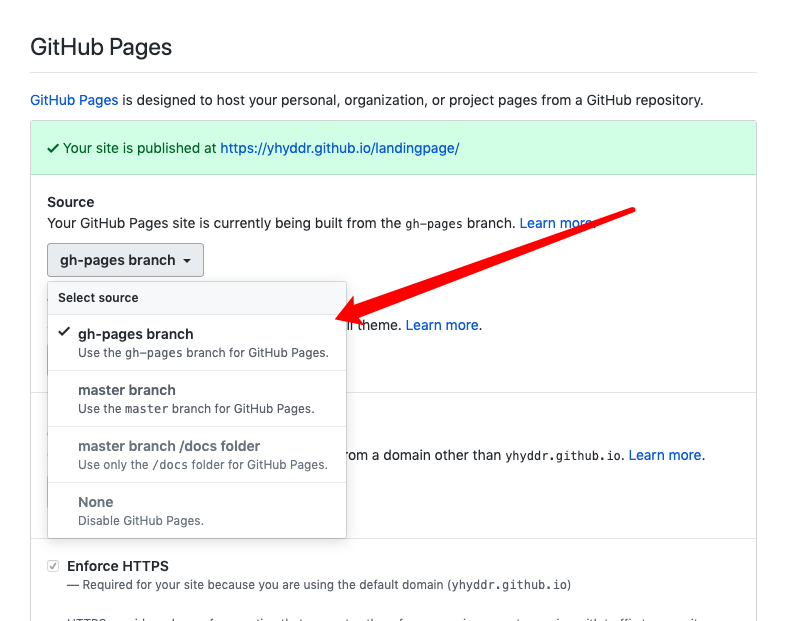
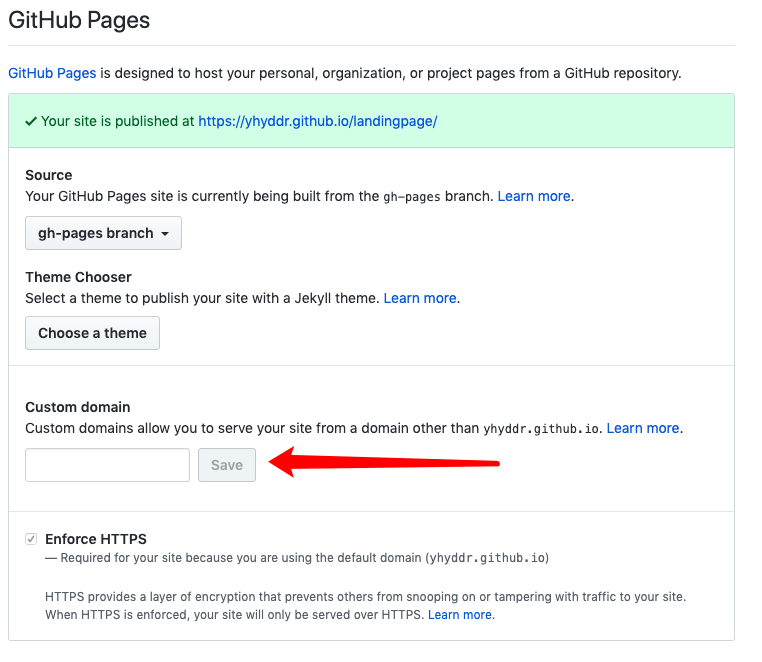
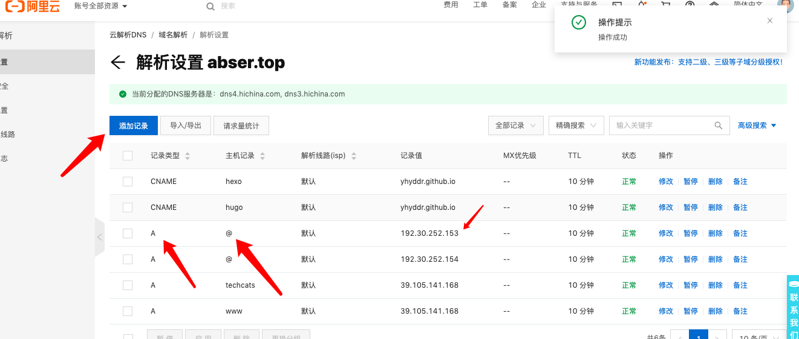

项目地址：

效果地址：

\-\-\-

\# 前言

\- GitHub 账号 与它的 pages 服务

不需要任何准备的东西，服务器？域名？前端工程师？ 都不需要！只需要你有

就能够享受到建立自己网站的乐趣。

\- 飞冰

现在搭配飞冰，还能让你一键生成你喜欢的页面：最最主要的是，你的这个项目是一个 React App，你可以边学前端边改进你的 网站。实时热更新查看自己的编辑成果。一键部署到网站供大家访问，你值得拥有。

\## 关于飞冰
\> 简单而友好的前端研发体系

\### 特性

\- \*\*可视化开发\*\*：通过 GUI 操作简化前端工程复杂度，同时通过适配器可接入不同的项目工程进行可视化管理，定制专有的前端工作台

\- \*\*丰富的物料\*\*：基于物料拼装提高项目开发效率，同时提供丰富的 React/Vue 物料

\- \*\*最佳实践\*\*：结合丰富的经验沉淀出的项目开发最佳实践，包括目录结果、开发调试、路由配置、状态管理等

\- \*\*自定义物料\*\*：通过物料开发者工具快速开发构建私有物料体系

另外，飞冰正确用法我觉得应该是企业搭建自己的物料库使用。

\## 关于 GitHub Pages
Websites for you and your projects.

Hosted directly from your [GitHub repository](https://github.com/). Just edit, push, and your changes are live.

非常方便的网站托管，直接使用 你的 GitHub 项目库构建。

\## 安装飞冰
首先安装飞冰
\`\`\`bash
\# 安装工具
$ npm install iceworks -g
\# 启动工作台
$ iceworks
\`\`\`

\### 创建项目
这里我们选择基于推荐模板开始创建：

\- 选择你喜欢的一个模版，用于快速部署

\- 新建一个文件夹或者选择已有的空文件夹（避免覆盖原有文件）;

\- 给项目起一个项目名，以便后续识别。

\### Do something
你可以随意看看控制台有哪些选项，或者修修改改。

我们在这里主要看部署如何操作，所以直接跳过。

\## 部署

\### Github
创建一个新的 GitHub 的项目仓库。

\### 项目
打开刚才创建的目录，找到 package.json 文件，并添加一下三项

\### homepage

这里填写你的账户和你的项目地址，如我的地址是 \`abserari/landingpage\`.

你的应该填写  \`https://{{yourGithubName}}.github.io/{{yourProjectName}}\`

\### predeploy & deploy
将这两行加入到 scripts 中
\`\`\`bash
"predeploy": "npm run build",
"deploy": "gh-pages -d build"
\`\`\`

\## 终端命令
打开 项目所在文件的终端 执行以下操作

\### 推到远端仓库存储代码
注意换成你自己的仓库名字
\`\`\`bash
git init
git add README.md
git commit -m "first commit"
git remote add origin git@github.com:{yourName}/{yourProjectName}.git
git push -u origin master
\`\`\`

\### 安装 gh-pages
\`\`\`bash
npm install gh-pages --save-dev
\`\`\`

\### 推送页面构建文件
\`\`\`bash
npm run deploy
\`\`\`
之后如果本地有更改，就可以直接使用这条命令更新你的页面了。

\## 最后
找到 GitHub 的 setting 页面

选择 使用 gh-pages 分支进行网站构建。

然后你的网站就可以在提示的网址进行访问了。

\### 自定义域名
如果你拥有自己的域名，甚至可以直接设置在这里

不过不要忘记在自己的域名服务商那里解析为 GitHub 的 IP 地址哦。

\## 效果总结
轻松拥有了一个自己的网站

同时只需要打开编辑器就可以非常快速的自定义化。

还有诸多组件任意选择帮助构建你自己的网站。

还在等什么！像一个前端工程师一样构建网站吧。

还一键部署哦。

\## 参考