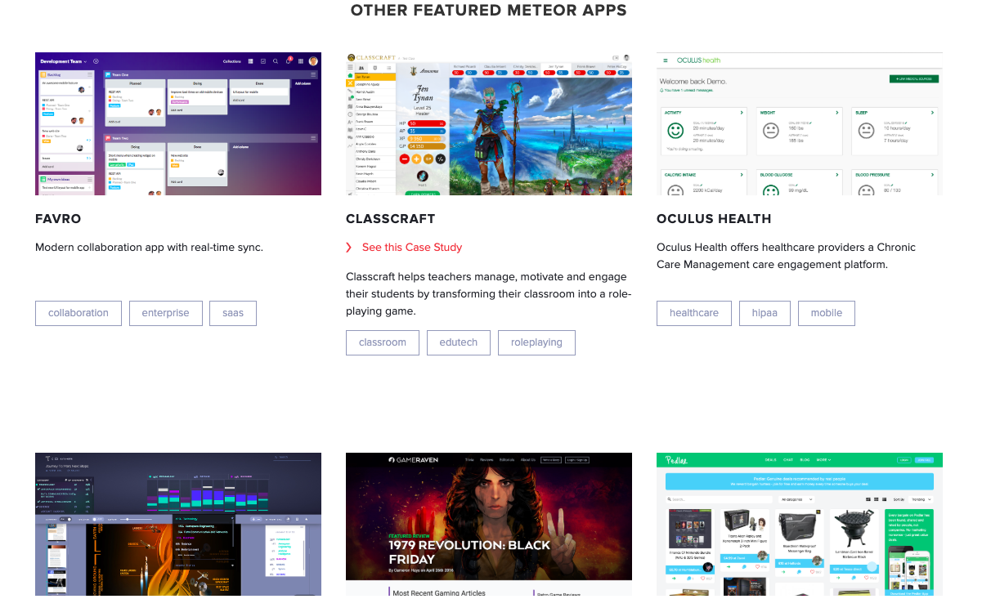

--- 
layout: category-post
title:  "Welcome to blog!"
date:   2016-08-05 20:20:56 -0400
categories: writing
---

\## Docu
\- [guide](https://guide.meteor.com/mobile.html#introduction)
\- [tutorial](https://www.meteor.com/tutorials)

\## Intro
Meteor give a very quick travel to build an app with some done user system. Unfortunately, this function costs a lot because these bonus is from the binding of mongoDB.

\- [github](https://github.com/yhyddr/TodoListByMeteor)

and it quickly (actually not) can move to IOS or Android.

\## Note for Future

\- quick build app or web app
\- rocket.chat use this framework
\- meteor good at medium and small application
\- using with pure js is better
\- there are many bugs on version because meteor use different tools which not belong to meteor to construct app.

\- should be compared to flutter.

\### Reference

