--- 
layout: category-post
title:  "Welcome to blog!"
date:   2016-08-05 20:20:56 -0400
categories: writing
---

1\. 打开 default 命名空间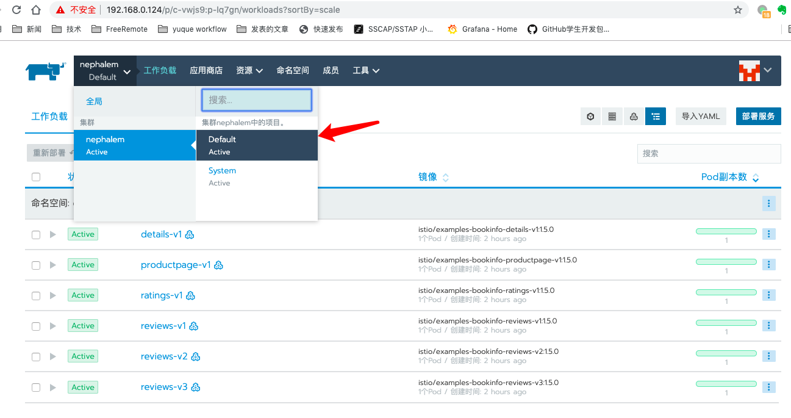

1\. 打开 应用商店， 点击启动或者 launch

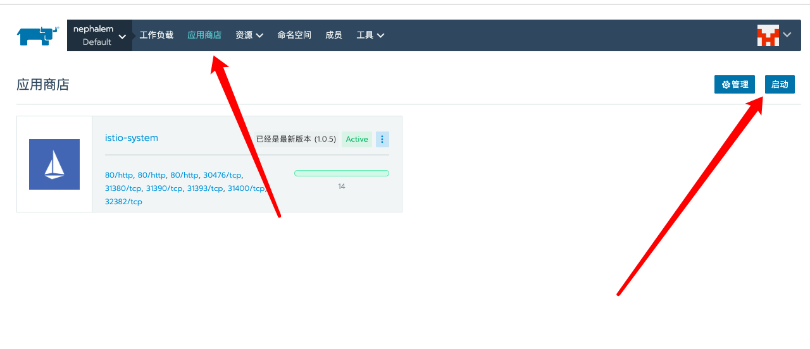

4\. 找到 istio 点开查看详情 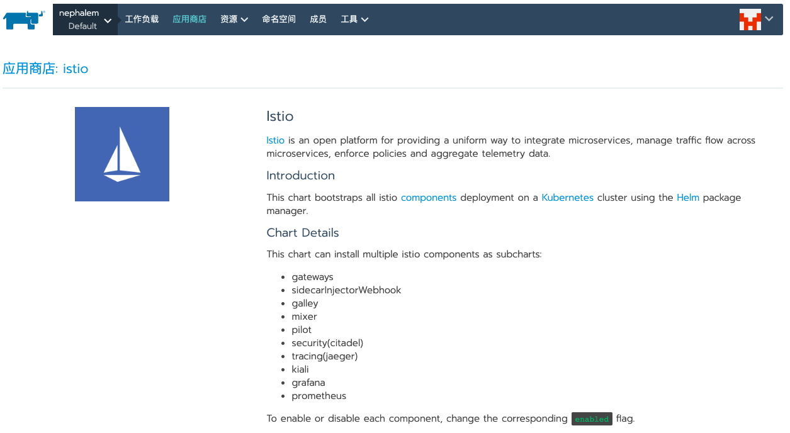

4\. 默认配置即可，我们这个版本是 1.05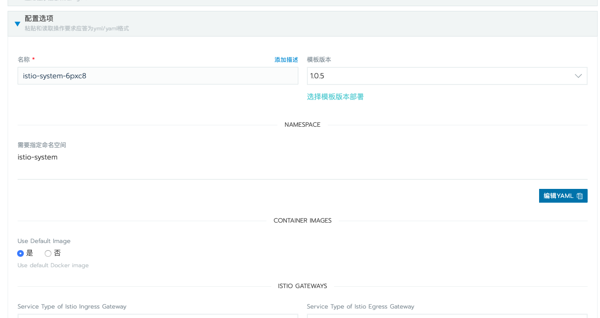

4\. 可以选择开启 grafana，不过需要注意的是需要为集群 加 PV 即持久化存储

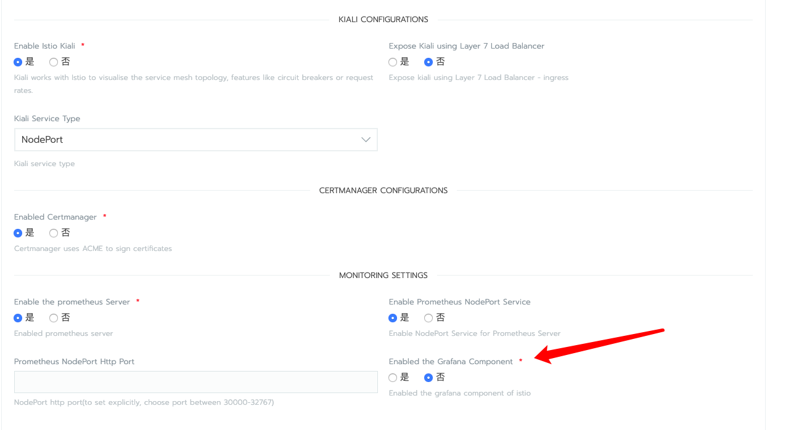

8\. 点击启动即可

8\. 这样添加持久卷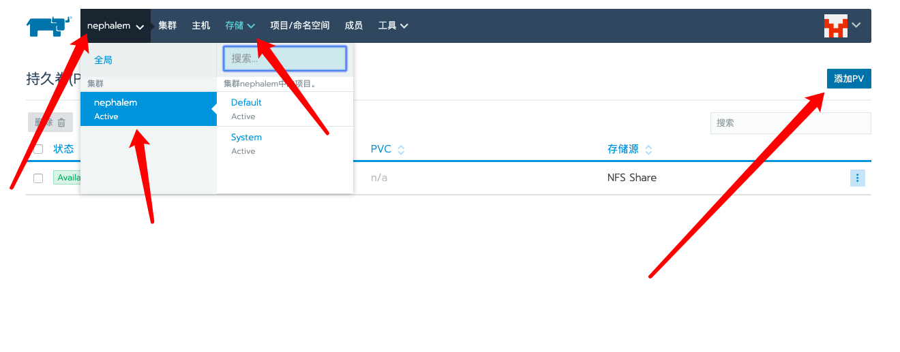

8\. 记得开启多主机读写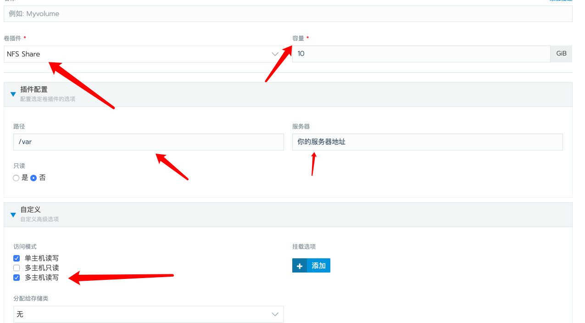

8\. 一会儿可以看到部署完毕，如果中途遇到问题，通常是 网络问题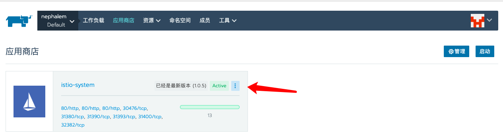

12\. 有时需要手动为你的服务添加负载均衡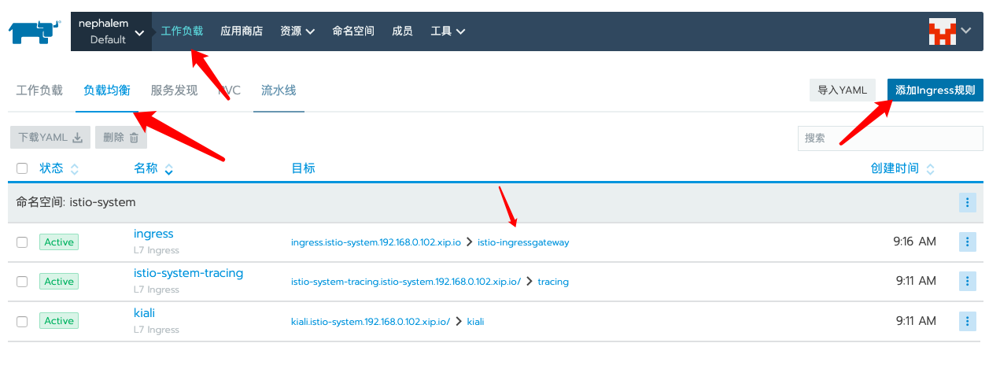

12\. 注意选择命名空间，这里可以理解为添加路由。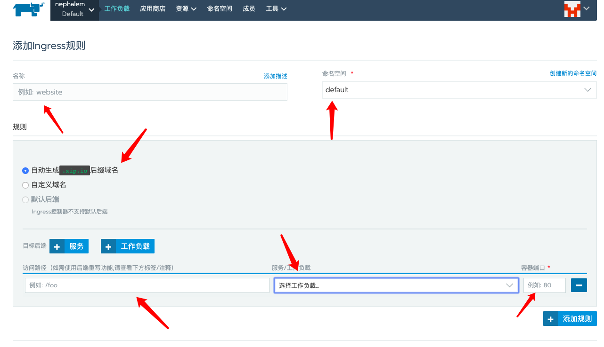

12\. 现在，你需要在Rancher的面板上检查Istio所有的工作负载、负载均衡以及服务发现均处于良好状态。即 active

12\. 最后还有一样东西需要添加：在你的默认命名空间里添加一个istio-injected标签，Istio sidecar容器会自动注入你的节点，运行下方的kubectl命令（如上文所述，你可以从Rancher内部启动kubectl）。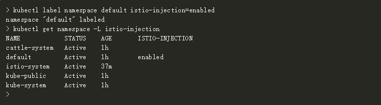这一标签将使得Istio-Sidecar-Injector自动将Envoy容器注入您的应用程序节点。

然后我们开始 bookinfo 的部署

\*\*部署Bookinfo示例应用\*\*

现在，你可以开始部署一个测试应用并且测试Istio的强大功能。首先，部署Bookinfo示例应用。这个应用有趣的部分在于它有三个版本的reviews程序同时运行。我们可-以在这三个版本的程序中体验到Istio的一些功能。接着，访问rancher-demo的默认项目中的工作负载来部署Bookinfo app，具体的操作是：

点击Import Yaml；下载bookinfo.yaml（[https://info.rancher.com/hubfs/bookinfo.yaml](https://info.rancher.com/hubfs/bookinfo.yaml)）到本地

当你进入Import Yaml菜单之后，通过从文件读取，将其上传至Rancher；

对于 Import Mode，选择【集群：将任何资源直接导入此集群】Cluster: Direct import of any resources into this cluster；

点击【导入/Import】。

这应该为您的rancher-demo Default项目增加6个工作负载。如下图：

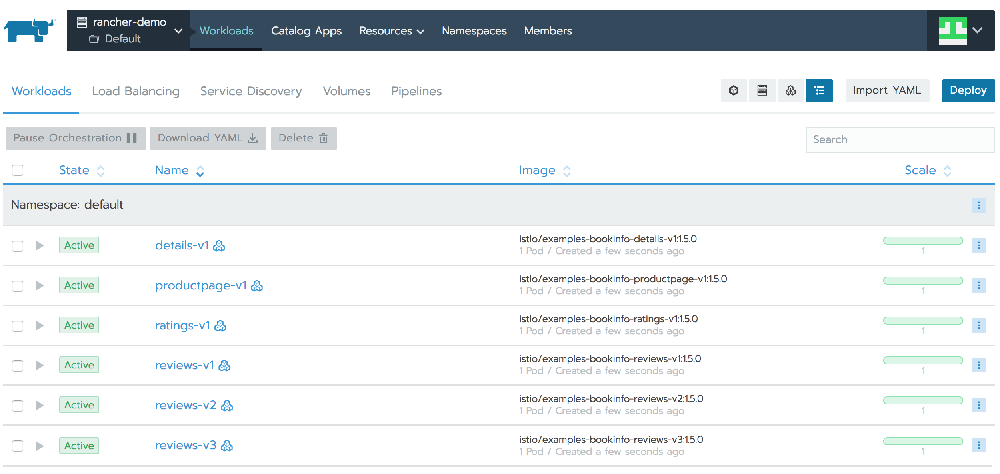

现在，通过Istio暴露Bookinfo app，你需要应用此bookinfo-gateway.yaml([https://info.rancher.com/hubfs/bookinfo-gateway.yaml](https://info.rancher.com/hubfs/bookinfo-gateway.yaml))，操作方式与bookinfo.yaml相同。此时，你可以用浏览器访问bookinfo app。你有两种方式可以获取istio-ingressgateway负载均衡器的外部IP地址：

第一，从Rancher中获取。访问负载均衡，从右手边的菜单栏选择View in API。它将打开一个新的浏览器页面，在那搜索publicEndpoints -> addresses，你就可以看到公共IP地址了。

第二，通过kubectl获取:

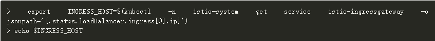

用你的浏览器访问： http://${INGRESS\_HOST}/productpage ，然后你应该看到Bookinfo app。多次刷新页面时，你应该看到 Book Reviews部分有三个不同版本：第一个版本没有星星；第二个版本有黑星星；第三个版本有红星星。

使用Istio，您可以限制您的应用仅路由到应用的第一个版本。具体操作为：导入 route-rule-all-v1.yaml（ [https://info.rancher.com/hubfs/route-rule-all-v1.yaml](https://info.rancher.com/hubfs/route-rule-all-v1.yaml) ）到Rancher，几秒之后再刷新页面，你将不会在reviews上看到任何星星。

除此之外，你也可以仅将流量路由到一组用户。当你导入route-rule-reviews-test-v2.yaml到Rancher之后，使用jason这个用户名（无需密码）登录Bookinfo app，你应该只能看到版本2的reviews（即有黑星星的版本）。但登出之后，你仅能看到版本1reviews的app。

至此，你已经体会了Istio的强大功能。当然，这并非全部，Istio还有很多其他功能。创建此设置后，您可以完成Istio文档中的任务。

\*\*Istio的遥感\*\*

现在是时候深入了解Istio另一个更有用的功能 ：默认情况下提供指标。

让我们从Grafana开始。当我们部署Istio时，值设置为true的grafana.enabled创建了一个grafana实例，并配置为收集Istio的指标以几个面板中显示它们。默认情况下，Grafana的服务不会公开显示，因此想要查看指标，首先需要将Grafana的服务暴露给公共IP地址。当然，还有另一个选项也可以暴露服务：NodePort（[https://kubernetes.io/docs/concepts/services-networking/service/#nodeport](https://kubernetes.io/docs/concepts/services-networking/service/#nodeport) ），但是这要求你在Google Cloud Platform防火墙的所有节点上开放Nodeport，这不止有一项任务，因此通过公共IP地址暴露服务更为简单。

为此，在rancher-demo的默认项目中访问工作负载并选择【服务发现】标签。当所有在集群上的工作都完成之后，应该有5项服务在默认的命名空间内，有12项服务在istio-system命名空间内，并且所有这些服务都处于活跃状态。接着，选择grafana服务，并且从右边的菜单栏内选择 View/Edit YAML。

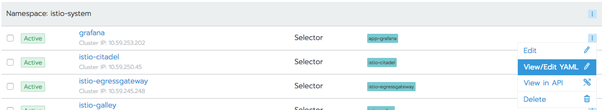

找到包含type: ClusterIP的那行，将其改为type: LoadBalancer，并点击【保存/Save】。然后它应该开始在Google Cloud Platform中配置负载均衡器，并在其默认端口3000上暴露Grafana。如果想要获取Grafana的公共IP地址的话，只需重复bookinfo示例中获取IP地址的步骤即可，即在API中查看grafana服务，你可以在其中找到IP地址，或通过kubectl获取它：

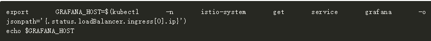

用你的浏览器访问：http://${GRAFANA\_HOST}:3000/ ，选择其中一个面板，比如 Istio Service。通过此前应用的配置，我们限制了流量，仅显示版本1的reveiws应用。从服务的下拉菜单中选择 reviews.default.svc.cluster.local，就可以从图表中查看。现在使用以下命令从Rancher的kubectl生成一些流量：

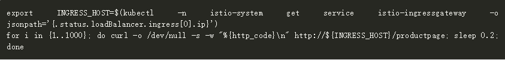

需要等待约5分钟，为Grafana生成的流量将会显示在如下面板上：

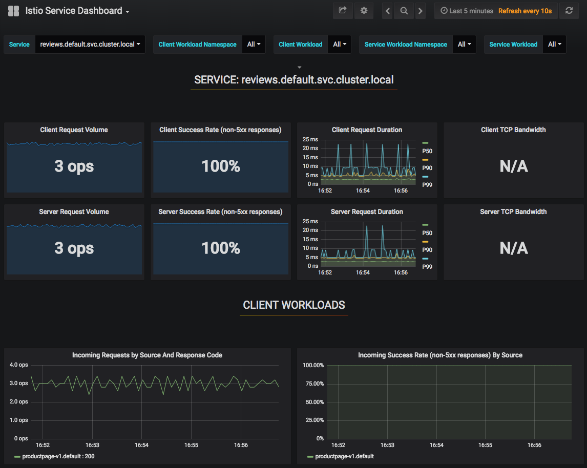

如果你滚动面板，在SERVICE WORKLOADS下你将看到Incoming Requests by Destination And Response Code的图表，它要求Reviews应用程序只在v1端点结束。如果你使用以下命令，生成对版本2的应用的请求（请记得用户jason可以访问版本2的reviews 应用）：

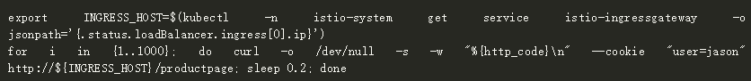

你应该也可以看到显示在版本2的应用上的请求：

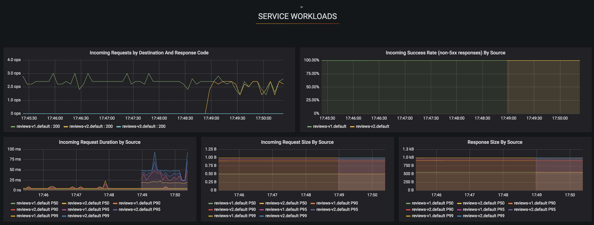

用同样的方式，也可能可以暴露并且看到Istio其他默认的指标，比如Prometheus, Tracing 和ServiceGraph。