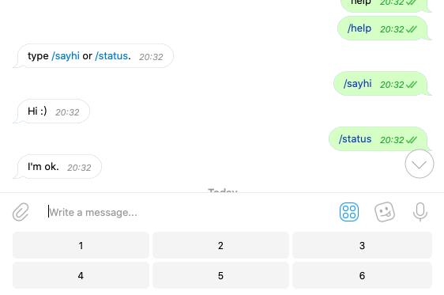

\### 调出键盘和使用 /command 命令

\`\`\`go
package main

import (
 "log"

 tgbotapi "github.com/go-telegram-bot-api/telegram-bot-api"
)

var numericKeyboard = tgbotapi.NewReplyKeyboard(
 tgbotapi.NewKeyboardButtonRow(
 tgbotapi.NewKeyboardButton("1"),
 tgbotapi.NewKeyboardButton("2"),
 tgbotapi.NewKeyboardButton("3"),
 ),
 tgbotapi.NewKeyboardButtonRow(
 tgbotapi.NewKeyboardButton("4"),
 tgbotapi.NewKeyboardButton("5"),
 tgbotapi.NewKeyboardButton("6"),
 ),
)

func main() {
 bot, err := tgbotapi.NewBotAPI("YourTokenForBot")
 if err != nil {
 log.Panic(err)
 }

 bot.Debug = true

 log.Printf("Authorized on account %s", bot.Self.UserName)

 u := tgbotapi.NewUpdate(0)
 u.Timeout = 60

 updates, err := bot.GetUpdatesChan(u)

 for update := range updates {
 if update.Message == nil { // ignore non-Message updates
 continue
 }

 msg := tgbotapi.NewMessage(update.Message.Chat.ID, update.Message.Text)

 switch update.Message.Text {
 case "open":
 msg.ReplyMarkup = numericKeyboard
 case "close":
 msg.ReplyMarkup = tgbotapi.NewRemoveKeyboard(true)
 }

 if \_, err := bot.Send(msg); err != nil {
 log.Panic(err)
 }
 }
}

\`\`\`