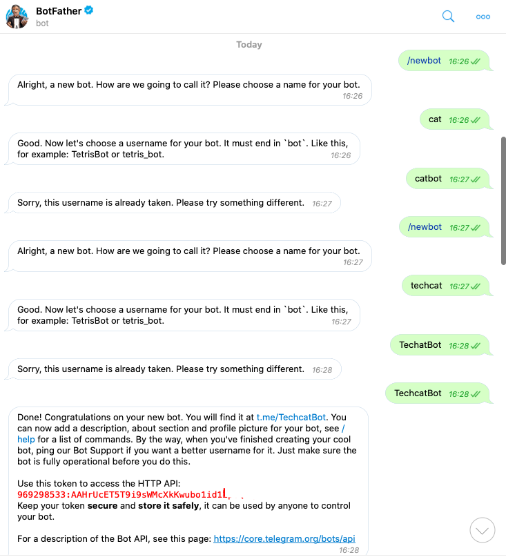
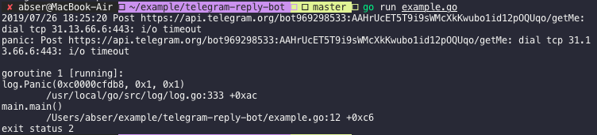
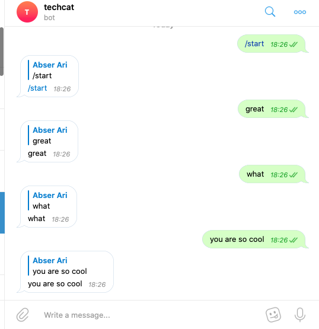

\## Doc
[https://core.telegram.org/bots/api](https://core.telegram.org/bots/api)

\## 尝试
用 Go 语言做了一个 telegram 的 bot . 用来简单实现对话（复读）。

\### 获得 telegram bot token
和 BotFather 交谈即可

中途需要设置一下名字和查找路径

\### go get
首先获取 api 包
\`\`\`go
go get -u github.com/go-telegram-bot-api/telegram-bot-api
\`\`\`

\### code
\`\`\`go
package main

import (
 "log"
 "os"

 "github.com/go-telegram-bot-api/telegram-bot-api"
)

func main() {
 bot, err := tgbotapi.NewBotAPI(os.Getenv("TELEGRAM\_APITOKEN"))
 if err != nil {
 log.Panic(err)
 }

 bot.Debug = true

 log.Printf("Authorized on account %s", bot.Self.UserName)

 u := tgbotapi.NewUpdate(0)
 u.Timeout = 60

 updates, err := bot.GetUpdatesChan(u)

 for update := range updates {
 if update.Message == nil { // ignore any non-Message Updates
 continue
 }

 msg := tgbotapi.NewMessage(update.Message.Chat.ID, update.Message.Text)
 msg.ReplyToMessageID = update.Message.MessageID

 if \_, err := bot.Send(msg); err != nil {
 log.Panic(err)
 }
 }
}
\`\`\`

\## Run
注意 终端需要能访问 telegram 的 API

\### 效果
