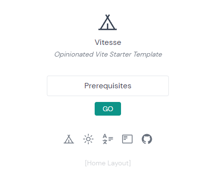

\## Refer
[https://github.com/antfu/vitesse](https://github.com/antfu/vitesse)

[https://cn.vitejs.dev/guide/#command-line-interface](https://cn.vitejs.dev/guide/#command-line-interface)

\## Overview
vue 搭建一个快速使用的前端展示页面

\## Prerequisites
windows 10 64.

\- 安装 scoop
\- scoop install nvm
\- nvm install 16
\- nvm use 16
\- npm install -g pnpm

\## 初始化
[Create a repo from this template on GitHub](https://github.com/antfu/vitesse/generate).： 通过 github repo template 创建一个仓库。或者按以下方式在本机初始化一个新的仓库
\`\`\`bash
npx degit antfu/vitesse my-vitesse-app
cd my-vitesse-app
pnpm i # 如果你没装过 pnpm, 可以先运行: npm install -g pnpm
\`\`\`
如果有 github.dev 可以直接在浏览器中编辑。把 repo 链接 github.com 改成 github.dev 即可

\## 启动
执行 pnpm i 之后在仓库目录下执行 pnpm dev

会自动打开 localhost:3333 访问目标，非常快

\## 编写
code . 打开编辑器， 按照 repo 指示完成

\- 在 LICENSE 中改变作者名
\- 在 App.vue 中改变标题
\- 在 public 目录下改变favicon
\- 移除 .github 文件夹中包含资助的信息
\- 整理 README 并删除路由

\## 部署
[https://app.netlify.com/](https://app.netlify.com/) 访问 netlify 网站，登录 github 账号，选择该项目即可

[vite 还支持很多其他的一键部署，heroku vercel 腾讯云， github pages 等](assert/1645943558338-c9238934-de25-48a5-939a-66f8b4d2b28b.png)

点击目标即可轻松访问。

btw，腾讯云为啥不能小量免费托管。