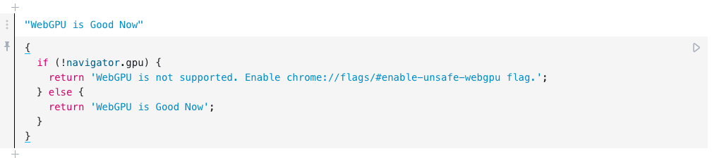
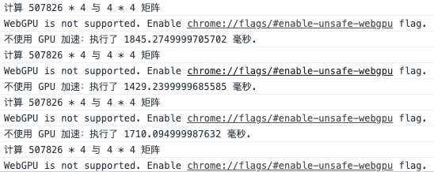
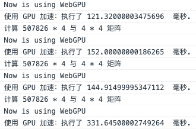
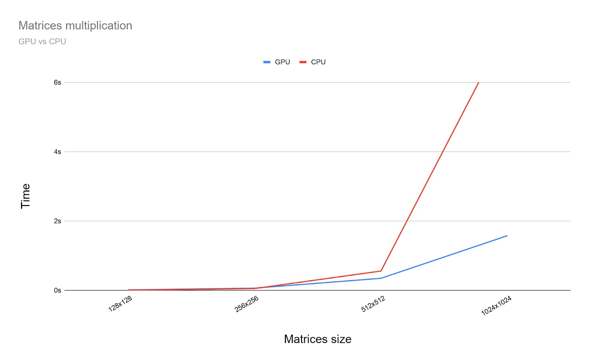

\## Experience

\### Code Location
You may test by yourself.

[@yhyddr/images-by-gpu](https://observablehq.com/@yhyddr/images-by-gpu)

[@yhyddr/images](https://observablehq.com/@yhyddr/images)

\### Performance
[](https://www.yuque.com/abser/blog/kmetb0?\_lake\_card=%7B%22status%22%3A%22done%22%2C%22name%22%3A%22Kapture+2020-02-11+at+18.10.15.mp4%22%2C%22size%22%3A5853958%2C%22percent%22%3A0%2C%22id%22%3A%22TLhcV%22%2C%22videoId%22%3A%22052de95cd84144368c6640ff456af226%22%2C%22coverUrl%22%3A%22https%3A%2F%2Fcdn.nlark.com%2Fyuque%2F0%2F2020%2Fjpeg%2F176280%2F1581416245503-4a673148-dc85-4c6a-ba4c-8648c51d65f3.jpeg%22%2C%22aliyunVideoSrc%22%3Anull%2C%22taobaoVideoId%22%3A%22252643675600%22%2C%22uploaderId%22%3A176280%2C%22authKey%22%3A%22YXBwX2tleT04MDAwMDAwMTImYXV0aF9pbmZvPXsidGltZXN0YW1wRW5jcnlwdGVkIjoiMzAyMWQ5YmEyYzdhNjI5MTczY2IwNDcxYjdkOGViYzYifSZkdXJhdGlvbj0mdGltZXN0YW1wPTE1ODM1OTIyNjM%3D%22%2C%22docUrl%22%3A%22https%3A%2F%2Fwww.yuque.com%2Fabser%2Fblog%2Fkmetb0%22%2C%22card%22%3A%22video%22%7D#TLhcV)
It is foreseeable that the larger the image, the higher the GPU advantage.

\## Key Code

\### First get GPU
\`\`\`javascript
adapter = navigator.gpu.requestAdapter()
device = adapter.requestDevice()
\`\`\`

\### Compute shader code
A syntax based on the C programming language. The following code is used in GPU to compute matrix.
\`\`\`javascript
const computeShaderCode = \`#version 450

 layout(std430, set = 0, binding = 0) readonly buffer FirstMatrix {
 vec2 size;
 float numbers[];
 } firstMatrix;

 layout(std430, set = 0, binding = 1) readonly buffer SecondMatrix {
 vec2 size;
 float numbers[];
 } secondMatrix;

 layout(std430, set = 0, binding = 2) buffer ResultMatrix {
 vec2 size;
 float numbers[];
 } resultMatrix;

 void main() {
 resultMatrix.size = vec2(firstMatrix.size.x, secondMatrix.size.y);

 ivec2 resultCell = ivec2(gl\_GlobalInvocationID.x, gl\_GlobalInvocationID.y);
 float result = 0.0;
 for (int i = 0; i < firstMatrix.size.y; i++) {
 int a = i + resultCell.x \* int(firstMatrix.size.y);
 int b = resultCell.y + i \* int(secondMatrix.size.y);
 result += firstMatrix.numbers[a] \* secondMatrix.numbers[b];
 }

 int index = resultCell.y + resultCell.x \* int(secondMatrix.size.y);
 resultMatrix.numbers[index] = result;
 }
\`;
\`\`\`

\### Compiler
This is a GLSL-to-SPIR-V compiler for the Web and Node.js. It is a WebAssembly build of [glslang](https://github.com/KhronosGroup/glslang).
\`\`\`javascript
const glslangModule = await import('https://unpkg.com/@webgpu/glslang@0.0.13/dist/web-devel/glslang.js')
const glslang = await glslangModule.default();
\`\`\`

[detail code link](https://observablehq.com/@yhyddr/gpu-matrix-compute)

\## Benchmark

\### Without GPU

\### With GPU

\### Test from [get-started-with-gpu-compute-on-the-web](https://developers.google.com/web/updates/2019/08/get-started-with-gpu-compute-on-the-web?hl=zh\_cn)

\## Reference

\- [@yhyddr/images-by-gpu](https://observablehq.com/@yhyddr/images-by-gpu)
\- [@yhyddr/gpu-matrix-compute](https://observablehq.com/@yhyddr/gpu-matrix-compute)
\- [@yhyddr/images](https://observablehq.com/@yhyddr/images)
\- [@fengyfei/image-processing](https://observablehq.com/@fengyfei/image-processing)
\- [get-started-with-gpu-compute-on-the-web](https://developers.google.com/web/updates/2019/08/get-started-with-gpu-compute-on-the-web?hl=zh\_cn)
\- [Digital\_image\_processing](https://en.wikipedia.org/wiki/Digital\_image\_processing)
\- [Edge\_detection](https://en.wikipedia.org/wiki/Edge\_detection)
\- [CNN1](https://mlnotebook.github.io/post/CNN1/)
\- [gpuweb](https://gpuweb.github.io/gpuweb/)
\- [googlechrome(canary).dmg](https://github.com/yyc-git/MyData/blob/master/3d/googlechrome(canary).dmg)
\- [zhihu.com/p/95461662](https://zhuanlan.zhihu.com/p/95461662)
\- [gpu.js vs WebGPU](https://yrq110.me/post/front-end/try-gpu-operations-in-web/)