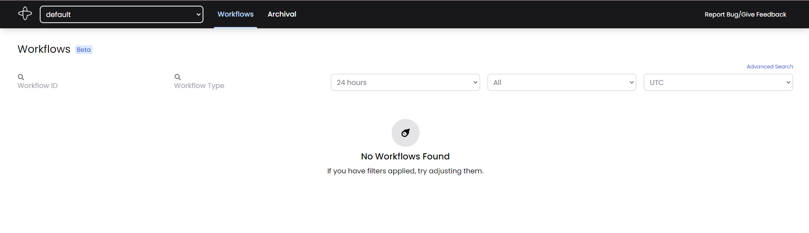

\## 介绍
temporalite 是 temporal 的无依赖二进制分发版本，可以快速在单机启动 temporal，并通过 sqlite 把数据持久化到内存或者文件中。

\> ⚠️ This project is experimental and not suitable for production use. ⚠️

:::warning
未在生产环境稳定，同时在 windows 上应该不能使用，具体看 issues
:::

\### 特点
\> The primary goal of Temporalite is to make it simple and fast to run Temporal locally or in testing environments.
\> Features that align with this goal:
\> \- Easy setup and teardown
\> \- Fast startup time
\> \- Minimal resource overhead: no dependencies on a container runtime or database server
\> \- Support for Windows, Linux, and macOS
\> \- Ships with a web interface

为什么我们要有这个版本， 看上列的特点，最重要的就是无依赖，不依赖容器运行时，也不依赖数据库服务器（因为状态存在 sqlite 里）
:::tips
temporalite 的实现得益于 temporal 本身良好的 interface 抽象，可以轻松完成基于 sqlite 的改造，这也是 golang 面向接口（能力）编程的好处。（另外推荐上 Rust 逃:>
:::

\## 使用
官网的 Readme 很详细，这里记录一下命令
:::warning
Note: Go 1.17 or greater is currently required.
:::
\`\`\`bash
go install github.com/DataDog/temporalite/cmd/temporalite@latest
\# 帮助信息
temporalite -h
\# 启动
temporalite start -f temp.db -ip 0.0.0.0 --namespace default --namespace test
\`\`\`
:::info
另外还可以使用无 web ui 界面启动和无 db 文件（存在内存中） 启动。分别是 temporalite start --ephemeral 和 temporalite start --headless 的标识符
:::

\### 访问
访问 8233 端口即可。

