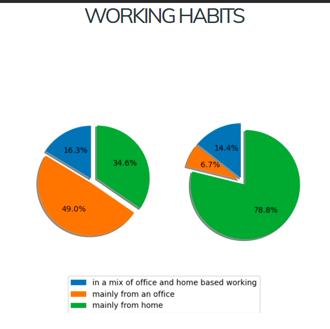
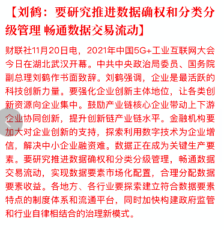
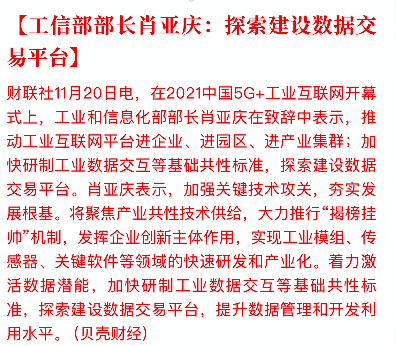

坚持写文字一直是我的爱好, 但是好久没有进行长时间的思考啦. 写这个的契机是在群里看到两年前看到在 v2ex 上招聘远程工作的公司 merico 发布了他们的开源新产品, 在群里发布了他们的信息. 两年前我还在对远程工作处于陌生又向往的状态, 对 merico 很感兴趣, 当时一看要求的正好是我熟悉的 k8s 相关, 于是积极的去申请了. 时过境迁, 现在已经入行有一段时间了, 对远程工作也有更多的经验和认识了.正好趁着这个机会写点啥.

远程工作一直在全球的程序员里都有非常高的认可度, 知名的公司 gitlab 就是一个典型的全员远程工作状况, 在群里还看到一个图, 是 qemu 社区 21 年统计的, 发现大多数人工作习惯倾向于 WFH(work from home). 我也是这一派的支持者.

尽管这个统计有很大的因素是疫情原因, 同时 qemu 是开源软件的缘故. 但这也侧面证明了远程工作对于公司和对于个人都是向好的趋势.

我看到一个非常有趣的叫 gather 的软件, 他们最近因为元宇宙概念大火啦, \*\*元宇宙会议平台Gather融资5000万美元；\*\*

感兴趣的朋友可以看看他们的软件实际应用场景, 我大概描述一下, 大概是玩家在虚拟办公室中有一个对应的小人, 大家在虚拟世界靠的比较近的时候, 视频中就会出现对应的人的视频讯号.

虽然很多人认为元宇宙概念是炒作, 但不可否认的是很多人在里面赚的盆满钵满, 让人不禁思考究竟是哪些人在里面盈利.可以预见的是, 通过空气币等之前大热的炒作手段富裕的人, 也不会放弃这样的机会. 这其中缺失的法律也给予了有心或者无心的人活动的空间.

我对经济向来是持强烈管控的态度的, 因为资本本身代表着一个态度, 如果不加以管制, 对普通人来说当然是种灾难. 无论是炒币还是炒鞋吧, 我个人认为这种浮躁的气氛必须加以限制, 不能使他们轻松的感染年轻人, 如果年轻人都追求这种低概率, 赌博, 被割韭菜或者参与割, 对于社会稳定和有序发展无疑是不良影响. 由于我们的位置特殊, 一旦任何的不稳定都会很容易被乘虚而入, 当然这些都是个人瞎想, 但是适当的政策反应还是要制定的, 我们看看最合适的是什么呢.

应该是数据相关的政策, 个人数据的保护和数据安全尤其需要, 政策关注的, 就是我们可以做的.

[【解局】“挖矿”致富？没有出路！](https://mp.weixin.qq.com/s/RbJmOyXs58PtvicmpxaZrw)

最近，江西省政协原党组成员、副主席肖毅因严重违纪违法被“双开”。在通报中，一则表述引发外界广泛关注：“\*\*滥用职权引进和支持企业从事不符合国家产业政策要求的虚拟货币‘挖矿’活动。”\*\*

上述的案例, 正好和 SIP(安全态势感知) 应用场景契合

我们继续看数据相关的消息

数据的治理一定要赶在前头, 只有这样才能让把握住之后的发展趋势.

回到最开头的感慨, 两年啦, 所谓天下风云出我辈, 我们更应该抓紧时间, 参与到自己想做的事中.