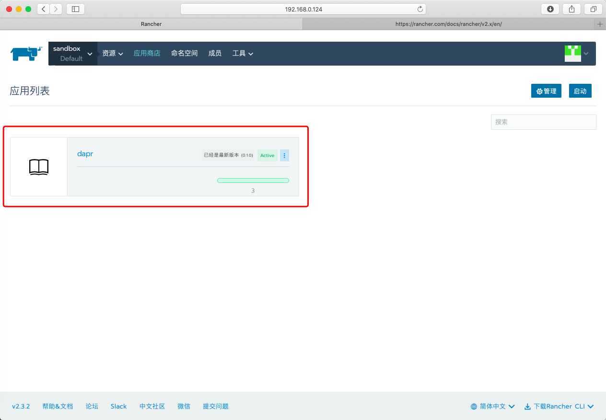

--- 
layout: category-post
title:  "Welcome to blog!"
date:   2016-08-05 20:20:56 -0400
categories: writing
---

\# 前言
我前不久体验了 \`Dapr\` 的单机使用，体验不错。不过\`Dapr\` 作为一个分布式应用的运行时，当然需要加入集群使用才能完全体验呀。我们使用 [GitHub 上的文档](https://github.com/dapr/samples/tree/master/2.hello-kubernetes) 部署。首先我们需要一个 \`Kubernetes\` 集群来做实验，选择 \`Rancher\` 由于我比较熟悉 Rancher ，同时 UI 操作才能让人感受到工具的便利嘛。之后会使用 \`Rancher\` 的 \`Helm\` 部署 \`Dapr\` 、\`Redis\` 图表，不过由于 UI 操作的便利，点一下就部署了。

集群的环境部署比较长，不过本来这些工具就是部署之后一劳永逸降低心智负担，当然你有一个 \`Kubernetes\` 可以直接实验就更好了。

下面是 架构 图

可以看到我们已经接触到了 \`Dapr\` 多语言的特性了。两个 Pod 包括不同语言的应用：Python 和 Node.js ，他们通过 \`Dapr\` Injects 的 \`sidecar\` 交互。

那么我们开始吧！

\# 环境

\- [Docker   18.06.2-ce](https://www.yuque.com/opte0v/shu93f/gss3ca) (安装 Rancher 所需的版本【可选】）
\- [Rancher](https://www.yuque.com/opte0v/shu93f/gss3ca)【可选】
\- [Kubernetes Cluster](https://www.yuque.com/opte0v/shu93f/k8sbyrancher)
\- [Dapr](https://github.com/dapr/docs/blob/master/getting-started/environment-setup.md#installing-dapr-on-a-kubernetes-cluster)
\- [Redis](https://github.com/dapr/docs/blob/master/concepts/components/redis.md#creating-a-redis-store)（用于 state store）

\## Kubernetes 部署

\### Docker
\`\`\`bash
$ yum install docker-ce-18.06.2.ce-3.el7 -y
\`\`\`

[语雀内容](https://www.yuque.com/opte0v/shu93f/gss3ca?view=doc\_embed)

\### Rancher
\`\`\`bash
$ sudo docker run -d --restart=unless-stopped -p 80:80 -p 443:443 rancher/rancher:latest
\`\`\`

[语雀内容](https://www.yuque.com/opte0v/shu93f/td5aq3?view=doc\_embed)

\### K8S By Rancher
[语雀内容](https://www.yuque.com/opte0v/shu93f/k8sbyrancher?view=doc\_embed)

\> 你也可以使用其他的工具快速启动 \`Kubernetes\` 集群

\#### 可选部署 Kubernetes 方法

\- [Setup Minikube Cluster](https://github.com/dapr/docs/blob/master/getting-started/cluster/setup-minikube.md)
\- [Setup Azure Kubernetes Service Cluster](https://github.com/dapr/docs/blob/master/getting-started/cluster/setup-aks.md)

\## Dapr

1\. Using \`Helm\`（Advanced）

添加 Dapr 源 \`https://daprio.azurecr.io/helm/v1/repo\` 到商店

2\. 启动 \`Dapr\`

3\. 默认配置即可

4\. 等待一段时间完成

\> 你可以选择其他方法安装 \`Dapr\`
\>
\##### Using Dapr CLI【可选】[官方文档](https://github.com/dapr/docs/blob/master/getting-started/environment-setup.md#installing-dapr-on-a-kubernetes-cluster)

\## Redis

1\. 同样在 \`Rancher\` 的商店中找到 \`Redis\` Chart，默认部署即可。（可以自己设定一些选项比如密码和访问端口等方便你接下来的操作）

2\. 等待一会儿部署完毕

3\. 使用 \`Rancher\` 自带的 \`kubectl\` 即可执行命令

4\. 使用 以下命令获取到 redis 命名空间下设置的密码

\`kubectl get secret --namespace redis redis -o jsonpath="{.data.redis-password}" \| base64 --decode\`

可以看到密码是 123456（方便实验，内网环境，生产环境请使用生成密码）

5\. 找到 \`Redis\` 的访问端口，我的是 192.168.0.116:32091（这是随机的端口）

6\. 接下来我们把这些值置换到官方给的模板里的

\### Configuration
这里是明文存储的 \`secret\` ，生产环境请参照.[secret management](https://github.com/dapr/docs/blob/master/concepts/components/secrets.md) .

\#### Configuring Redis for State Persistence and Retrieval
在刚才的 \`kubectl\` 命令行中继续操作。
\`\`\`bash
$ vi redis-state.yaml
\`\`\`

记得将上文 4 ，5 步骤得到的 HOST 地址 和 Password 密码替换.
\`\`\`yaml
apiVersion: dapr.io/v1alpha1
kind: Component
metadata:
 name: statestore
spec:
 type: state.redis
 metadata:
 \- name: redisHost
 value:
 \- name: redisPassword
 value:
\`\`\`

同时这个文件也可以在 \`samples/2.hello-kubernetes/deploy \`下找到

\#### [我的 Yaml 文件](https://github.com/yhyddr/quicksilver/tree/master/dapr)

\### Apply the configuration
使用 \`kubectl apply\` 部署。
\`\`\`bash
$ kubectl apply -f redis-state.yaml
$ kubectl apply -f redis-pubsub.yaml
\`\`\`

\# HelloKubernetes

\## Download Code
首先下载示例代码
\`\`\`bash
$ git clone https://github.com/dapr/samples.git
$ cd samples/2.hello-kubernetes/node
\`\`\`

\## Node
该示例有多个应用，首先我们看老朋友 Node.js 的代码

\### Cat app.js
\`\`\`javascript
// $ cat app.js

const express = require('express');
const bodyParser = require('body-parser');
require('isomorphic-fetch');

const app = express();
app.use(bodyParser.json());

const daprPort = process.env.DAPR\_HTTP\_PORT \|\| 3500;
const daprUrl = \`http://localhost:${daprPort}/v1.0\`;
const port = 3000;

app.get('/order', (\_req, res) => {
 fetch(\`${daprUrl}/state/order\`)
 .then((response) => {
 return response.json();
 }).then((order) => {
 res.send(order);
 });
});

app.post('/neworder', (req, res) => {
 const data = req.body.data;
 const orderId = data.orderId;
 console.log("Got a new order! Order ID: " + orderId);

 const state = [{
 key: "order",
 value: data
 }];

 fetch(\`${daprUrl}/state\`, {
 method: "POST",
 body: JSON.stringify(state),
 headers: {
 "Content-Type": "application/json"
 }
 }).then((response) => {
 console.log((response.ok) ? "Successfully persisted state" : "Failed to persist state");
 });

 res.status(200).send();
});

app.listen(port, () => console.log(\`Node App listening on port ${port}!\`));
\`\`\`

可以看到这个和我们之前使用的单机的 Node.js 一样，可以参照我的这篇文章

\### Node Application Explain
[语雀内容](https://www.yuque.com/abser/process/fa0ntp?inner=zjdNP&view=doc\_embed)

\### Deploy Node Application
虽然代码一样，但是我们部署的方法变了，不是直接使用 \`dapr\` 进行部署，而是使用 \`kubectl\`(注意我们当前目录还在 \`samples/2.hello-kubernetes/node\` 下
\`\`\`bash
$ kubectl apply -f ../deploy/node.yaml

service/nodeapp created
deployment.apps/nodeapp created
\`\`\`

如果你好奇，我们可以看一看 node.yaml 的内容（我把代码块调小了，可以自己滑动查看）
\`\`\`yaml
kind: Service
apiVersion: v1
metadata:
 name: nodeapp
 labels:
 app: node
spec:
 selector:
 app: node
 ports:
 \- protocol: TCP
 port: 80
 targetPort: 3000
 type: LoadBalancer

\-\-\-
apiVersion: apps/v1
kind: Deployment
metadata:
 name: nodeapp
 labels:
 app: node
spec:
 replicas: 1
 selector:
 matchLabels:
 app: node
 template:
 metadata:
 labels:
 app: node
 annotations:
 dapr.io/enabled: "true"
 dapr.io/id: "nodeapp"
 dapr.io/port: "3000"
 spec:
 containers:
 \- name: node
 image: dapriosamples/hello-k8s-node
 ports:
 \- containerPort: 3000
 imagePullPolicy: Always

\`\`\`
     注意这两个选项，   \` dapr.io/enabled: "true"\` 告诉 \`Dapr\` 控制器注入边车

        \` dapr.io/id: "nodeapp"\` 告诉 \`Dapr\` 这个部署的唯一 ID（用来 \`Dapr\` 之间相互通信）

现在我们来查看状态和外部 IP（外部 IP 在 pending 是因为我们使用 \`Rancher\` 的原因，4 层负载均衡并不是每一个运营商都支持，不过外部 IP 不影响本次 Demo， 我会在下面做一个 \`Ingress\` 访问它
\`\`\`bash
$ kubectl get svc nodeapp
NAME TYPE CLUSTER-IP EXTERNAL-IP PORT(S) AGE
nodeapp LoadBalancer 10.43.255.238  80:30557/TCP 5m17s
\`\`\`

 将 NodeApp 导入环境变量【跳过：由于我们没有 EXTERNAL-IP 】
\`\`\`bash
$ export NODE\_APP=$(kubectl get svc nodeapp --output 'jsonpath={.status.loadBalancer.ingress[0].ip}')
\`\`\`

\## Python
我们还有一个 Python 的 Application 需要部署。
\`\`\`bash
$cd samples/2.hello-kubernetes/python
$cat app.py
\`\`\`

Python 的代码很简单，他把 JSON 消息发到 \`localhost：3500\` （这个端口是可变的，\`3500\` 是 \`Dapr\` 默认端口） 调用 Node App 的 neworder endpoint 。我们的消息也是很简单的每秒递增一次的消息。
\`\`\`python
import time
import requests
import os

dapr\_port = os.getenv("DAPR\_HTTP\_PORT", 3500)
dapr\_url = "http://localhost:{}/v1.0/invoke/nodeapp/method/neworder".format(dapr\_port)

n = 0
while True:
 n += 1
 message = {"data": {"orderId": n}}

 try:
 response = requests.post(dapr\_url, json=message)
 except Exception as e:
 print(e)

 time.sleep(1)
\`\`\`

部署并等待 Pod 进入 Running 状态
\`\`\`bash
$ kubectl apply -f ./deploy/python.yaml
$ kubectl get pods --selector=app=python -w

NAME READY STATUS RESTARTS AGE
pythonapp-b5fd4474d-tk84x 0/2 ContainerCreating 0 9s
pythonapp-b5fd4474d-tk84x 1/2 ErrImagePull 0 38s
pythonapp-b5fd4474d-tk84x 1/2 ImagePullBackOff 0 39s
pythonapp-b5fd4474d-tk84x 2/2 Running 0 3m24s
\`\`\`

\## Observe
我们毕竟使用的是 UI 界面，现在我们可以通过 \`Rancher\` UI 检验一下我们的成果。

可以看到 \`nodeapp\` 和 \`pythonapp\` 两个 Pod 都在 active 状态。同时我们点进入更多信息界面可以看到 Pod 中还有 \`Dapr\` 的 边车

我们进入 nodeapp 检查日志

或者使用命令行
\`\`\`bash
$ kubectl logs --selector=app=node -c node

Got a new order! Order ID: 1
Successfully persisted state
Got a new order! Order ID: 2
Successfully persisted state
Got a new order! Order ID: 3
Successfully persisted state
\`\`\`

\## Persistence
当然，我们不能使用 LoadBalance 或者 外部 IP 并不能阻止我们检查持久性。

我们可以通过 \`Rancher\` 添加一个 \`Ingress\` 七层负载均衡到 目标容器进行访问。

然后设置 nodeapp 的端口 \`3000\`

等待一会儿出现分配的地址 [http://nodeapp.default.192.168.0.102.xip.io](http://nodeapp.default.192.168.0.102.xip.io)

浏览器或者命令行访问，会返回最新的 orderID
\`\`\`bash
$ curl http://nodeapp.default.192.168.0.102.xip.io/order
{"orderID":"42"}
\`\`\`

\## Clean
这会清理所有的东西，包括 状态组件。
\`\`\`bash
$ cd samples/2.hello-kubernetes/deploy
$ kubectl delete -f .
\`\`\`

\# Summary
首先使用 Dapr 的开发感受还需要一步，就是修改代码之后编译为自己的 Docker 然后部署在 Kubernetes 上，这里不详述，留给读者当练手即可。引用官方的 Next Steps 大概导引一下。
\>
\## Next Steps
\> Now that you're successfully working with Dapr, you probably want to update the sample code to fit your scenario. The Node.js and Python apps that make up this sample are deployed from container images hosted on a private [Azure Container Registry](https://azure.microsoft.com/en-us/services/container-registry/). To create new images with updated code, you'll first need to install docker on your machine. Next, follow these steps:
\> 1\. Update Node or Python code as you see fit!
\> 1\. Navigate to the directory of the app you want to build a new image for.
\> 1\. Run \`docker build -t  . \`. You can name your image whatever you like. If you're planning on hosting it on docker hub, then it should start with \`/\`.
\> 1\. Once your image has built you can see it on your machines by running \`docker images\`.
\> 1\. To publish your docker image to docker hub (or another registry), first login: \`docker login\`. Then run\`docker publish \`.
\> 1\. Update your .yaml file to reflect the new image name.
\> 1\. Deploy your updated Dapr enabled app: \`kubectl apply -f .yaml\`.

这一次的 Dapr 体验遇到的一些问题主要是集群本身的网络问题。本身 Dapr 在这个 Demo 中起到的就是通信和存储状态的服务，但是在实际使用中并没有看到非常多的日志可供调试。也就是说依旧需要专业的运维人员进行 Dapr 开发的维护。不过，本来 Dapr 的打算就是制定标准，划开开发人员和运维人员的界限降低心智负担。

Demo 中是两个语言的应用，我在查看日志的时候看了下环境变量，看到了 GRPC 的 50001 端口。同时 Dapr 也提供 各个语言的 SDK。我们看过了两个应用的代码，都很简单，不过可以看到的是对于通信的感知是不大的，或者说对于 Dapr 的感知不大，意味着微服务改为 Dapr 的并不需要改动太多，就是服务的 URL 变动一下。剩余的交给 Dapr 的 Sidecar 就行了。

如果你不选择 Rancher 作为 搭建 Kubernetes 的集群的工具的话，[跳转](#u6kbX) 也有其他的教程指导。没有一些非常明白好看的 UI 了。Rancher 的可视化部署状态在这个 Demo 中起到了很大的作用。

接下来对于 Dapr 会尝试一下 他的事件驱动特性和 Pub/Sub 。这对于分布式应用来说也比较好玩。我非常赞同边车的开发模式，说到 sidecar 很多人都会想到 Istio 和 envoy，我也是一开始因为 ServiceMesh 和 sidecar 才开始关注 Dapr 的。刚看到开源的消息到现在，GitHub stars 已经到 4k 了，不过一天时间涨了 1k 多。微软的能量还是挺大的。

\# Refer

\- [https://github.com/dapr/samples/tree/master/2.hello-kubernetes](https://github.com/dapr/samples/tree/master/2.hello-kubernetes)
\- [https://github.com/dapr/docs/blob/master/concepts/components/redis.md#creating-a-redis-store](https://github.com/dapr/docs/blob/master/concepts/components/redis.md#creating-a-redis-store)
\- [https://www.yuque.com/abser/process/fa0ntp](https://www.yuque.com/abser/process/fa0ntp)