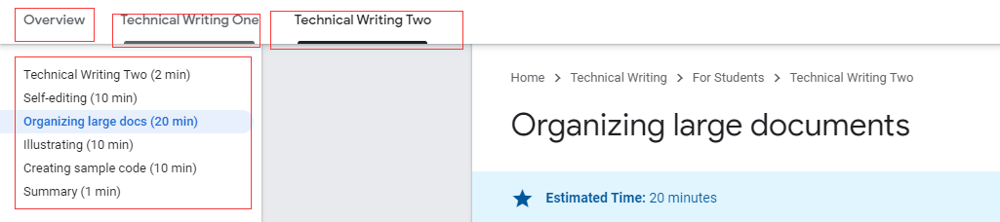

如何自己编写像 google doc 一样的文档, 阅读 [Google Writing Principle](https://developers.google.com/tech-writing/one/just-enough-grammar)

\# 基础部分

\## 使用术语

1\. 术语使用要保持前后一致
1\. 缩略词第一次出现应为 \`Telekinetic Tactile Network (TTN)\` 形式
1\. 使用术语全称还是缩略词需要考究.
1\. 重用名词而不是使用代词.(就像指针一样, 代词往往会引入错误和歧义) ~~This, That, It, Them~~

~~

\## 使用主动语态(谁对谁做了什么)

大多数人的思维方式是主动语态, 可以帮助读者跳过预处理器阶段,直接进行编译. 并且主动语态更短. 被动语态有时会省略 actor.

\- 错误例子
 \- It has been suggested that...
 \- Data was taken...
 \- Statistics were calculated...
 \- Results were evaluated.

\## 消除句子歧义

\### 使用准确的动词
The error ~~\*\*occurs\*\*~~\*\* \*\*when clicking the Submit button.

💡Clicking the Submit button \*\*triggers \*\*the error.

This error message ~~\*\*happens\*\*~~ when...

💡The system \*\*generates\*\* this error message when...

We \*\*~~are~~ \*\*very careful to ensure...

💡We carefully \*\*ensure\*\*...

\### 去掉 There is, There are
\*\*~~There is~~\*\* a variable called that stores the current accuracy.

💡A variable named stores the current accuracy. The variable stores the current accuracy.

~~\*\*There is\*\*~~ no guarantee that the updates will be received in sequential order.

💡\*\*Clients \*\*might not receive the updates in sequential order.

\### 减少形容词和副词
Setting this flag makes the application run screamingly fast.

💡Setting this flag makes the application run 225-250% faster.

google doc 在这里说, 减少副词会减少语言魅力, 换成数据可以增加可信和准确度, 是值得的. 我认为可以折中一下.

💡Setting this flag makes the application run screamingly faster(225-250%).

\## 将长句分割成短句

\### 直接分割
The late 1950s was a key era for programming languages because IBM introduced Fortran in 1957 and John McCarthy introduced Lisp the following year, which gave programmers both an iterative way of solving problems and a recursive way.

💡The late 1950s was a key era for programming languages. IBM introduced Fortran in 1957. John McCarthy invented Lisp the following year. Consequently, by the late 1950s, programmers could solve problems iteratively or recursively.

\### 给读者选择阅读的权利
To alter the usual flow of a loop, you may use either a \*\*break \*\*statement (which hops you out of the current loop) or a \*\*continue \*\*statement (which skips past the remainder of the current iteration of the current loop).

💡To alter the usual flow of a loop, call one of the following statements:

\- \*\*break\*\*, which hops you out of the current loop.
\- \*\*continue\*\*, which skips past the remainder of the current iteration of the current loop.

\### 减少多余的词
An input value greater than 100\*\* causes the triggering of logging.\*\*

💡An input value greater than 100 \*\*triggers logging.\*\*

✅\`one sentence = one idea\` 记住这个原则

\## 列表语义统一

\- 区分顺序和无序列表
\- 列表每一项应为统一格式
\- 解释列表的含义

\## 段落
写作的工作很简单：解开主题部分之间的依赖关系，并在逻辑流中呈现这些部分，使读者能够理解您。

\- 使用总分句式A block of code is any set of contiguous code within the same function. For example, suppose you wrote a block of code that detected whether an input line ended with a period. To evaluate a million input lines, create a loop that runs a million times.

💡A loop runs the same block of code multiple times. For example, suppose you wrote a block of code that detected whether an input line ended with a period. To evaluate a million input lines, create a loop that runs a million times.

\- 使每段话保持一个主题, 与主题无关的应该舍弃The Pythagorean Theorem states that the sum of the squares of both legs of a right triangle is equal to the square of the hypotenuse. ~~The perimeter of a triangle is equal to the sum of the three sides.~~ You can use the Pythagorean Theorem to measure diagonal distances. For example, if you know the length and width of a ping-pong table, you can use the Pythagorean Theorem to determine the diagonal distance.~~ To calculate the perimeter of the ping-pong table, sum the length and the width, and then multiply that sum by 2.~~

~~

\- 不要太长或太短(这个我觉得保持在 3 到 5 句话就合适, 见仁见智)

\- 问自己三个问题来优化段落表达
 1\. 你要告诉读者什么
 1\. 为什么这一点需要读者知道
 1\. 读者怎么使用你告知的信息, 或者读者如何知道你说的是正确的.

💡    The garp() function returns the delta between a dataset's mean and median. Many people believe unquestioningly that a mean always holds the truth. However, a mean is easily influenced by a few very large or very small data points. Call garp() to help determine whether a few very large or very small data points are influencing the mean too much. A relatively small garp

\## 受众
良好的文档= 受众完成任务所需的知识和技能 – 受众当前的知识和技能
确立受众角色, 斟酌使用术语,习语, 并为读者提供可查阅的资料如果需要.

\## 文档

1\. 确立文档范围 \`本文档介绍了 Frambus 项目的总体设计\`
1\. 说明受众期望\` 本文档假定您了解矩阵乘法以及如何泡一杯茶\`
1\. 简单摘要 \`比如简介 比如大纲\`
1\. 确立文章预期 \`读者阅读之后期望得到什么知识和技能\`

\# 提高部分
提高部分主要讲述了一些策略用于优化文档. 斟酌选用他, 并持续保持

1\. 采用样式指南, 比如让写作者统一学习上面的基础部分.
1\. 在受众的角度来审阅文档 - 该策略可能会为受众增加指向资源的链接, 让他们可以了解更多信息
1\. 大声朗读 - 可以避免不自然的措辞, 长句
1\. 初稿后间隔一段时间( hours ) 再回来改进迭代

\### 组织大型文档

1\. 选择类型, 是单个大文档(像这篇文章) 还是一组文档(就像这篇文章使用的 Google Writing 教程)

1\. 整一个大纲
1\. 优化标题表达
1\. 逐步提供信息 (不要一股脑把所有的概念贴在开头)

\### 画图
figures truly worth a thousand words.
这是最重要的部分, 首先 图片的吸引力比文本大, 也能让读者学到更多. (这个教程说大多数成年人在面临技术文档的时候还是小孩子, 他们更渴望图片.

1\. 给图片标题
1\. 限制单个图片信息量
1\. 突出重点聚焦注意力
1\. 不断迭代
 \- 询问自己问题
 \- 如何简化插图？
 \- 我应该将此插图拆分为两个或更多更简单的插图吗？
 \- 插图中的文字容易阅读吗？文本是否与其背景形成足够的对比？
 \- 要点是什么？

\## 例子代码
提供正确的, 简短的, 可重用的代码, 同时保证代码带来的副作用最小