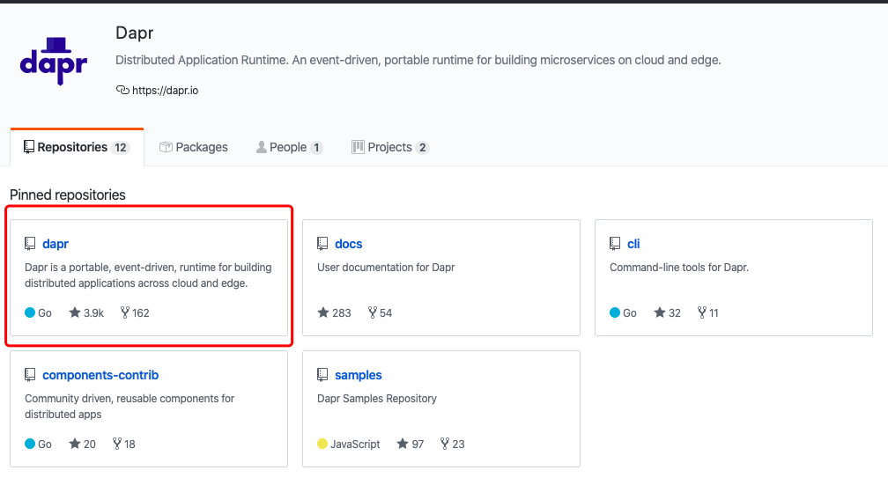
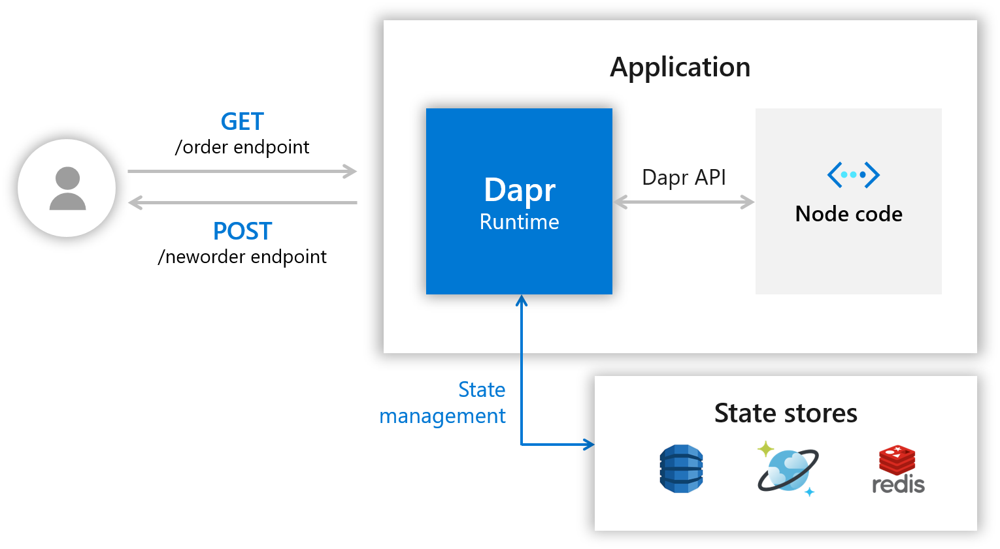
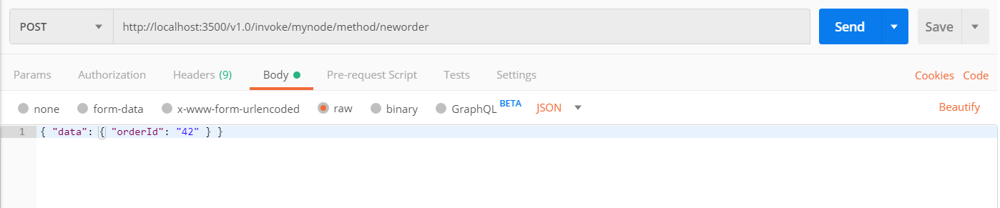
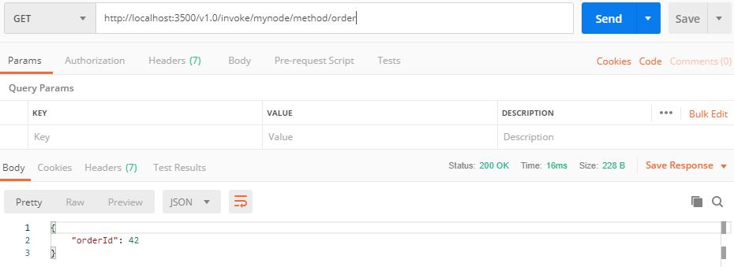

--- 
layout: category-post
title:  "Welcome to blog!"
date:   2016-08-05 20:20:56 -0400
categories: writing
---

最近看到 Kubernetes 的文章 ：[《微软开源微服务构建软件 Dapr》](https://www.kubernetes.org.cn/5954.html)

微软开源的微服务套件？我一下子来了兴趣，作为一个开发人员，当然是先上手试试手感啦。我看文章中提到
\> Dapr是由一套创建区块所组成，可通过标准的HTTP或gRPC APIs来存取，每个区块都是独立的，可在应用程序中选用全部或其中几个，同时微软也欢迎开源社区贡献更多的区块与组件。
\> 目前的Dapr项目处于alpha阶段，因此仅提供最常用的创建区块，例如服务调用、状态管理、服务之间的出版与订阅通讯、事件驱动的资源绑定、虚拟模型，以及服务之间的分散式追踪。

\> 开发人员已可由GitHub存取Dapr程序代码与范例，微软会建立专门的Dapr网站以供开发人员交流。

嗯，已经在 GitHub 上开源了，事不宜迟，马上打开 GitHub 找到它。居然已经 3900 stars 啦！看来我来迟了一点。

那么进入正题，首先来一个 HelloWorld 试试吧。

\## Dapr
首先看了这整个项目的介绍。
\> Distributed Application Runtime. An event-driven, portable runtime for building microservices on cloud and edge.

分布式应用运行时、事件驱动、为云和边缘构建微服务提供便携化运行时。

咦，说的非常华丽啊！不过我们开发人员看待的是实际解决问题的能力，现在 Dapr 版本也低于 1.0，先尝尝鲜吧。

\### [dapr/dapr](https://github.com/dapr/dapr)
[GitHub](https://github.com/dapr/dapr)

打开主项目，介绍摘要如下
\> Dapr is a portable, serverless, event-driven runtime that makes it easy for developers to build resilient, stateless and stateful microservices that run on the cloud and edge and embraces the diversity of languages and developer frameworks.
>
\> Dapr codifies the \_best practices\_ for building microservice applications into open, independent, building blocks that enable you to build portable applications with the language and framework of your choice. Each building block is independent and you can use one, some, or all of them in your application.

我特别注意了下 stateless or stateful 的标签。大学的时候学《计算理论》的时候接触过一些状态机，了解了一些状态的理论，好奇一下 Dapr 是如何打上这两个标签的。

\> ”状态是万恶之源“

还提到了多语言和多开发者框架，我认为这是他选择的通过通信共享信息，即 \`HTTP\` 和 \`GRPC\` 支持多语言等特性。微软想通过这个设定一个构建微服务应用的规则。从根本上确立你开发的每一个应用的独立性。

正式开始 QuickStart 吧。

\## 环境

1\. Install [Docker](https://docs.docker.com/install/)（微服务已经离不开容器化了）
1\. Install [Dapr](https://github.com/dapr/docs/blob/master/getting-started/environment-setup.md#environment-setup)
1\. [Node.js version 8 or greater](https://nodejs.org/en/)（这个 Helloworld 是 node 应用）

\### On MacOS
Install the latest darwin Dapr CLI to \`/usr/local/bin\`
\`\`\`bash
curl -fsSL https://raw.githubusercontent.com/dapr/cli/master/install/install.sh \| /bin/bash
\`\`\`

有条件可以加速

执行初始化（会启动 docker 容器）
\`\`\`bash
$ dapr init
⌛ Making the jump to hyperspace...
Downloading binaries and setting up components
✅ Success! Dapr is up and running

$ docker ps
CONTAINER ID IMAGE COMMAND CREATED STATUS PORTS NAMES
b3a5600e672f redis "docker-entrypoint.s…" 44 hours ago Up 44 hours 0.0.0.0:6379->6379/tcp xenodochial\_hofstadter
e5010ba0c33f daprio/dapr "./placement" 44 hours ago Up 44 hours 0.0.0.0:50005->50005/tcp dapr\_placement
\`\`\`

\## HelloWorld

\### Application Architecture

能够看到暴露两个 \`endpoint\` 是 \`HTTP\` 访问，一个创建一个查询。

主要看我们使用 \`Dapr\` 的交互。在图中它作为 \`Runtime\`

\- 提供 Dapr API 给多语言调用。
\- 提供 状态管理 By state stores

\### Download Code
下载并进入相应文件夹
\`\`\`bash
git clone https://github.com/dapr/samples.git
cd samples/1.hello-world
\`\`\`

\### Cat app.js
\`\`\`javascript
// $ cat app.js
// ------------------------------------------------------------
// Copyright (c) Microsoft Corporation.
// Licensed under the MIT License.
// ------------------------------------------------------------

const express = require('express');
const bodyParser = require('body-parser');
require('isomorphic-fetch');

const app = express();
app.use(bodyParser.json());

const daprPort = process.env.DAPR\_HTTP\_PORT \|\| 3500;
const stateUrl = \`http://localhost:${daprPort}/v1.0/state\`;
const port = 3000;

app.get('/order', (\_req, res) => {
 fetch(\`${stateUrl}/order\`)
 .then((response) => {
 return response.json();
 }).then((orders) => {
 res.send(orders);
 });
});

app.post('/neworder', (req, res) => {
 const data = req.body.data;
 const orderId = data.orderId;
 console.log("Got a new order! Order ID: " + orderId);

 const state = [{
 key: "order",
 value: data
 }];

 fetch(stateUrl, {
 method: "POST",
 body: JSON.stringify(state),
 headers: {
 "Content-Type": "application/json"
 }
 }).then((response) => {
 console.log((response.ok) ? "Successfully persisted state" : "Failed to persist state");
 });

 res.status(200).send();
});

app.listen(port, () => console.log(\`Node App listening on port ${port}!\`));
\`\`\`
这是一些路由和 \`handlers\`

注意 14-16 行
\`\`\`javascript
const daprPort = process.env.DAPR\_HTTP\_PORT \|\| 3500;
const stateUrl = \`http://localhost:${daprPort}/v1.0/state\`;
const port = 3000;
\`\`\`

3500 是 \`Dapr\` 的环境端口，如果你安装时有改动，需要考虑。

\`stateurl\` 就是 \`Dapr\` 提供的 URL 了

\#### Handlers

\##### /neworder
\`\`\`javascript
app.post('/neworder', (req, res) => {
 const data = req.body.data;
 const orderId = data.orderId;
 console.log("Got a new order! Order ID: " + orderId);

 const state = [{
 key: "order",
 value: data
 }];

 fetch(stateUrl, {
 method: "POST",
 body: JSON.stringify(state),
 headers: {
 "Content-Type": "application/json"
 }
 }).then((response) => {
 console.log((response.ok) ? "Successfully persisted state" : "Failed to persist state");
 });

 res.status(200).send();
});
\`\`\`

这里重点是状态存储，即将 \`state\` 通过 \`stateurl\` 存储在 \`Dapr\` 中。

\##### /order
我们并不是直接通过 \`res.json\` 作为 \`Response\` 来进行已经持久化的数据的使用，而是通过暴露一个 GET endpoint 通过访问它来验证持久化是否成功。
\`\`\`javascript
app.get('/order', (\_req, res) => {
 fetch(\`${stateUrl}/order\`)
 .then((response) => {
 return response.json();
 }).then((orders) => {
 res.send(orders);
 });
});
\`\`\`

现在我们通过状态转移在 \`Dapr\` 里实现了 \`stateless\`，同样我们也可以在加上一个 \`local cache\` 并通过一个新的 endpoint 访问来使 \`Node\` application 变成 \`stateful\`

\### Dapr Run Node.js App

1\. \`npm install\` ：通过当前目录下的 \`package.json\` , 会安装 \`express\` 和 \`body-parser\` ，在 app.js 7-8行我们可以看到这两项。
1\. \`dapr run --app-id mynode --app-port 3000 --port 3500 node app.js\`

\`\`\`bash
$ dapr run --app-id mynode --app-port 3000 --port 3500 node app.js
ℹ️ Starting Dapr with id mynode. HTTP Port: 3500. gRPC Port: 55099
✅ You're up and running! Both Dapr and your app logs will appear here.
\`\`\`

应该是有后台运行的 \`CLI\` 命令，这里是前台打印的日志
\`\`\`bash
== DAPR == time="2019-11-06T10:37:41+08:00" level=info msg="starting Dapr Runtime -- version 0.1.0 -- commit 4358565-dirty"
== DAPR == time="2019-11-06T10:37:41+08:00" level=info msg="log level set to: info"
== DAPR == time="2019-11-06T10:37:41+08:00" level=info msg="standalone mode configured"
== DAPR == time="2019-11-06T10:37:41+08:00" level=info msg="dapr id: mynode"
== DAPR == time="2019-11-06T10:37:41+08:00" level=info msg="loaded component messagebus (pubsub.redis)"
== DAPR == time="2019-11-06T10:37:41+08:00" level=info msg="loaded component statestore (state.redis)"
== DAPR == time="2019-11-06T10:37:41+08:00" level=info msg="application protocol: http. waiting on port 3000"
== APP == Node App listening on port 3000!
== DAPR == time="2019-11-06T10:37:42+08:00" level=info msg="application discovered on port 3000"
== DAPR == 2019/11/06 10:37:42 redis: connecting to localhost:6379
== DAPR == 2019/11/06 10:37:42 redis: connected to localhost:6379 (localAddr: [::1]:55130, remAddr: [::1]:6379)
== DAPR == time="2019-11-06T10:37:42+08:00" level=info msg="actor runtime started. actor idle timeout: 1h0m0s. actor scan interval: 30s"
== DAPR == time="2019-11-06T10:37:42+08:00" level=info msg="actors: starting connection attempt to placement service at localhost:50005"
== DAPR == time="2019-11-06T10:37:42+08:00" level=info msg="http server is running on port 3500"
== DAPR == time="2019-11-06T10:37:42+08:00" level=info msg="gRPC server is running on port 55099"
== DAPR == time="2019-11-06T10:37:42+08:00" level=info msg="local service entry announced"
== DAPR == time="2019-11-06T10:37:42+08:00" level=info msg="dapr initialized. Status: Running. Init Elapsed 945.8297490000001ms"
== DAPR == time="2019-11-06T10:37:42+08:00" level=info msg="actors: established connection to placement service at localhost:50005"
== DAPR == time="2019-11-06T10:37:42+08:00" level=info msg="actors: placement order received: lock"
== DAPR == time="2019-11-06T10:37:42+08:00" level=info msg="actors: placement order received: update"
== DAPR == time="2019-11-06T10:37:42+08:00" level=info msg="actors: placement tables updated"
== DAPR == time="2019-11-06T10:37:42+08:00" level=info msg="actors: placement order received: unlock"
\`\`\`
⚠️：注意到 \`Node App\` 在指定的 \`3000\` 端口运行，同时还有状态存储的 \`redis\` 在 \`6379\` 端口运行

\### Post and Get
接下来注意，文中的端口是 \`app.js\` 里默认的 \`3500\`

\#### Post

\##### Curl
\`\`\`bash
curl -XPOST -d @sample.json http://localhost:3500/v1.0/invoke/mynode/method/neworder
\`\`\`

\##### Vscode
如果你用 vscode ，使用这个插件 [Rest Client Plugin](https://marketplace.visualstudio.com/items?itemName=humao.rest-client)

然后打开目录下的 \`sample.http\` , 可以看到 send request 的选项

[sample.http](https://github.com/dapr/samples/blob/master/1.hello-world/sample.http)
\`\`\`http
POST http://localhost:3500/v1.0/invoke/mynode/method/neworder
{
 "data": {
 "orderId": "42"
 }
}
\`\`\`

\##### Postman
如图： \`http://localhost:3500/v1.0/invoke/mynode/method/neworder\` [

\##### Result Update
你可以在你启动的终端中看到新的日志
\`\`\`bash
== APP == Got a new order! Order ID: 42
== APP == Successfully persisted state
\`\`\`

\#### Get

\##### Curl
\`\`\`bash
curl http://localhost:3500/v1.0/invoke/mynode/method/order
\`\`\`

\##### Vscode
[sample.http](https://github.com/dapr/samples/blob/master/1.hello-world/sample.http)
\`\`\`bash
GET http://localhost:3500/v1.0/invoke/mynode/method/order
\`\`\`

\##### Postman

\### Terminate
\`ctrl + c\` 或者 \`dapr stop --app-id mynode\`
\`\`\`bash
^C
ℹ️ terminated signal received: shutting down
✅ Exited Dapr successfully
✅ Exited App successfully
\`\`\`

\## Feature

\- 具有可插入提供程序和至少一次语义的事件驱动的Pub-Sub系统
\- 使用可插入提供程序的输入和输出绑定
\- 具有可插拔数据存储的状态管理
\- 一致的服务到服务发现和调用
\- 选择加入状态模型：强大/最终一致性，首次写入/最后写入获胜
\- 跨平台虚拟演员
\- 限速
\- 使用OpenTelemetry的内置分布式跟踪
\- 使用专用的Operator和CRD在Kubernetes上本地运行
\- 通过HTTP和gRPC支持所有编程语言
\- 来自Azure，AWS，GCP的多云，开放式组件（绑定，发布-订阅，状态）
\- 作为过程或容器化在任何地方运行
\- 轻量级（58MB二进制，4MB物理内存）
\- 作为辅助工具运行-无需特殊的SDK或库
\- 专用的CLI-易于调试的开发人员友好体验
\- Java，Dotnet，Go，Javascript和Python的客户端

\## Refer

\- [https://github.com/dapr/dapr](https://github.com/dapr/dapr)
\- [https://github.com/dapr/docs/blob/master/getting-started/environment-setup.md#environment-setup](https://github.com/dapr/docs/blob/master/getting-started/environment-setup.md#environment-setup)
\- [https://github.com/dapr/docs/tree/master/howto](https://github.com/dapr/docs/tree/master/howto)
\- [https://github.com/dapr/samples](https://github.com/dapr/samples)
\- [https://github.com/dapr/samples/tree/master/1.hello-world](https://github.com/dapr/samples/tree/master/1.hello-world)