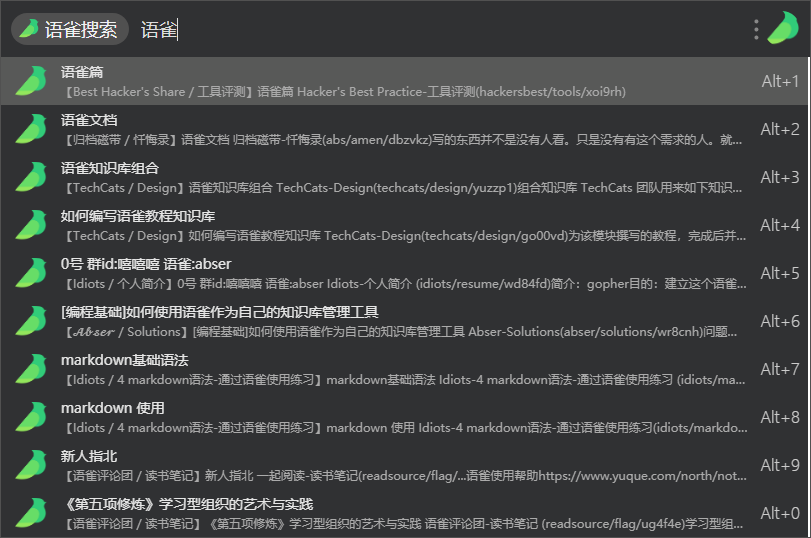
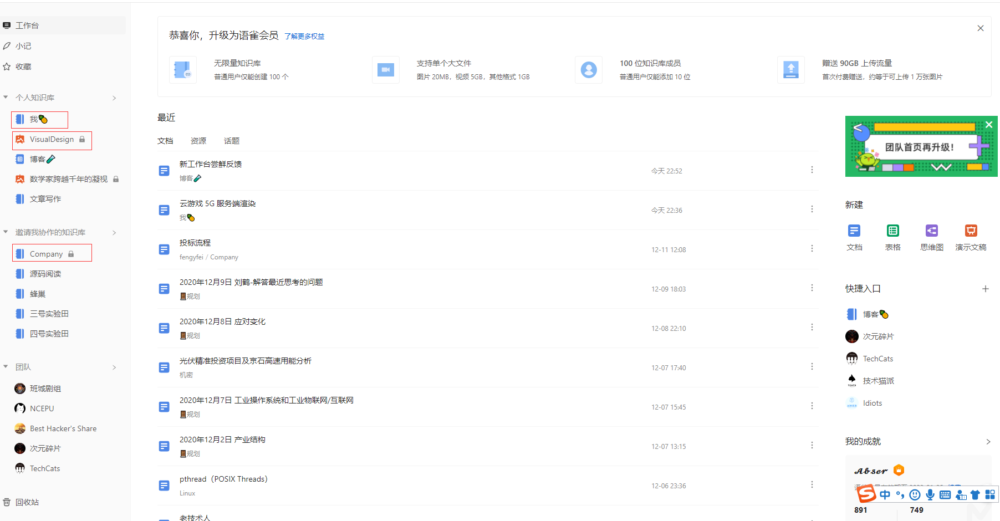

--- 
layout: category-post
title:  "Welcome to blog!"
date:   2016-08-05 20:20:56 -0400
categories: writing
---

我更喜欢新工作台，

以前不会使用工作台，都是使用语雀自带的搜索和个人主页中的知识库列表找到目标文档和知识库。因为旧工作台的难用，只能简单的使用快捷入口，基本不会有点开左边栏位二级菜单的情况（只有一种，找与我协作的知识库的时候，在个人主页中找不到，需要在工作台中找到）。收藏功能存在感薄弱，工作台里都想不起这个功能。

新型工作台能够有更多的自定义选项而不是之前的快捷入口，同时侧边栏的设计和分类入口的自定义让我能有更多的机会直接通过左侧侧边栏进入，不在作为无用的工作台页面出现在语雀中（以前点开工作台，只是看看自己关注的东西的动态）

比较欣喜的是收藏功能的提出，和小记并列，收藏在页内路由，将收藏的东西分类别存在子菜单中，感觉方便了不少，可能会在以后更多的使用收藏单个文档、画板和团队（都没有想过收藏团队的事）的功能。私以为，收藏是弱一级的 follow，watch，可以理解为 fork。

现在侧边栏还不能方便的操作比如直接拖拽排序入口，另外如果能保存上一次退出的时候折叠了哪些菜单项也不错。更新:其实是可以的, 转为加分项.

由于以前工作台的不便，我使用的是 Utools 类似 Alfred 的一个工作流软件的语雀插件进行的快速打开文档编辑。

相比较桌面端的体验，我更喜欢全部使用 Web 端进行编辑。

\> 简单介绍新老工作台对比更喜欢哪一个，用平时用工作台主要会用到什么功能

\# 如果给新旧工作台打分，你分别会打多少分？\*
旧工作台：  1  分（满分5分）1 分打给在旧工作台看动态

新工作台：   3 分（满分5分）1 分给侧边栏明晰了语雀的功能（工作台，小记，收藏，回收站，分类快捷入口） 1 分给点击侧边栏菜单后页面内路由，1 分给颜值和习惯符合。

\# 使用困扰（如有）
\> 简单描述在使用新工作台时是否有不顺手/难用的地方，或者希望能改进的地方？

1\.

我的困扰主要是点击标记红框的链接时，期待行为是页内变换而不是新建一个页面跳转。

2\. 动态不再是在工作台而是在发现栏看了， 不知道以后顶部栏会不会消失？对右上角的新建和工作台里的新建有一些困惑。
2\. 顶部栏的通知是否也会合并到新工作台中。

\# 亮点（如有）
\> 有没有你觉得新工作台很好用的地方？

1\. 能够把自己的快捷入口分类放出来。
1\. 能够快捷点开小记。
1\. 能够在同一个页面浏览自己的知识库，协作知识库，团队。
1\. \`最近\`中的资源和话题版块能够查看列表。

\# 其他想法

1\. 工作台能否有更强大的快捷入口的能力。
 1\. 在搜索框中输入字符的时候，能即时跳出符合的文档或知识库
 1\. 在工作台点开文档和知识库不再是新跳出一个页面而是在当前页面编辑。