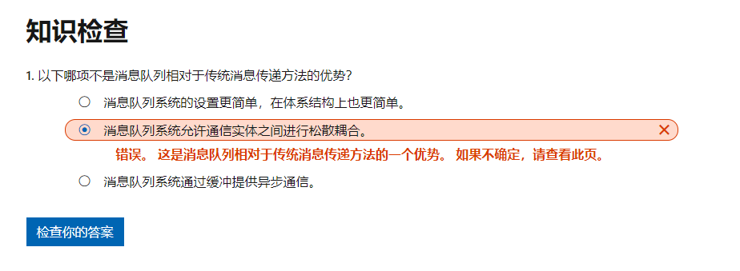
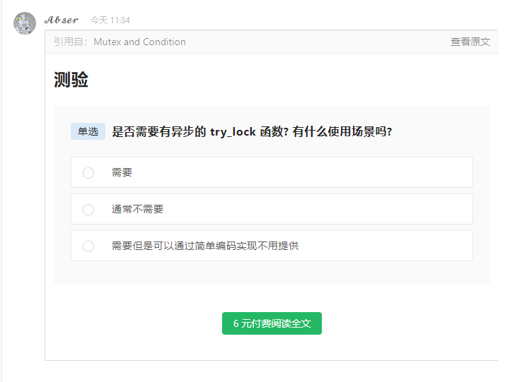
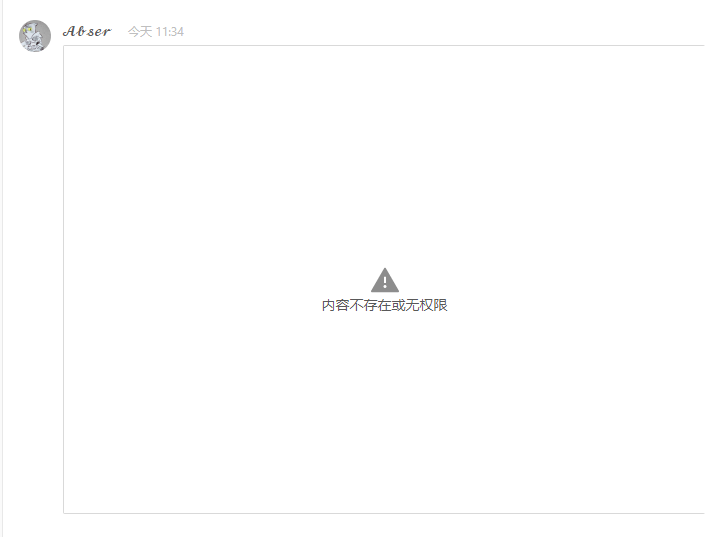

\## 0\. 预期效果

\## 1\. 简单使用投票功能

\## 2\. 使用文档引用功能复用
[语雀内容](https://www.yuque.com/abser/linux/krtcgk?inner=aC5Cv&view=doc\_embed)

\### 2.1权限问题

\*\*图三: 无需访问权限的投票块\*\*

\*\*\*\*

\*\*图四: 需要权限的投票块\*\*